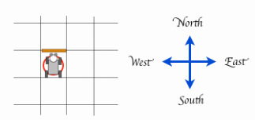

> "결정, 결정, 결정"

### 부울, 부울 연산자

부울(boolean)은 단지 두값만 갖는 자료형이다: 참과 거짓(True, False). 핵심 연산자 3개가 다음에 나와 있다.

~~~ {.python}
not     # 부울 값을 켰다 껐다(토글) 한다.
and     # 모든 피연산자가 참이면 참이 된다.
or      # 피연산자 중 참이 있다면, 참이 된다.
~~~ 

예를 들어: [시도해 보기](http://www.codeskulptor.org/#user40_FAprm5xYmpoMWdi.py)

~~~ {.python}
name = "Peter"
age = 10
 
print("expressions involving name")
a = (name == "Mark")
print( a )
b = (name == "Peter")
print( b )
 
c = (age == 10)
d = (age == 50)
 
print( b )       # 거짓: 이름이 Peter면 거짓이다.
print( not b )   # 참: a 의 반대
print("")
 
print("And operations")
print( a )       # 참: 이름이 Mark면 참이다.
print( a and c ) # 참: 이름이 Mark고, 나이가 10이면 참이다.
print( a and d ) # 거짓: 이름이 Mark로 맞지만, 나이는 50이 아니다.
print("")
 
print("Or operations")
print( a or c )  # 참: 이름이 Mark라서, 나이에 관계없이 참이다.
print( a or c )  # 참: 나이가 10이라서, 이름에 관계없이 참이다.
print( b or d )  # 거짓: 이름이 Peter가 아니고, 나이도 50이 아니다.
print("")
 
print("Expression")
value = (a and b) or not(a or c or d)
print( value )
~~~

이제 부울 표현식을 받아서, 값으로 축약한다:

~~~ {.python}
(a and b) or not(a or c or d) = (True and False) or not(True or True or False)
                                = (False) or not(True)
                                = False or False
                                = False
~~~

### 카렐 부울 함수

다음에 카렐이 세상을 감지하고 인식하는데, 사용하는 부울 함수가 나와 있다.

~~~ {.python}
front_is_clear()    # 참: 카렐 전방에 벽이 없다면
is_facing_north()   # 참: 카렐이 북쪽을 향해 있다면
token_here()        # 참: 카렐이 위치한 셀에 적어도 토큰이 하나 있다면
has_token()         # 참: 토큰 가방이 비어있지 않다면
at_goal()           # 참: 카렐이 정사각형 집에 있다면
~~~

상기 함수중 아무것이나 호출하면, 호출된 함수는 부울 값을 반환한다. 예를 들어, 다음 이미지에 나타난 상황은 다음과 같다...

~~~ {.python}
front_is_clear() == False   # 거짓: 전방에 장매물이 없다면
is_facing_north() == True   # 참: 카렐이 북쪽을 향하고 있다면
token_here() == True        # 참: 카렐이 토큰을 가지고 있다면
~~~

### 조건문 - if / else

카렐은 결정을 내리는데 감각인지 함수로, `if / else` 구조를 사용한다.  `if / else` 구조는 다음과 같이 생겼다:

~~~ {.python}
if <조건>:       # <조건>이 참이면 -> 'if'문 몸통부문을 실행한다.
    명령어 1         # 'if'문 몸통부문 시작
    명령어 2
    ...
    명령어 n         # 'if'문 몸통부문 끝
else:                 # <조건> 이 거짓이면 -> 'else'문 몸통부문 시작 
    명령어 a         # 'else'문 몸통부문 시작
    명령어 b
    ...
    명령어 z         # 'else'문 몸통부문 끝
~~~

조건이 **참** 이면, 카렐은 `if` 문 몸통부문 명령어를 실행한다; 그렇지 않으면, `else` 문 몸통부문 명령어를 실행한다. 조건 구조에서 `else` 부분은 선택옵션 사항이다.

### 상보함수

카렐 감각인지 함수는 제한되어 있어, 자연스럽게 카렐에게 말을 할 수 있도록 허용되지 않는다. 예를 들어, "전방에 장애물이 없지 않다", `not front_is_clear()` 라고 말하는 것이 아니라, 대신에 "장방에 벽", `wall_in_front()` 이라고 표현한다.
서로 상반되는 함수를 *상보함수(complementary function)*라고 부른다.

카렐에 내장된 감각인지 함수에 대한 상보함수가 다음에 나와 있다:

~~~ {.python}
 # front_is_clear() 상보함수
def wall_in_front():
    return not front_is_clear()
 
# token_here() 상보함수
def cell_is_empty():
    return not token_here()
 
# has_token() 상보함수
def bag_is_empty():
    return not has_token()
~~~

 상기 상보함수를 라이브러리에 추가한다.

### 훈련 작업임무

#### TM1. 남가주(SoCal) 생활 -  길 닦기

