> "결정, 결정, 결정"

### 부울, 부울 연산자 

부울(boolean)은 단지 두값만 갖는 자료형이다: 참과 거짓(True, False). 핵심 연산자 3개가 다음에 나와 있다.

~~~ {.python}
not     # 부울 값을 켰다 껐다(토글) 한다.
and     # 모든 피연산자가 참이면 참이 된다.
or      # 피연산자 중 참이 있다면, 참이 된다.
~~~ 

예를 들어: [시도해 보기](http://www.codeskulptor.org/#user40_FAprm5xYmpoMWdi.py)

~~~ {.python}
name = "Peter"
age = 10
 
print("expressions involving name")
a = (name == "Mark")
print( a )
b = (name == "Peter")
print( b )
 
c = (age == 10)
d = (age == 50)
 
print( b )       # 거짓: 이름이 Peter면 거짓이다.
print( not b )   # 참: a 의 반대
print("")
 
print("And operations")
print( a )       # 참: 이름이 Mark면 참이다.
print( a and c ) # 참: 이름이 Mark고, 나이가 10이면 참이다.
print( a and d ) # 거짓: 이름이 Mark로 맞지만, 나이는 50이 아니다.
print("")
 
print("Or operations")
print( a or c )  # 참: 이름이 Mark라서, 나이에 관계없이 참이다.
print( a or c )  # 참: 나이가 10이라서, 이름에 관계없이 참이다.
print( b or d )  # 거짓: 이름이 Peter가 아니고, 나이도 50이 아니다.
print("")
 
print("Expression")
value = (a and b) or not(a or c or d)
print( value )
~~~

이제 부울 표현식을 받아서, 값으로 축약한다:

~~~ {.python}
(a and b) or not(a or c or d) = (True and False) or not(True or True or False)
                                = (False) or not(True)
                                = False or False
                                = False
~~~

### 카렐 부울 함수

다음에 카렐이 세상을 감지하고 인식하는데, 사용하는 부울 함수가 나와 있다.

~~~ {.python}
front_is_clear()    # 참: 카렐 전방에 벽이 없다면
is_facing_north()   # 참: 카렐이 북쪽을 향해 있다면
token_here()        # 참: 카렐이 위치한 셀에 적어도 토큰이 하나 있다면
has_token()         # 참: 토큰 가방이 비어있지 않다면
at_goal()           # 참: 카렐이 정사각형 집에 있다면
~~~

상기 함수중 아무것이나 호출하면, 호출된 함수는 부울 값을 반환한다. 예를 들어, 다음 이미지에 나타난 상황은 다음과 같다...

~~~ {.python}
front_is_clear() == False   # 거짓: 전방에 장매물이 없다면
is_facing_north() == True   # 참: 카렐이 북쪽을 향하고 있다면
token_here() == True        # 참: 카렐이 토큰을 가지고 있다면
~~~

### 조건문 - if / else

카렐은 결정을 내리는데 감각인지 함수로, `if / else` 구조를 사용한다.  `if / else` 구조는 다음과 같이 생겼다:

~~~ {.python}
if <조건>:       # <조건>이 참이면 -> 'if'문 몸통부문을 실행한다.
    명령어 1         # 'if'문 몸통부문 시작
    명령어 2
    ...
    명령어 n         # 'if'문 몸통부문 끝
else:                 # <조건> 이 거짓이면 -> 'else'문 몸통부문 시작 
    명령어 a         # 'else'문 몸통부문 시작
    명령어 b
    ...
    명령어 z         # 'else'문 몸통부문 끝
~~~

조건이 **참** 이면, 카렐은 `if` 문 몸통부문 명령어를 실행한다; 그렇지 않으면, `else` 문 몸통부문 명령어를 실행한다. 조건 구조에서 `else` 부분은 선택옵션 사항이다.

### 상보함수

카렐 감각인지 함수는 제한되어 있어, 자연스럽게 카렐에게 말을 할 수 있도록 허용되지 않는다. 예를 들어, "전방에 장애물이 없지 않다", `not front_is_clear()` 라고 말하는 것이 아니라, 대신에 "장방에 벽", `wall_in_front()` 이라고 표현한다.
서로 상반되는 함수를 *상보함수(complementary function)*라고 부른다.

카렐에 내장된 감각인지 함수에 대한 상보함수가 다음에 나와 있다:

~~~ {.python}
 # front_is_clear() 상보함수
def wall_in_front():
    return not front_is_clear()
 
# token_here() 상보함수
def cell_is_empty():
    return not token_here()
 
# has_token() 상보함수
def bag_is_empty():
    return not has_token()
~~~

 상기 상보함수를 라이브러리에 추가한다.

### 훈련 작업임무

#### TM1. 남가주(SoCal) 생활 -  길 닦기

[학습 교안](http://codeperspectives.com/reeborg-dev/world.html?proglang=python-en&world=%7B%22robots%22%3A%5B%7B%22x%22%3A7%2C%22y%22%3A2%2C%22tokens%22%3A%221-3%22%2C%22orientation%22%3A1%2C%22_prev_x%22%3A7%2C%22_prev_y%22%3A2%2C%22_prev_orientation%22%3A1%2C%22max_tokens%22%3A3%2C%22min_tokens%22%3A1%2C%22tokens_range%22%3A%221-3%22%7D%5D%2C%22tokens%22%3A%7B%227%2C5%22%3A0%2C%227%2C7%22%3A0%2C%227%2C8%22%3A0%2C%227%2C4%22%3A0%2C%227%2C6%22%3A0%2C%227%2C3%22%3A0%7D%2C%22walls%22%3A%7B%226%2C4%22%3A%5B%22east%22%5D%2C%226%2C5%22%3A%5B%22east%22%5D%2C%226%2C6%22%3A%5B%22east%22%5D%2C%226%2C7%22%3A%5B%22east%22%5D%2C%226%2C8%22%3A%5B%22east%22%5D%2C%227%2C8%22%3A%5B%22east%22%5D%2C%227%2C7%22%3A%5B%22east%22%5D%2C%227%2C6%22%3A%5B%22east%22%5D%2C%227%2C5%22%3A%5B%22east%22%5D%2C%227%2C4%22%3A%5B%22east%22%5D%2C%226%2C9%22%3A%5B%22east%22%5D%2C%227%2C9%22%3A%5B%22north%22%2C%22east%22%5D%2C%227%2C3%22%3A%5B%22east%22%5D%2C%226%2C3%22%3A%5B%22east%22%5D%7D%2C%22goal%22%3A%7B%22possible_positions%22%3A%5B%5B7%2C9%5D%5D%2C%22position%22%3A%7B%22x%22%3A7%2C%22y%22%3A9%7D%2C%22orientation%22%3A3%7D%2C%22min_tokens%22%3A%7B%227%2C5%22%3A0%2C%227%2C7%22%3A0%2C%227%2C8%22%3A0%2C%227%2C4%22%3A0%2C%227%2C6%22%3A0%2C%227%2C3%22%3A0%7D%2C%22max_tokens%22%3A%7B%227%2C5%22%3A1%2C%227%2C7%22%3A1%2C%227%2C8%22%3A1%2C%227%2C4%22%3A1%2C%227%2C6%22%3A1%2C%227%2C3%22%3A1%7D%2C%22tokens_range%22%3A%7B%227%2C5%22%3A%220-1%22%2C%227%2C7%22%3A%220-1%22%2C%227%2C8%22%3A%220-1%22%2C%227%2C4%22%3A%220-1%22%2C%227%2C6%22%3A%220-1%22%2C%227%2C3%22%3A%220-1%22%7D%7D&editor=%23%204-tm1%20%20Paving%20the%20way&library=%23%20%27from%20my_lib%20import%20*%27%20in%20Python%20Code%20is%20required%20to%20use%0A%23%20the%20code%20in%20this%20library.%20%0A%0Asound(True)%0A%0Adef%20left()%3A%0A%20%20%20%20turn_left()%0A%20%20%20%20%0Adef%20right()%3A%0A%20%20%20%20repeat(%20left%2C%203%20)%0A%20%20%20%20%0Adef%20turn_around()%3A%0A%20%20%20%20repeat(%20left%2C%202%20)%0A%20%20%20%20%0Adef%20sidestep_left()%3A%0A%20%20%20%20left()%0A%20%20%20%20move()%0A%20%20%20%20right()%0A%20%20%20%20%0Adef%20sidestep_right()%3A%0A%20%20%20%20right()%0A%20%20%20%20move()%0A%20%20%20%20left()%0A%0A%23%20sensing%20functions%0A%0Adef%20wall_in_front()%3A%0A%20%20%20%20return%20not%20front_is_clear()%0A%0Adef%20cell_is_empty()%3A%0A%20%20%20%20return%20not%20token_here()%0A%0Adef%20bag_is_empty()%3A%0A%20%20%20%20return%20not%20has_token())

6칸 떨어진 카렐 집에 가는 길에 타일이 일부 빠져있다.
카렐은 가방에 일부 타일을 보유하고 있지만, 얼마나 많은 타일을 보유하고 있는지 모른다.
카렐이 가능하면 많은 타일을 교체하고, 집으로 되돌아 갈 수 있게 하고, 
작업한 것을 살펴볼 수 있도록 남쪽을 향하게 하고, 마지막으로 집에 도착했다는 선언한다.

Corn maze at the Bishop’s Pumpkin Patch in Wheatland, CA

해답: [보여주기](http://codeperspectives.com/reeborg-dev/world.html?proglang=python-en&world=%7B%22robots%22%3A%5B%7B%22x%22%3A7%2C%22y%22%3A2%2C%22tokens%22%3A%221-3%22%2C%22orientation%22%3A1%2C%22_prev_x%22%3A7%2C%22_prev_y%22%3A2%2C%22_prev_orientation%22%3A1%2C%22max_tokens%22%3A3%2C%22min_tokens%22%3A1%2C%22tokens_range%22%3A%221-3%22%7D%5D%2C%22tokens%22%3A%7B%227%2C5%22%3A0%2C%227%2C7%22%3A0%2C%227%2C8%22%3A0%2C%227%2C4%22%3A0%2C%227%2C6%22%3A0%2C%227%2C3%22%3A0%7D%2C%22walls%22%3A%7B%226%2C4%22%3A%5B%22east%22%5D%2C%226%2C5%22%3A%5B%22east%22%5D%2C%226%2C6%22%3A%5B%22east%22%5D%2C%226%2C7%22%3A%5B%22east%22%5D%2C%226%2C8%22%3A%5B%22east%22%5D%2C%227%2C8%22%3A%5B%22east%22%5D%2C%227%2C7%22%3A%5B%22east%22%5D%2C%227%2C6%22%3A%5B%22east%22%5D%2C%227%2C5%22%3A%5B%22east%22%5D%2C%227%2C4%22%3A%5B%22east%22%5D%2C%226%2C9%22%3A%5B%22east%22%5D%2C%227%2C9%22%3A%5B%22north%22%2C%22east%22%5D%2C%227%2C3%22%3A%5B%22east%22%5D%2C%226%2C3%22%3A%5B%22east%22%5D%7D%2C%22goal%22%3A%7B%22possible_positions%22%3A%5B%5B7%2C9%5D%5D%2C%22position%22%3A%7B%22x%22%3A7%2C%22y%22%3A9%7D%2C%22orientation%22%3A3%7D%2C%22min_tokens%22%3A%7B%227%2C5%22%3A0%2C%227%2C7%22%3A0%2C%227%2C8%22%3A0%2C%227%2C4%22%3A0%2C%227%2C6%22%3A0%2C%227%2C3%22%3A0%7D%2C%22max_tokens%22%3A%7B%227%2C5%22%3A1%2C%227%2C7%22%3A1%2C%227%2C8%22%3A1%2C%227%2C4%22%3A1%2C%227%2C6%22%3A1%2C%227%2C3%22%3A1%7D%2C%22tokens_range%22%3A%7B%227%2C5%22%3A%220-1%22%2C%227%2C7%22%3A%220-1%22%2C%227%2C8%22%3A%220-1%22%2C%227%2C4%22%3A%220-1%22%2C%227%2C6%22%3A%220-1%22%2C%227%2C3%22%3A%220-1%22%7D%7D&editor=%23%204-tm1%20%20Paving%20the%20way%0Afrom%20my_lib%20import%20*%0A%0Adef%20safe_put()%3A%0A%20%20%20%20if%20has_token()%3A%0A%20%20%20%20%20%20%20%20put()%0A%0Adef%20tile_cell()%3A%0A%20%20%20%20move()%0A%20%20%20%20if%20not%20token_here()%3A%0A%20%20%20%20%20%20%20%20safe_put()%0A%20%20%20%20%20%20%20%20%0Adef%20tile_path()%3A%0A%20%20%20%20repeat(%20tile_cell%2C%206)%0A%20%20%20%20%20%20%20%20%20%20%20%20%0Adef%20go_home()%3A%0A%20%20%20%20move()%0A%20%20%20%20turn_around()%0A%0A%23%20main%20program%0Atile_path()%0Ago_home()%0Asay(%20%22Mommy...%20I%27m%20home%22%20)&library=%23%20%27from%20my_lib%20import%20*%27%20in%20Python%20Code%20is%20required%20to%20use%0A%23%20the%20code%20in%20this%20library.%20%0A%0Asound(True)%0A%0Adef%20left()%3A%0A%20%20%20%20turn_left()%0A%20%20%20%20%0Adef%20right()%3A%0A%20%20%20%20repeat(%20left%2C%203%20)%0A%20%20%20%20%0Adef%20turn_around()%3A%0A%20%20%20%20repeat(%20left%2C%202%20)%0A%20%20%20%20%0Adef%20sidestep_left()%3A%0A%20%20%20%20left()%0A%20%20%20%20move()%0A%20%20%20%20right()%0A%20%20%20%20%0Adef%20sidestep_right()%3A%0A%20%20%20%20right()%0A%20%20%20%20move()%0A%20%20%20%20left()%0A%0A%23%20sensing%20functions%0A%0Adef%20wall_in_front()%3A%0A%20%20%20%20return%20not%20front_is_clear()%0A%0Adef%20cell_is_empty()%3A%0A%20%20%20%20return%20not%20token_here()%0A%0Adef%20bag_is_empty()%3A%0A%20%20%20%20return%20not%20has_token())

초기 설정으로 각 셀에 토큰 숫자는 0 혹은 1 값이 된다.
즉, 일부 셀은 토큰이 있고, 일부 셀은 토큰이 없다. 
`Play` 버튼을 누를 때, 값이 발현된다.

정사각형 집에는 한쪽에 작은 검은색 점이 있다. 
다음 그림에 나와 있는 것처럼, 
로봇이 작업임무를 마치고 검은 점이 있는 방향을 향하고 있음을 나타낸다.

| 출발전 ... | ... 종료후| 
|---------------------------------|---------------------------------|
| 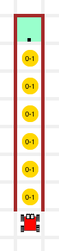 | 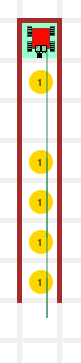 |

**힌트:**

이번 작업임무에서, 매우 유용한 `safe_put()` 함수를 사용한다:

~~~ {.python}
def safe_put():
    if has_token():
        put()
~~~

`put()` 대신에 `safe_put()` 함수를 호출하면 로봇이 절대로 빈 가방에서 토큰을 내려놓지 못하게 보장한다.
지금부터 라이브러리에서 해당 함수를 사용할 수 있다.

#### TM2. 남가주(SoCal) 생활 - 또다른 터치다운

[학습 교안](http://codeperspectives.com/reeborg-dev/world.html?proglang=python-en&world=%7B%22robots%22%3A%5B%7B%22x%22%3A7%2C%22y%22%3A4%2C%22tokens%22%3A0%2C%22orientation%22%3A1%2C%22_prev_x%22%3A7%2C%22_prev_y%22%3A4%2C%22_prev_orientation%22%3A1%2C%22start_positions%22%3A%5B%5B7%2C2%5D%2C%5B7%2C3%5D%2C%5B7%2C4%5D%5D%7D%5D%2C%22tokens%22%3A%7B%228%2C4%22%3A1%2C%228%2C8%22%3A1%2C%229%2C9%22%3A1%2C%227%2C8%22%3A1%2C%227%2C10%22%3A0%7D%2C%22walls%22%3A%7B%226%2C11%22%3A%5B%22north%22%5D%2C%227%2C11%22%3A%5B%22north%22%5D%2C%228%2C11%22%3A%5B%22north%22%5D%2C%229%2C11%22%3A%5B%22north%22%2C%22east%22%5D%2C%225%2C11%22%3A%5B%22north%22%5D%2C%224%2C11%22%3A%5B%22east%22%5D%7D%2C%22min_tokens%22%3A%7B%227%2C5%22%3A0%2C%228%2C7%22%3A0%2C%226%2C6%22%3A0%2C%226%2C9%22%3A0%2C%228%2C4%22%3A0%2C%228%2C8%22%3A0%2C%229%2C9%22%3A0%2C%225%2C7%22%3A0%2C%225%2C5%22%3A0%2C%227%2C8%22%3A0%2C%227%2C10%22%3A0%7D%2C%22max_tokens%22%3A%7B%227%2C5%22%3A1%2C%228%2C7%22%3A1%2C%226%2C6%22%3A1%2C%226%2C9%22%3A1%2C%228%2C4%22%3A1%2C%228%2C8%22%3A1%2C%229%2C9%22%3A1%2C%225%2C7%22%3A1%2C%225%2C5%22%3A1%2C%227%2C8%22%3A1%2C%227%2C10%22%3A1%7D%2C%22tokens_range%22%3A%7B%227%2C5%22%3A%220-1%22%2C%228%2C7%22%3A%220-1%22%2C%226%2C6%22%3A%220-1%22%2C%226%2C9%22%3A%220-1%22%2C%228%2C4%22%3A%220-1%22%2C%228%2C8%22%3A%220-1%22%2C%229%2C9%22%3A%220-1%22%2C%225%2C7%22%3A%220-1%22%2C%225%2C5%22%3A%220-1%22%2C%227%2C8%22%3A%220-1%22%2C%227%2C10%22%3A%220-1%22%7D%2C%22goal%22%3A%7B%22possible_positions%22%3A%5B%5B7%2C11%5D%5D%2C%22position%22%3A%7B%22x%22%3A7%2C%22y%22%3A11%7D%7D%7D&editor=%23%204-TM2%20another%20touchdown%0Afrom%20my_lib%20import%20*&library=%23%20%27import%20my_lib%27%20in%20Python%20Code%20is%20required%20to%20use%0A%23%20the%20code%20in%20this%20library.%20%0A%0Asound(True)%0A%0Adef%20left()%3A%0A%20%20%20%20turn_left()%0A%20%20%20%20%0Adef%20right()%3A%0A%20%20%20%20repeat(%20left%2C%203%20)%0A%20%20%20%20%0Adef%20turn_around()%3A%0A%20%20%20%20repeat(%20left%2C%202%20)%0A%20%20%20%20%0Adef%20sidestep_left()%3A%0A%20%20%20%20left()%0A%20%20%20%20move()%0A%20%20%20%20right()%0A%20%20%20%20%0Adef%20sidestep_right()%3A%0A%20%20%20%20right()%0A%20%20%20%20move()%0A%20%20%20%20left()%0A%0A%23%20sensing%20functions%0A%0Adef%20wall_in_front()%3A%0A%20%20%20%20return%20not%20front_is_clear()%0A%0Adef%20cell_is_empty()%3A%0A%20%20%20%20return%20not%20token_here()%0A%0Adef%20bag_is_empty()%3A%0A%20%20%20%20return%20not%20has_token())

하루 훈련이 거의 끝났다. 카렐은 한번더 터치다운을 시도하고 나서, 샤워실하러 가려한다.
하지만, 동료가 공을 여기저기에 공을 남겨두고 떠났다.

카렐은 10 칸이상 떨어지 있지 않은 엔드존 쪽으로 곧바로 뛰어가야 한다.
경로에 공이 있으면, 공을 집어 들고 뛰어 득점한다.
물론, 경로에 공이 1개 이상 있다면, 단지 공을 1개만 집어들고, 나머지는 무시해야 된다.
카렐로 하여금 곧바로 뛰어가면서 공을 찾았는지, 득점을 했는지 못했는지 목적지에서 선언해야 된다.

해답: [보여주기](http://codeperspectives.com/reeborg-dev/world.html?proglang=python-en&world=%7B%22robots%22%3A%5B%7B%22x%22%3A7%2C%22y%22%3A4%2C%22tokens%22%3A0%2C%22orientation%22%3A1%2C%22_prev_x%22%3A7%2C%22_prev_y%22%3A4%2C%22_prev_orientation%22%3A1%2C%22start_positions%22%3A%5B%5B7%2C2%5D%2C%5B7%2C3%5D%2C%5B7%2C4%5D%5D%7D%5D%2C%22tokens%22%3A%7B%228%2C4%22%3A1%2C%228%2C8%22%3A1%2C%229%2C9%22%3A1%2C%227%2C8%22%3A1%2C%227%2C10%22%3A0%7D%2C%22walls%22%3A%7B%226%2C11%22%3A%5B%22north%22%5D%2C%227%2C11%22%3A%5B%22north%22%5D%2C%228%2C11%22%3A%5B%22north%22%5D%2C%229%2C11%22%3A%5B%22north%22%2C%22east%22%5D%2C%225%2C11%22%3A%5B%22north%22%5D%2C%224%2C11%22%3A%5B%22east%22%5D%7D%2C%22min_tokens%22%3A%7B%227%2C5%22%3A0%2C%228%2C7%22%3A0%2C%226%2C6%22%3A0%2C%226%2C9%22%3A0%2C%228%2C4%22%3A0%2C%228%2C8%22%3A0%2C%229%2C9%22%3A0%2C%225%2C7%22%3A0%2C%225%2C5%22%3A0%2C%227%2C8%22%3A0%2C%227%2C10%22%3A0%7D%2C%22max_tokens%22%3A%7B%227%2C5%22%3A1%2C%228%2C7%22%3A1%2C%226%2C6%22%3A1%2C%226%2C9%22%3A1%2C%228%2C4%22%3A1%2C%228%2C8%22%3A1%2C%229%2C9%22%3A1%2C%225%2C7%22%3A1%2C%225%2C5%22%3A1%2C%227%2C8%22%3A1%2C%227%2C10%22%3A1%7D%2C%22tokens_range%22%3A%7B%227%2C5%22%3A%220-1%22%2C%228%2C7%22%3A%220-1%22%2C%226%2C6%22%3A%220-1%22%2C%226%2C9%22%3A%220-1%22%2C%228%2C4%22%3A%220-1%22%2C%228%2C8%22%3A%220-1%22%2C%229%2C9%22%3A%220-1%22%2C%225%2C7%22%3A%220-1%22%2C%225%2C5%22%3A%220-1%22%2C%227%2C8%22%3A%220-1%22%2C%227%2C10%22%3A%220-1%22%7D%2C%22goal%22%3A%7B%22possible_positions%22%3A%5B%5B7%2C11%5D%5D%2C%22position%22%3A%7B%22x%22%3A7%2C%22y%22%3A11%7D%7D%7D&editor=%23%204-TM2%20another%20touchdown%0Afrom%20my_lib%20import%20*%0A%0Adef%20safe_take()%3A%0A%20%20%20%20if%20token_here()%3A%0A%20%20%20%20%20%20%20%20take()%0A%20%20%20%20%0Adef%20safe_move()%3A%0A%20%20%20%20if%20front_is_clear()%3A%0A%20%20%20%20%20%20%20%20move()%0A%20%20%20%20%20%20%20%20%20%20%20%20%20%20%20%20%0Adef%20step_to_end_zone()%3A%0A%20%20%20%20if%20bag_is_empty()%3A%0A%20%20%20%20%20%20%20%20safe_take()%0A%20%20%20%20safe_move()%0A%20%20%20%20%0Adef%20go_to_endzone()%3A%0A%20%20%20%20repeat(%20step_to_end_zone%2C%2010%20)%0A%20%20%20%20%20%20%20%20%0Adef%20attempt_score()%3A%0A%20%20%20%20if%20bag_is_empty()%3A%0A%20%20%20%20%20%20%20%20say(%20%22Bummer..%20I%20didn%27t%20score%22%20)%0A%20%20%20%20else%3A%0A%20%20%20%20%20%20%20%20put()%0A%20%20%20%20%20%20%20%20say(%20%22Touchdown!%22%20)%0A%0A%23%20main%20program%0Ago_to_endzone()%0Aattempt_score()&library=%23%20%27from%20my_lib%20import%20*%27%20in%20Python%20Code%20is%20required%20to%20use%0A%23%20the%20code%20in%20this%20library.%20%0A%0Asound(True)%0A%0Adef%20left()%3A%0A%20%20%20%20turn_left()%0A%20%20%20%20%0Adef%20right()%3A%0A%20%20%20%20repeat(%20left%2C%203%20)%0A%20%20%20%20%0Adef%20turn_around()%3A%0A%20%20%20%20repeat(%20left%2C%202%20)%0A%20%20%20%20%0Adef%20sidestep_left()%3A%0A%20%20%20%20left()%0A%20%20%20%20move()%0A%20%20%20%20right()%0A%20%20%20%20%0Adef%20sidestep_right()%3A%0A%20%20%20%20right()%0A%20%20%20%20move()%0A%20%20%20%20left()%0A%0A%23%20sensing%20functions%0A%0Adef%20wall_in_front()%3A%0A%20%20%20%20return%20not%20front_is_clear()%0A%0Adef%20cell_is_empty()%3A%0A%20%20%20%20return%20not%20token_here()%0A%0Adef%20bag_is_empty()%3A%0A%20%20%20%20return%20not%20has_token())

초기 설정으로, 각 셀에 토큰 숫자는 0 혹은 1 값이 된다.
즉, 일부 셀은 토큰이 있고, 일부 셀은 토큰이 없다. 
`Play` 버튼을 누를 때, 값이 발현된다.

희미한 로봇 3대는 가능한 처음 로봇 위치를 나타낸다.
`Play` 버튼을 누를 때, 프로그램이 시작 위치를 자동 정한다.

| 출발전 ... | ... 종료후| 
|---------------------------------|---------------------------------|
|  |  |

**힌트:**

이번 작업임무에서, 매우 유용한 `safe_take()` 와 `safe_move()` 함수를 사용한다:

~~~ {.python}
def safe_take():
    if token_here():
        take()
    
def safe_move():
    if front_is_clear():
        move()
~~~

상기 함수가 카렐이 벽과 충돌하지 않게 하고, 빈 셀에서 토큰을 집어 올리지 않도록 보장한다. 이 함수를 지금부터 라이브러리에서 사용할 수 있다.

#### 3학년 - 딸기 - 후식

[학생 교안](http://codeperspectives.com/reeborg-dev/world.html?proglang=python-en&world=%7B%22robots%22%3A%5B%7B%22x%22%3A2%2C%22y%22%3A2%2C%22tokens%22%3A0%2C%22orientation%22%3A0%2C%22_prev_x%22%3A2%2C%22_prev_y%22%3A2%2C%22_prev_orientation%22%3A0%2C%22start_positions%22%3A%5B%5B2%2C2%5D%5D%7D%5D%2C%22walls%22%3A%7B%223%2C2%22%3A%5B%22north%22%5D%2C%224%2C2%22%3A%5B%22north%22%5D%2C%225%2C2%22%3A%5B%22north%22%5D%2C%226%2C2%22%3A%5B%22north%22%5D%2C%227%2C2%22%3A%5B%22north%22%5D%2C%223%2C1%22%3A%5B%22north%22%5D%2C%224%2C1%22%3A%5B%22north%22%5D%2C%225%2C1%22%3A%5B%22north%22%5D%2C%226%2C1%22%3A%5B%22north%22%5D%2C%227%2C1%22%3A%5B%22north%22%5D%2C%228%2C2%22%3A%5B%22north%22%5D%2C%229%2C2%22%3A%5B%22north%22%5D%2C%2210%2C2%22%3A%5B%22north%22%5D%2C%2210%2C1%22%3A%5B%22north%22%5D%2C%229%2C1%22%3A%5B%22north%22%5D%2C%228%2C1%22%3A%5B%22north%22%5D%7D%2C%22goal%22%3A%7B%22possible_positions%22%3A%5B%5B2%2C2%5D%5D%2C%22position%22%3A%7B%22x%22%3A2%2C%22y%22%3A2%7D%2C%22orientation%22%3A0%7D%2C%22tokens%22%3A%7B%223%2C2%22%3A0%2C%225%2C2%22%3A0%2C%227%2C2%22%3A0%2C%226%2C2%22%3A0%2C%224%2C2%22%3A0%2C%228%2C2%22%3A0%2C%229%2C2%22%3A0%2C%2210%2C2%22%3A0%7D%2C%22min_tokens%22%3A%7B%223%2C2%22%3A0%2C%225%2C2%22%3A0%2C%227%2C2%22%3A0%2C%226%2C2%22%3A0%2C%224%2C2%22%3A0%2C%228%2C2%22%3A0%2C%229%2C2%22%3A0%2C%2210%2C2%22%3A0%7D%2C%22max_tokens%22%3A%7B%223%2C2%22%3A1%2C%225%2C2%22%3A1%2C%227%2C2%22%3A1%2C%226%2C2%22%3A1%2C%224%2C2%22%3A1%2C%228%2C2%22%3A1%2C%229%2C2%22%3A1%2C%2210%2C2%22%3A1%7D%2C%22tokens_range%22%3A%7B%223%2C2%22%3A%220-1%22%2C%225%2C2%22%3A%220-1%22%2C%227%2C2%22%3A%220-1%22%2C%226%2C2%22%3A%220-1%22%2C%224%2C2%22%3A%220-1%22%2C%228%2C2%22%3A%220-1%22%2C%229%2C2%22%3A%220-1%22%2C%2210%2C2%22%3A%220-1%22%7D%7D&editor=%23%20Dessert%0A%23%20have%20Karel%20pick%20up%20the%20strawberries%20in%20his%20garden%2C%0A%23%20then%20go%20home%20and%20finally%20have%20him%20face%20the%20garden%0Afrom%20my_lib%20import%20*%0A%0Adef%20process_cell()%3A%0A%20%20%20%20pass%0A%0Adef%20go_home()%3A%0A%20%20%20%20pass%0A%20%20%20%20%0Adef%20face_garden()%3A%0A%20%20%20%20pass%0A%0A%23%20main%20program%0Arepeat(%20process_cell%2C%208%20)%0Ago_home()%0Aface_garden()&library=%23%20%27from%20my_lib%20import%20*%27%20in%20Python%20Code%20is%20required%20to%20use%0A%23%20the%20code%20in%20this%20library.%20%0A%0Asound(True)%0A%0Adef%20left()%3A%0A%20%20%20%20turn_left()%0A%20%20%20%20%0Adef%20right()%3A%0A%20%20%20%20repeat(%20left%2C%203%20)%0A%20%20%20%20%0Adef%20turn_around()%3A%0A%20%20%20%20repeat(%20left%2C%202%20)%0A%20%20%20%20%0Adef%20sidestep_left()%3A%0A%20%20%20%20left()%0A%20%20%20%20move()%0A%20%20%20%20right()%0A%20%20%20%20%0Adef%20sidestep_right()%3A%0A%20%20%20%20right()%0A%20%20%20%20move()%0A%20%20%20%20left()%0A%20%20%20%20%0Adef%20safe_take()%3A%0A%20%20%20%20if%20token_here()%3A%0A%20%20%20%20%20%20%20%20take()%0A%20%20%20%20%20%20%20%20%0Adef%20safe_put()%3A%0A%20%20%20%20if%20has_token()%3A%0A%20%20%20%20%20%20%20%20put()%0A%20%20%20%20%0Adef%20safe_move()%3A%0A%20%20%20%20if%20front_is_clear()%3A%0A%20%20%20%20%20%20%20%20move()%0A%0A%23%20sensing%20functions%0A%0Adef%20wall_in_front()%3A%0A%20%20%20%20return%20not%20front_is_clear()%0A%0Adef%20cell_is_empty()%3A%0A%20%20%20%20return%20not%20token_here()%0A%0Adef%20bag_is_empty()%3A%0A%20%20%20%20return%20not%20has_token())

8셀 카렐 정원에는 만개한 빨기가 각 셀마다 0 혹은 1개씩 있다. 
카렐로 하여금 정원에 가서 가능하면 많은 딸기를 모으게 하고 나서,
집에 돌아와서, 마지막으로 정원을 바라보게 한다.

초기 설정에 정원 각 셀마다 딸기가 0 혹은 1개씩 갖을 수 있다.
`Play` 버튼을 실행하면, 파이썬이 자동으로 각 셀에 0 혹은 1 값을 고른다.
그러면 시나리오에 맞게 작업임무를 실행한다.

그림에 나온 경우에, 2번, 3번, 8번 셀만 딸기가 1개 있다; 다른 모든 셀에는 딸기가 0개 있다.

해답: [보여주기](http://codeperspectives.com/reeborg-dev/world.html?proglang=python-en&world=%7B%22robots%22%3A%5B%7B%22x%22%3A2%2C%22y%22%3A2%2C%22tokens%22%3A0%2C%22orientation%22%3A0%2C%22_prev_x%22%3A2%2C%22_prev_y%22%3A2%2C%22_prev_orientation%22%3A0%2C%22start_positions%22%3A%5B%5B2%2C2%5D%5D%7D%5D%2C%22walls%22%3A%7B%223%2C2%22%3A%5B%22north%22%5D%2C%224%2C2%22%3A%5B%22north%22%5D%2C%225%2C2%22%3A%5B%22north%22%5D%2C%226%2C2%22%3A%5B%22north%22%5D%2C%227%2C2%22%3A%5B%22north%22%5D%2C%223%2C1%22%3A%5B%22north%22%5D%2C%224%2C1%22%3A%5B%22north%22%5D%2C%225%2C1%22%3A%5B%22north%22%5D%2C%226%2C1%22%3A%5B%22north%22%5D%2C%227%2C1%22%3A%5B%22north%22%5D%2C%228%2C2%22%3A%5B%22north%22%5D%2C%229%2C2%22%3A%5B%22north%22%5D%2C%2210%2C2%22%3A%5B%22north%22%5D%2C%2210%2C1%22%3A%5B%22north%22%5D%2C%229%2C1%22%3A%5B%22north%22%5D%2C%228%2C1%22%3A%5B%22north%22%5D%7D%2C%22goal%22%3A%7B%22possible_positions%22%3A%5B%5B2%2C2%5D%5D%2C%22position%22%3A%7B%22x%22%3A2%2C%22y%22%3A2%7D%2C%22orientation%22%3A0%7D%2C%22tokens%22%3A%7B%223%2C2%22%3A0%2C%225%2C2%22%3A0%2C%227%2C2%22%3A0%2C%226%2C2%22%3A0%2C%224%2C2%22%3A0%2C%228%2C2%22%3A0%2C%229%2C2%22%3A0%2C%2210%2C2%22%3A0%7D%2C%22min_tokens%22%3A%7B%223%2C2%22%3A0%2C%225%2C2%22%3A0%2C%227%2C2%22%3A0%2C%226%2C2%22%3A0%2C%224%2C2%22%3A0%2C%228%2C2%22%3A0%2C%229%2C2%22%3A0%2C%2210%2C2%22%3A0%7D%2C%22max_tokens%22%3A%7B%223%2C2%22%3A1%2C%225%2C2%22%3A1%2C%227%2C2%22%3A1%2C%226%2C2%22%3A1%2C%224%2C2%22%3A1%2C%228%2C2%22%3A1%2C%229%2C2%22%3A1%2C%2210%2C2%22%3A1%7D%2C%22tokens_range%22%3A%7B%223%2C2%22%3A%220-1%22%2C%225%2C2%22%3A%220-1%22%2C%227%2C2%22%3A%220-1%22%2C%226%2C2%22%3A%220-1%22%2C%224%2C2%22%3A%220-1%22%2C%228%2C2%22%3A%220-1%22%2C%229%2C2%22%3A%220-1%22%2C%2210%2C2%22%3A%220-1%22%7D%7D&editor=%23%20Dessert%0A%23%20have%20Karel%20pick%20up%20the%20strawberries%20in%20his%20garden%2C%0A%23%20then%20go%20home%20and%20finally%20have%20him%20face%20the%20garden%0Afrom%20my_lib%20import%20*%0A%0Adef%20process_cell()%3A%0A%20%20%20%20move()%0A%20%20%20%20if%20token_here()%3A%0A%20%20%20%20%20%20%20%20take()%0A%0Adef%20go_home()%3A%0A%20%20%20%20turn_around()%0A%20%20%20%20repeat(%20move%2C%208%20)%0A%20%20%20%20%0Adef%20face_garden()%3A%0A%20%20%20%20turn_around()%0A%0A%23%20main%20program%0Arepeat(%20process_cell%2C%208%20)%0Ago_home()%0Aface_garden()&library=%23%20%27from%20my_lib%20import%20*%27%20in%20Python%20Code%20is%20required%20to%20use%0A%23%20the%20code%20in%20this%20library.%20%0A%0Asound(True)%0A%0Adef%20left()%3A%0A%20%20%20%20turn_left()%0A%20%20%20%20%0Adef%20right()%3A%0A%20%20%20%20repeat(%20left%2C%203%20)%0A%20%20%20%20%0Adef%20turn_around()%3A%0A%20%20%20%20repeat(%20left%2C%202%20)%0A%20%20%20%20%0Adef%20sidestep_left()%3A%0A%20%20%20%20left()%0A%20%20%20%20move()%0A%20%20%20%20right()%0A%20%20%20%20%0Adef%20sidestep_right()%3A%0A%20%20%20%20right()%0A%20%20%20%20move()%0A%20%20%20%20left()%0A%20%20%20%20%0Adef%20safe_take()%3A%0A%20%20%20%20if%20token_here()%3A%0A%20%20%20%20%20%20%20%20take()%0A%20%20%20%20%20%20%20%20%0Adef%20safe_put()%3A%0A%20%20%20%20if%20has_token()%3A%0A%20%20%20%20%20%20%20%20put()%0A%20%20%20%20%0Adef%20safe_move()%3A%0A%20%20%20%20if%20front_is_clear()%3A%0A%20%20%20%20%20%20%20%20move()%0A%0A%23%20sensing%20functions%0A%0Adef%20wall_in_front()%3A%0A%20%20%20%20return%20not%20front_is_clear()%0A%0Adef%20cell_is_empty()%3A%0A%20%20%20%20return%20not%20token_here()%0A%0Adef%20bag_is_empty()%3A%0A%20%20%20%20return%20not%20has_token())

| 가능범위를 보여주는 초기설정 | 착수 준비 | 가능한 결과: "아주 맛있어요...!" | 
|---------------------------------|---------------------------------|---------------------------------|
| 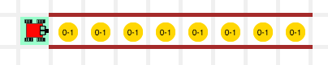 | 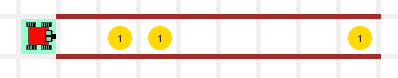 |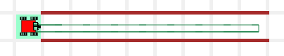 |

#### 4학년 - 올림픽 신화 - 바이애슬론 [^1]

[^1]: 바이애슬론(Biathon) - 사격과 크로스컨트리 스키를 혼합한 경기

[학생 교안](http://codeperspectives.com/reeborg-dev/world.html?proglang=python-en&world=%7B%22robots%22%3A%5B%7B%22x%22%3A2%2C%22y%22%3A9%2C%22tokens%22%3A5%2C%22orientation%22%3A0%2C%22_prev_x%22%3A2%2C%22_prev_y%22%3A9%2C%22_prev_orientation%22%3A0%2C%22start_positions%22%3A%5B%5B2%2C9%5D%5D%7D%5D%2C%22large_world%22%3Afalse%2C%22walls%22%3A%7B%224%2C7%22%3A%5B%22north%22%5D%2C%224%2C8%22%3A%5B%22east%22%5D%2C%223%2C8%22%3A%5B%22east%22%5D%2C%225%2C8%22%3A%5B%22east%22%5D%2C%226%2C7%22%3A%5B%22north%22%5D%2C%226%2C8%22%3A%5B%22east%22%5D%2C%227%2C8%22%3A%5B%22east%22%5D%2C%228%2C7%22%3A%5B%22north%22%5D%2C%228%2C8%22%3A%5B%22east%22%5D%2C%229%2C8%22%3A%5B%22east%22%5D%2C%2210%2C7%22%3A%5B%22north%22%5D%2C%2210%2C8%22%3A%5B%22east%22%5D%2C%2211%2C8%22%3A%5B%22east%22%5D%2C%2212%2C7%22%3A%5B%22north%22%5D%2C%2212%2C8%22%3A%5B%22east%22%5D%7D%2C%22goal%22%3A%7B%22position%22%3A%7B%22x%22%3A2%2C%22y%22%3A9%7D%2C%22possible_positions%22%3A%5B%5B2%2C9%5D%5D%2C%22orientation%22%3A0%2C%22tokens%22%3A%7B%224%2C8%22%3A1%2C%226%2C8%22%3A1%2C%228%2C8%22%3A1%2C%2210%2C8%22%3A1%2C%2212%2C8%22%3A1%7D%7D%2C%22tokens%22%3A%7B%226%2C8%22%3A0%2C%224%2C7%22%3A0%2C%228%2C8%22%3A0%2C%2210%2C7%22%3A0%2C%2212%2C8%22%3A0%2C%224%2C8%22%3A0%2C%2210%2C8%22%3A0%2C%2212%2C7%22%3A0%2C%228%2C7%22%3A0%2C%226%2C7%22%3A0%7D%2C%22min_tokens%22%3A%7B%224%2C8%22%3A0%2C%226%2C8%22%3A0%2C%228%2C8%22%3A0%2C%2210%2C8%22%3A0%2C%2212%2C8%22%3A0%2C%2212%2C7%22%3A0%2C%2210%2C7%22%3A0%2C%228%2C7%22%3A0%2C%226%2C7%22%3A0%2C%224%2C7%22%3A0%7D%2C%22max_tokens%22%3A%7B%224%2C8%22%3A1%2C%226%2C8%22%3A1%2C%228%2C8%22%3A1%2C%2210%2C8%22%3A1%2C%2212%2C8%22%3A1%2C%2212%2C7%22%3A1%2C%2210%2C7%22%3A1%2C%228%2C7%22%3A1%2C%226%2C7%22%3A1%2C%224%2C7%22%3A1%7D%2C%22tokens_range%22%3A%7B%224%2C8%22%3A%220-1%22%2C%226%2C8%22%3A%220-1%22%2C%228%2C8%22%3A%220-1%22%2C%2210%2C8%22%3A%220-1%22%2C%2212%2C8%22%3A%220-1%22%2C%2212%2C7%22%3A%220-1%22%2C%2210%2C7%22%3A%220-1%22%2C%228%2C7%22%3A%220-1%22%2C%226%2C7%22%3A%220-1%22%2C%224%2C7%22%3A%220-1%22%7D%7D&editor=%23%204-2%20Biathlon&library=%23%20%27from%20my_lib%20import%20*%27%20in%20Python%20Code%20is%20required%20to%20use%0A%23%20the%20code%20in%20this%20library.%20%0A%0Asound(True)%0A%0Adef%20left()%3A%0A%20%20%20%20turn_left()%0A%20%20%20%20%0Adef%20right()%3A%0A%20%20%20%20repeat(%20left%2C%203%20)%0A%20%20%20%20%0Adef%20turn_around()%3A%0A%20%20%20%20repeat(%20left%2C%202%20)%0A%20%20%20%20%0Adef%20sidestep_left()%3A%0A%20%20%20%20left()%0A%20%20%20%20move()%0A%20%20%20%20right()%0A%20%20%20%20%0Adef%20sidestep_right()%3A%0A%20%20%20%20right()%0A%20%20%20%20move()%0A%20%20%20%20left()%0A%20%20%20%20%0Adef%20safe_take()%3A%0A%20%20%20%20if%20token_here()%3A%0A%20%20%20%20%20%20%20%20take()%0A%20%20%20%20%20%20%20%20%0Adef%20safe_put()%3A%0A%20%20%20%20if%20has_token()%3A%0A%20%20%20%20%20%20%20%20put()%0A%20%20%20%20%0Adef%20safe_move()%3A%0A%20%20%20%20if%20front_is_clear()%3A%0A%20%20%20%20%20%20%20%20move()%0A%0A%23%20sensing%20functions%0A%0Adef%20wall_in_front()%3A%0A%20%20%20%20return%20not%20front_is_clear()%0A%0Adef%20cell_is_empty()%3A%0A%20%20%20%20return%20not%20token_here()%0A%0Adef%20bag_is_empty()%3A%0A%20%20%20%20return%20not%20has_token())

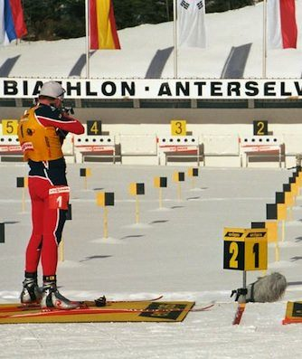
출처: “Biathlon-Weltcup 2006 Antholz 1” by Götz A. Primke from Muenchen, Germany – Biathlon_WC_Antholz_2006_01_Film3_MassenDamen_13. Licensed under Creative Commons Attribution-Share Alike 2.0 via Wikimedia Commons

팀으로 모두가 할 수 있다면 어떤 방식으로든지 도와야 한다.
오늘 카렐은 바이애슬론 선수를 자원봉사한다.
선수들이 사격장에 지쳐 도착했지만, 아드레날린은 충만해서, 공에 들어 있는 목표물 5개를 쏴야만 한다.
카렐의 임무는 눕혀진 목표물을 교체하고, 바닥에 떨어진 목표물을 모아오는 것이다.

카렐은 가방에 목표물을 5개 가지고 작업임무를 시작한다.
물론, 어떤 목표물을 교체할지, 어떤 목표물이 눕혀졌는지 알 수가 없다.
그래서, 프로그램을 작성해서 어떤 연습결과든지 처리할 수 있게 만든다.
작업을 완료한 후에, 카렐은 정사각형 집에 되돌아 와야하고, 
다음 선수가 사격하길 준비한다.

해답: [보여주기](http://codeperspectives.com/reeborg-dev/world.html?proglang=python-en&world=%7B%22robots%22%3A%5B%7B%22x%22%3A2%2C%22y%22%3A9%2C%22tokens%22%3A5%2C%22orientation%22%3A0%2C%22_prev_x%22%3A2%2C%22_prev_y%22%3A9%2C%22_prev_orientation%22%3A0%2C%22start_positions%22%3A%5B%5B2%2C9%5D%5D%7D%5D%2C%22large_world%22%3Afalse%2C%22walls%22%3A%7B%224%2C7%22%3A%5B%22north%22%5D%2C%224%2C8%22%3A%5B%22east%22%5D%2C%223%2C8%22%3A%5B%22east%22%5D%2C%225%2C8%22%3A%5B%22east%22%5D%2C%226%2C7%22%3A%5B%22north%22%5D%2C%226%2C8%22%3A%5B%22east%22%5D%2C%227%2C8%22%3A%5B%22east%22%5D%2C%228%2C7%22%3A%5B%22north%22%5D%2C%228%2C8%22%3A%5B%22east%22%5D%2C%229%2C8%22%3A%5B%22east%22%5D%2C%2210%2C7%22%3A%5B%22north%22%5D%2C%2210%2C8%22%3A%5B%22east%22%5D%2C%2211%2C8%22%3A%5B%22east%22%5D%2C%2212%2C7%22%3A%5B%22north%22%5D%2C%2212%2C8%22%3A%5B%22east%22%5D%7D%2C%22goal%22%3A%7B%22position%22%3A%7B%22x%22%3A2%2C%22y%22%3A9%7D%2C%22possible_positions%22%3A%5B%5B2%2C9%5D%5D%2C%22orientation%22%3A0%2C%22tokens%22%3A%7B%224%2C8%22%3A1%2C%226%2C8%22%3A1%2C%228%2C8%22%3A1%2C%2210%2C8%22%3A1%2C%2212%2C8%22%3A1%7D%7D%2C%22tokens%22%3A%7B%226%2C8%22%3A0%2C%224%2C7%22%3A0%2C%228%2C8%22%3A0%2C%2210%2C7%22%3A0%2C%2212%2C8%22%3A0%2C%224%2C8%22%3A0%2C%2210%2C8%22%3A0%2C%2212%2C7%22%3A0%2C%228%2C7%22%3A0%2C%226%2C7%22%3A0%7D%2C%22min_tokens%22%3A%7B%224%2C8%22%3A0%2C%226%2C8%22%3A0%2C%228%2C8%22%3A0%2C%2210%2C8%22%3A0%2C%2212%2C8%22%3A0%2C%2212%2C7%22%3A0%2C%2210%2C7%22%3A0%2C%228%2C7%22%3A0%2C%226%2C7%22%3A0%2C%224%2C7%22%3A0%7D%2C%22max_tokens%22%3A%7B%224%2C8%22%3A1%2C%226%2C8%22%3A1%2C%228%2C8%22%3A1%2C%2210%2C8%22%3A1%2C%2212%2C8%22%3A1%2C%2212%2C7%22%3A1%2C%2210%2C7%22%3A1%2C%228%2C7%22%3A1%2C%226%2C7%22%3A1%2C%224%2C7%22%3A1%7D%2C%22tokens_range%22%3A%7B%224%2C8%22%3A%220-1%22%2C%226%2C8%22%3A%220-1%22%2C%228%2C8%22%3A%220-1%22%2C%2210%2C8%22%3A%220-1%22%2C%2212%2C8%22%3A%220-1%22%2C%2212%2C7%22%3A%220-1%22%2C%2210%2C7%22%3A%220-1%22%2C%228%2C7%22%3A%220-1%22%2C%226%2C7%22%3A%220-1%22%2C%224%2C7%22%3A%220-1%22%7D%7D&editor=%23%204-2%20Biathlon%0Afrom%20my_lib%20import%20*%0A%0Adef%20put_new_target()%3A%0A%20%20%20%20move()%0A%20%20%20%20sidestep_right()%0A%20%20%20%20if%20cell_is_empty()%3A%0A%20%20%20%20%20%20%20%20put()%0A%20%20%20%20sidestep_left()%0A%20%20%20%20move()%0A%0Adef%20take_knocked_down_target()%3A%0A%20%20%20%20move()%0A%20%20%20%20safe_take()%0A%20%20%20%20move()%0A%20%20%20%20%0Adef%20switch_rows()%3A%0A%20%20%20%20right()%0A%20%20%20%20repeat(%20move%2C%202%20)%0A%20%20%20%20right()%0A%20%20%20%20%0A%23main%20program%0Amove()%0Arepeat(%20put_new_target%2C%205%20)%0Aswitch_rows()%0Arepeat(%20take_knocked_down_target%2C%205%20)%0Amove()%0Aswitch_rows()%0Asay(%20%22All%20done%22%20)&library=%23%20%27from%20my_lib%20import%20*%27%20in%20Python%20Code%20is%20required%20to%20use%0A%23%20the%20code%20in%20this%20library.%20%0A%0Asound(True)%0A%0Adef%20left()%3A%0A%20%20%20%20turn_left()%0A%20%20%20%20%0Adef%20right()%3A%0A%20%20%20%20repeat(%20left%2C%203%20)%0A%20%20%20%20%0Adef%20turn_around()%3A%0A%20%20%20%20repeat(%20left%2C%202%20)%0A%20%20%20%20%0Adef%20sidestep_left()%3A%0A%20%20%20%20left()%0A%20%20%20%20move()%0A%20%20%20%20right()%0A%20%20%20%20%0Adef%20sidestep_right()%3A%0A%20%20%20%20right()%0A%20%20%20%20move()%0A%20%20%20%20left()%0A%20%20%20%20%0Adef%20safe_take()%3A%0A%20%20%20%20if%20token_here()%3A%0A%20%20%20%20%20%20%20%20take()%0A%20%20%20%20%20%20%20%20%0Adef%20safe_put()%3A%0A%20%20%20%20if%20has_token()%3A%0A%20%20%20%20%20%20%20%20put()%0A%20%20%20%20%0Adef%20safe_move()%3A%0A%20%20%20%20if%20front_is_clear()%3A%0A%20%20%20%20%20%20%20%20move()%0A%0A%23%20sensing%20functions%0A%0Adef%20wall_in_front()%3A%0A%20%20%20%20return%20not%20front_is_clear()%0A%0Adef%20cell_is_empty()%3A%0A%20%20%20%20return%20not%20token_here()%0A%0Adef%20bag_is_empty()%3A%0A%20%20%20%20return%20not%20has_token())

| 출발전... | 종료후 ... |
|---------------------------------|---------------------------------|---------------------------------|
| 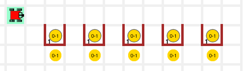 | 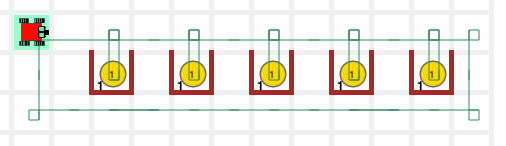 |

**힌트:**

라이브러리에서 `safe_take()` 함수를 사용한다.

#### 5학년: 남가주(SoCal) 생활 - 우주 발사대

[학생 교안](http://codeperspectives.com/reeborg-dev/world.html?proglang=python-en&world=%7B%22robots%22%3A%5B%7B%22x%22%3A6%2C%22y%22%3A2%2C%22tokens%22%3A16%2C%22orientation%22%3A1%2C%22_prev_x%22%3A6%2C%22_prev_y%22%3A2%2C%22_prev_orientation%22%3A1%2C%22start_positions%22%3A%5B%5B6%2C2%5D%5D%7D%5D%2C%22walls%22%3A%7B%224%2C5%22%3A%5B%22east%22%5D%2C%224%2C6%22%3A%5B%22east%22%5D%2C%224%2C7%22%3A%5B%22east%22%5D%2C%224%2C8%22%3A%5B%22east%22%5D%2C%224%2C9%22%3A%5B%22east%22%5D%2C%224%2C10%22%3A%5B%22east%22%5D%2C%225%2C11%22%3A%5B%22east%22%5D%2C%226%2C11%22%3A%5B%22east%22%2C%22north%22%5D%2C%227%2C10%22%3A%5B%22north%22%2C%22east%22%5D%2C%227%2C9%22%3A%5B%22east%22%2C%22north%22%5D%2C%227%2C8%22%3A%5B%22east%22%2C%22north%22%5D%2C%227%2C7%22%3A%5B%22east%22%2C%22north%22%5D%2C%227%2C6%22%3A%5B%22east%22%2C%22north%22%5D%2C%227%2C5%22%3A%5B%22east%22%2C%22north%22%5D%2C%225%2C2%22%3A%5B%22north%22%5D%2C%227%2C2%22%3A%5B%22north%22%5D%2C%225%2C10%22%3A%5B%22north%22%5D%2C%227%2C3%22%3A%5B%22north%22%2C%22east%22%5D%2C%227%2C4%22%3A%5B%22north%22%2C%22east%22%5D%2C%224%2C3%22%3A%5B%22east%22%5D%2C%224%2C4%22%3A%5B%22east%22%5D%2C%225%2C3%22%3A%5B%22north%22%5D%2C%225%2C4%22%3A%5B%22north%22%5D%2C%225%2C5%22%3A%5B%22north%22%5D%2C%225%2C6%22%3A%5B%22north%22%5D%2C%225%2C7%22%3A%5B%22north%22%5D%2C%225%2C8%22%3A%5B%22north%22%5D%2C%225%2C9%22%3A%5B%22north%22%5D%7D%2C%22other%22%3A%7B%22mud%22%3A%5B%223%2C2%22%2C%223%2C3%22%2C%224%2C3%22%2C%224%2C4%22%2C%228%2C3%22%2C%229%2C2%22%2C%229%2C3%22%2C%228%2C4%22%5D%7D%2C%22goal%22%3A%7B%22possible_positions%22%3A%5B%5B6%2C11%5D%5D%2C%22position%22%3A%7B%22x%22%3A6%2C%22y%22%3A11%7D%2C%22orientation%22%3A1%7D%2C%22tokens%22%3A%7B%225%2C10%22%3A0%2C%227%2C10%22%3A0%2C%225%2C9%22%3A0%2C%227%2C9%22%3A0%2C%225%2C8%22%3A0%2C%227%2C8%22%3A0%2C%225%2C7%22%3A0%2C%227%2C7%22%3A0%2C%225%2C6%22%3A0%2C%227%2C6%22%3A0%2C%225%2C5%22%3A0%2C%227%2C5%22%3A0%2C%225%2C4%22%3A0%2C%227%2C4%22%3A0%2C%225%2C3%22%3A0%2C%227%2C3%22%3A0%7D%2C%22min_tokens%22%3A%7B%225%2C10%22%3A0%2C%227%2C10%22%3A0%2C%225%2C9%22%3A0%2C%227%2C9%22%3A0%2C%225%2C8%22%3A0%2C%227%2C8%22%3A0%2C%225%2C7%22%3A0%2C%227%2C7%22%3A0%2C%225%2C6%22%3A0%2C%227%2C6%22%3A0%2C%225%2C5%22%3A0%2C%227%2C5%22%3A0%2C%225%2C4%22%3A0%2C%227%2C4%22%3A0%2C%225%2C3%22%3A0%2C%227%2C3%22%3A0%7D%2C%22max_tokens%22%3A%7B%225%2C10%22%3A2%2C%227%2C10%22%3A2%2C%225%2C9%22%3A2%2C%227%2C9%22%3A2%2C%225%2C8%22%3A2%2C%227%2C8%22%3A2%2C%225%2C7%22%3A2%2C%227%2C7%22%3A2%2C%225%2C6%22%3A2%2C%227%2C6%22%3A2%2C%225%2C5%22%3A2%2C%227%2C5%22%3A2%2C%225%2C4%22%3A2%2C%227%2C4%22%3A2%2C%225%2C3%22%3A2%2C%227%2C3%22%3A2%7D%2C%22tokens_range%22%3A%7B%225%2C10%22%3A%220-2%22%2C%227%2C10%22%3A%220-2%22%2C%225%2C9%22%3A%220-2%22%2C%227%2C9%22%3A%220-2%22%2C%225%2C8%22%3A%220-2%22%2C%227%2C8%22%3A%220-2%22%2C%225%2C7%22%3A%220-2%22%2C%227%2C7%22%3A%220-2%22%2C%225%2C6%22%3A%220-2%22%2C%227%2C6%22%3A%220-2%22%2C%225%2C5%22%3A%220-2%22%2C%227%2C5%22%3A%220-2%22%2C%225%2C4%22%3A%220-2%22%2C%227%2C4%22%3A%220-2%22%2C%225%2C3%22%3A%220-2%22%2C%227%2C3%22%3A%220-2%22%7D%7D&editor=%23%20launch%20pad&library=%23%20%27from%20my_lib%20import%20*%27%20in%20Python%20Code%20is%20required%20to%20use%0A%23%20the%20code%20in%20this%20library.%20%0A%0Asound(True)%0A%0Adef%20left()%3A%0A%20%20%20%20turn_left()%0A%20%20%20%20%0Adef%20right()%3A%0A%20%20%20%20repeat(%20left%2C%203%20)%0A%20%20%20%20%0Adef%20turn_around()%3A%0A%20%20%20%20repeat(%20left%2C%202%20)%0A%20%20%20%20%0Adef%20sidestep_left()%3A%0A%20%20%20%20left()%0A%20%20%20%20move()%0A%20%20%20%20right()%0A%20%20%20%20%0Adef%20sidestep_right()%3A%0A%20%20%20%20right()%0A%20%20%20%20move()%0A%20%20%20%20left()%0A%20%20%20%20%0Adef%20safe_take()%3A%0A%20%20%20%20if%20token_here()%3A%0A%20%20%20%20%20%20%20%20take()%0A%20%20%20%20%20%20%20%20%0Adef%20safe_put()%3A%0A%20%20%20%20if%20has_token()%3A%0A%20%20%20%20%20%20%20%20put()%0A%20%20%20%20%0Adef%20safe_move()%3A%0A%20%20%20%20if%20front_is_clear()%3A%0A%20%20%20%20%20%20%20%20move()%0A%0A%23%20sensing%20functions%0A%0Adef%20wall_in_front()%3A%0A%20%20%20%20return%20not%20front_is_clear()%0A%0Adef%20cell_is_empty()%3A%0A%20%20%20%20return%20not%20token_here()%0A%0Adef%20bag_is_empty()%3A%0A%20%20%20%20return%20not%20has_token())

카렐은 우주비행사가 되는 꿈을 계속 꾸고 있다.
오늘 발사 기술을 훈련한다.
로켓 발사를 준비하려면, `균형있게 하중을 맞춰야` 한다. 
즉, 각 객실마다 토큰이 하나씩 있어서 로켓 양쪽에 동일한 중량이 나가도록 균형 잡는다.
그리고 나서, 조종실로 가서, "발사!" 메시지로 모든 준비가 완료되었음을 알린다.
카렐은 가방에 토큰 16개로 작업임무를 착수한다.

| 출발전... | 종료후 ... |
|---------------------------------|---------------------------------|---------------------------------|
| 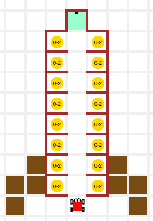 | 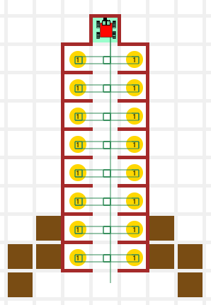 |

해답: [보여주기](http://codeperspectives.com/reeborg-dev/world.html?proglang=python-en&world=%7B%22robots%22%3A%5B%7B%22x%22%3A6%2C%22y%22%3A2%2C%22tokens%22%3A16%2C%22orientation%22%3A1%2C%22_prev_x%22%3A6%2C%22_prev_y%22%3A2%2C%22_prev_orientation%22%3A1%2C%22start_positions%22%3A%5B%5B6%2C2%5D%5D%7D%5D%2C%22walls%22%3A%7B%224%2C5%22%3A%5B%22east%22%5D%2C%224%2C6%22%3A%5B%22east%22%5D%2C%224%2C7%22%3A%5B%22east%22%5D%2C%224%2C8%22%3A%5B%22east%22%5D%2C%224%2C9%22%3A%5B%22east%22%5D%2C%224%2C10%22%3A%5B%22east%22%5D%2C%225%2C11%22%3A%5B%22east%22%5D%2C%226%2C11%22%3A%5B%22east%22%2C%22north%22%5D%2C%227%2C10%22%3A%5B%22north%22%2C%22east%22%5D%2C%227%2C9%22%3A%5B%22east%22%2C%22north%22%5D%2C%227%2C8%22%3A%5B%22east%22%2C%22north%22%5D%2C%227%2C7%22%3A%5B%22east%22%2C%22north%22%5D%2C%227%2C6%22%3A%5B%22east%22%2C%22north%22%5D%2C%227%2C5%22%3A%5B%22east%22%2C%22north%22%5D%2C%225%2C2%22%3A%5B%22north%22%5D%2C%227%2C2%22%3A%5B%22north%22%5D%2C%225%2C10%22%3A%5B%22north%22%5D%2C%227%2C3%22%3A%5B%22north%22%2C%22east%22%5D%2C%227%2C4%22%3A%5B%22north%22%2C%22east%22%5D%2C%224%2C3%22%3A%5B%22east%22%5D%2C%224%2C4%22%3A%5B%22east%22%5D%2C%225%2C3%22%3A%5B%22north%22%5D%2C%225%2C4%22%3A%5B%22north%22%5D%2C%225%2C5%22%3A%5B%22north%22%5D%2C%225%2C6%22%3A%5B%22north%22%5D%2C%225%2C7%22%3A%5B%22north%22%5D%2C%225%2C8%22%3A%5B%22north%22%5D%2C%225%2C9%22%3A%5B%22north%22%5D%7D%2C%22other%22%3A%7B%22mud%22%3A%5B%223%2C2%22%2C%223%2C3%22%2C%224%2C3%22%2C%224%2C4%22%2C%228%2C3%22%2C%229%2C2%22%2C%229%2C3%22%2C%228%2C4%22%5D%7D%2C%22goal%22%3A%7B%22possible_positions%22%3A%5B%5B6%2C11%5D%5D%2C%22position%22%3A%7B%22x%22%3A6%2C%22y%22%3A11%7D%2C%22orientation%22%3A1%7D%2C%22tokens%22%3A%7B%225%2C10%22%3A0%2C%227%2C10%22%3A0%2C%225%2C9%22%3A0%2C%227%2C9%22%3A0%2C%225%2C8%22%3A0%2C%227%2C8%22%3A0%2C%225%2C7%22%3A0%2C%227%2C7%22%3A0%2C%225%2C6%22%3A0%2C%227%2C6%22%3A0%2C%225%2C5%22%3A0%2C%227%2C5%22%3A0%2C%225%2C4%22%3A0%2C%227%2C4%22%3A0%2C%225%2C3%22%3A0%2C%227%2C3%22%3A0%7D%2C%22min_tokens%22%3A%7B%225%2C10%22%3A0%2C%227%2C10%22%3A0%2C%225%2C9%22%3A0%2C%227%2C9%22%3A0%2C%225%2C8%22%3A0%2C%227%2C8%22%3A0%2C%225%2C7%22%3A0%2C%227%2C7%22%3A0%2C%225%2C6%22%3A0%2C%227%2C6%22%3A0%2C%225%2C5%22%3A0%2C%227%2C5%22%3A0%2C%225%2C4%22%3A0%2C%227%2C4%22%3A0%2C%225%2C3%22%3A0%2C%227%2C3%22%3A0%7D%2C%22max_tokens%22%3A%7B%225%2C10%22%3A2%2C%227%2C10%22%3A2%2C%225%2C9%22%3A2%2C%227%2C9%22%3A2%2C%225%2C8%22%3A2%2C%227%2C8%22%3A2%2C%225%2C7%22%3A2%2C%227%2C7%22%3A2%2C%225%2C6%22%3A2%2C%227%2C6%22%3A2%2C%225%2C5%22%3A2%2C%227%2C5%22%3A2%2C%225%2C4%22%3A2%2C%227%2C4%22%3A2%2C%225%2C3%22%3A2%2C%227%2C3%22%3A2%7D%2C%22tokens_range%22%3A%7B%225%2C10%22%3A%220-2%22%2C%227%2C10%22%3A%220-2%22%2C%225%2C9%22%3A%220-2%22%2C%227%2C9%22%3A%220-2%22%2C%225%2C8%22%3A%220-2%22%2C%227%2C8%22%3A%220-2%22%2C%225%2C7%22%3A%220-2%22%2C%227%2C7%22%3A%220-2%22%2C%225%2C6%22%3A%220-2%22%2C%227%2C6%22%3A%220-2%22%2C%225%2C5%22%3A%220-2%22%2C%227%2C5%22%3A%220-2%22%2C%225%2C4%22%3A%220-2%22%2C%227%2C4%22%3A%220-2%22%2C%225%2C3%22%3A%220-2%22%2C%227%2C3%22%3A%220-2%22%7D%7D&editor=%23%20launch%20pad%0Afrom%20my_lib%20import%20*%0A%0Athink(10)%0A%0Adef%20fix_cell()%3A%0A%20%20%20%20repeat(%20safe_take%2C%202)%20%20%23%20take%20up%20to%20two%20tokens%0A%20%20%20%20put()%20%20%20%20%20%20%20%20%20%20%20%20%20%20%20%20%20%20%23%20put%20one%20token%20back%0A%0Adef%20arrange_row()%3A%0A%20%20%20%20move()%0A%20%20%20%20sidestep_left()%0A%20%20%20%20fix_cell()%0A%20%20%20%20repeat(%20sidestep_right%2C%202%20)%0A%20%20%20%20fix_cell()%0A%20%20%20%20sidestep_left()%0A%0A%23%20main%0Arepeat(%20arrange_row%2C%208%20)%0Amove()%0Asay(%20%22Blast%20off!%22%20)&library=%23%20%27from%20my_lib%20import%20*%27%20in%20Python%20Code%20is%20required%20to%20use%0A%23%20the%20code%20in%20this%20library.%20%0A%0Asound(True)%0A%0Adef%20left()%3A%0A%20%20%20%20turn_left()%0A%20%20%20%20%0Adef%20right()%3A%0A%20%20%20%20repeat(%20left%2C%203%20)%0A%20%20%20%20%0Adef%20turn_around()%3A%0A%20%20%20%20repeat(%20left%2C%202%20)%0A%20%20%20%20%0Adef%20sidestep_left()%3A%0A%20%20%20%20left()%0A%20%20%20%20move()%0A%20%20%20%20right()%0A%20%20%20%20%0Adef%20sidestep_right()%3A%0A%20%20%20%20right()%0A%20%20%20%20move()%0A%20%20%20%20left()%0A%20%20%20%20%0Adef%20safe_take()%3A%0A%20%20%20%20if%20token_here()%3A%0A%20%20%20%20%20%20%20%20take()%0A%20%20%20%20%20%20%20%20%0Adef%20safe_put()%3A%0A%20%20%20%20if%20has_token()%3A%0A%20%20%20%20%20%20%20%20put()%0A%20%20%20%20%0Adef%20safe_move()%3A%0A%20%20%20%20if%20front_is_clear()%3A%0A%20%20%20%20%20%20%20%20move()%0A%0A%23%20sensing%20functions%0A%0Adef%20wall_in_front()%3A%0A%20%20%20%20return%20not%20front_is_clear()%0A%0Adef%20cell_is_empty()%3A%0A%20%20%20%20return%20not%20token_here()%0A%0Adef%20bag_is_empty()%3A%0A%20%20%20%20return%20not%20has_token())

#### 6학년: 남가주(SoCal) 생활 - 우주 착륙장

[학생 교안](http://codeperspectives.com/reeborg-dev/world.html?proglang=python-en&world=%7B%22robots%22%3A%5B%7B%22x%22%3A6%2C%22y%22%3A4%2C%22tokens%22%3A%22infinite%22%2C%22orientation%22%3A-1%2C%22_prev_x%22%3A6%2C%22_prev_y%22%3A4%2C%22_prev_orientation%22%3A-1%2C%22start_positions%22%3A%5B%5B6%2C8%5D%2C%5B4%2C6%5D%2C%5B8%2C6%5D%2C%5B6%2C4%5D%5D%7D%5D%2C%22walls%22%3A%7B%226%2C8%22%3A%5B%22north%22%2C%22east%22%5D%2C%228%2C6%22%3A%5B%22north%22%5D%2C%228%2C5%22%3A%5B%22north%22%5D%2C%225%2C4%22%3A%5B%22east%22%5D%2C%226%2C3%22%3A%5B%22north%22%5D%2C%224%2C6%22%3A%5B%22north%22%5D%2C%223%2C6%22%3A%5B%22east%22%5D%7D%2C%22goal%22%3A%7B%22possible_positions%22%3A%5B%5B6%2C6%5D%5D%2C%22position%22%3A%7B%22x%22%3A6%2C%22y%22%3A6%7D%7D%7D&editor=%23%204-4%20landing%20pad%0Afrom%20my_lib%20import%20*&library=%23%20%27from%20my_lib%20import%20*%27%20in%20Python%20Code%20is%20required%20to%20use%0A%23%20the%20code%20in%20this%20library.%20%0A%0Asound(True)%0A%0Adef%20left()%3A%0A%20%20%20%20turn_left()%0A%20%20%20%20%0Adef%20right()%3A%0A%20%20%20%20repeat(%20left%2C%203%20)%0A%20%20%20%20%0Adef%20turn_around()%3A%0A%20%20%20%20repeat(%20left%2C%202%20)%0A%20%20%20%20%0Adef%20sidestep_left()%3A%0A%20%20%20%20left()%0A%20%20%20%20move()%0A%20%20%20%20right()%0A%20%20%20%20%0Adef%20sidestep_right()%3A%0A%20%20%20%20right()%0A%20%20%20%20move()%0A%20%20%20%20left()%0A%20%20%20%20%0Adef%20safe_take()%3A%0A%20%20%20%20if%20token_here()%3A%0A%20%20%20%20%20%20%20%20take()%0A%20%20%20%20%20%20%20%20%0Adef%20safe_put()%3A%0A%20%20%20%20if%20has_token()%3A%0A%20%20%20%20%20%20%20%20put()%0A%20%20%20%20%0Adef%20safe_move()%3A%0A%20%20%20%20if%20front_is_clear()%3A%0A%20%20%20%20%20%20%20%20move()%0A%0A%23%20sensing%20functions%0A%0Adef%20wall_in_front()%3A%0A%20%20%20%20return%20not%20front_is_clear()%0A%0Adef%20cell_is_empty()%3A%0A%20%20%20%20return%20not%20token_here()%0A%0Adef%20bag_is_empty()%3A%0A%20%20%20%20return%20not%20has_token())

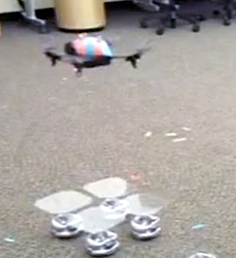

카렐은 우주비행사가 되는 꿈을 계속 꾸고 있다.
성공적인 우주발사 작전임무를 완수한 후에, 
이제 우주로켓을 착륙시킬 수 있음을 보여야만 된다.
가능한 4개 우주착륙장에 임의 방향을 향해 착륙한다.
사전에 인지하고 있는 벽이 배열된 정보를 활용해서,
정사각형 집에 대해서, 카렐이 어느 위치에 있는 파악해야 하고,
집으로 이동해야 된다.

| 출발전... | 종료후 ... |
|---------------------------------|---------------------------------|---------------------------------|
| 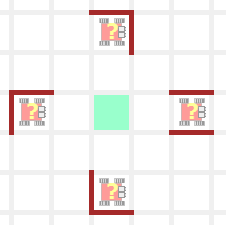 | 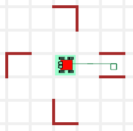 |

해답: [보여주기](http://codeperspectives.com/reeborg-dev/world.html?proglang=python-en&world=%7B%22robots%22%3A%5B%7B%22x%22%3A6%2C%22y%22%3A4%2C%22tokens%22%3A%22infinite%22%2C%22orientation%22%3A-1%2C%22_prev_x%22%3A6%2C%22_prev_y%22%3A4%2C%22_prev_orientation%22%3A-1%2C%22start_positions%22%3A%5B%5B6%2C8%5D%2C%5B4%2C6%5D%2C%5B8%2C6%5D%2C%5B6%2C4%5D%5D%7D%5D%2C%22walls%22%3A%7B%226%2C8%22%3A%5B%22north%22%2C%22east%22%5D%2C%228%2C6%22%3A%5B%22north%22%5D%2C%228%2C5%22%3A%5B%22north%22%5D%2C%225%2C4%22%3A%5B%22east%22%5D%2C%226%2C3%22%3A%5B%22north%22%5D%2C%224%2C6%22%3A%5B%22north%22%5D%2C%223%2C6%22%3A%5B%22east%22%5D%7D%2C%22goal%22%3A%7B%22possible_positions%22%3A%5B%5B6%2C6%5D%5D%2C%22position%22%3A%7B%22x%22%3A6%2C%22y%22%3A6%7D%7D%7D&editor=%23%204-4%20landing%20pad%0Afrom%20my_lib%20import%20*%0A%0Adef%20face_north()%3A%0A%20%20%20%20if%20not%20is_facing_north()%3A%0A%20%20%20%20%20%20%20%20left()%0A%20%20%20%20if%20not%20is_facing_north()%3A%0A%20%20%20%20%20%20%20%20left()%0A%20%20%20%20if%20not%20is_facing_north()%3A%0A%20%20%20%20%20%20%20%20left()%0A%0Adef%20face_home()%3A%0A%20%20%20%20if%20front_is_clear()%3A%20%23we%20are%20south%0A%20%20%20%20%20%20%20%20return%0A%20%20%20%20%0A%20%20%20%20left()%20%20%20%20%20%20%20%20%20%20%20%20%20%23%20face%20east%0A%20%20%20%20if%20wall_in_front()%3A%20%23%20we%20are%20west%0A%20%20%20%20%20%20%20%20turn_around()%0A%20%20%20%20%20%20%20%20return%0A%20%20%20%20%0A%20%20%20%20left()%20%20%20%20%20%20%20%20%20%20%20%20%20%20%23%20face%20south%0A%20%20%20%20if%20wall_in_front()%3A%20%23%20we%20are%20east%0A%20%20%20%20%20%20%20%20right()%0A%20%20%20%20%20%20%20%20return%0A%20%20%20%0A%23%20main%20program%0Aface_north()%0Aface_home()%0Arepeat(%20move%2C%202%20)%0Asay(%20%22I%20am%20home%22%20)&library=%23%20%27from%20my_lib%20import%20*%27%20in%20Python%20Code%20is%20required%20to%20use%0A%23%20the%20code%20in%20this%20library.%20%0A%0Asound(True)%0A%0Adef%20left()%3A%0A%20%20%20%20turn_left()%0A%20%20%20%20%0Adef%20right()%3A%0A%20%20%20%20repeat(%20left%2C%203%20)%0A%20%20%20%20%0Adef%20turn_around()%3A%0A%20%20%20%20repeat(%20left%2C%202%20)%0A%20%20%20%20%0Adef%20sidestep_left()%3A%0A%20%20%20%20left()%0A%20%20%20%20move()%0A%20%20%20%20right()%0A%20%20%20%20%0Adef%20sidestep_right()%3A%0A%20%20%20%20right()%0A%20%20%20%20move()%0A%20%20%20%20left()%0A%20%20%20%20%0Adef%20safe_take()%3A%0A%20%20%20%20if%20token_here()%3A%0A%20%20%20%20%20%20%20%20take()%0A%20%20%20%20%20%20%20%20%0Adef%20safe_put()%3A%0A%20%20%20%20if%20has_token()%3A%0A%20%20%20%20%20%20%20%20put()%0A%20%20%20%20%0Adef%20safe_move()%3A%0A%20%20%20%20if%20front_is_clear()%3A%0A%20%20%20%20%20%20%20%20move()%0A%0A%23%20sensing%20functions%0A%0Adef%20wall_in_front()%3A%0A%20%20%20%20return%20not%20front_is_clear()%0A%0Adef%20cell_is_empty()%3A%0A%20%20%20%20return%20not%20token_here()%0A%0Adef%20bag_is_empty()%3A%0A%20%20%20%20return%20not%20has_token())

**힌트:**

감각인지 함수를 사용한다.  `is_facing_north()` 함수는 카렐이 북쪽을 향하게 한다.
그리고 나서, 벽 배치정보를 활용해서 카렐이 위치한 우주착륙장을 식별한다.

