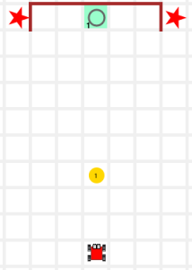
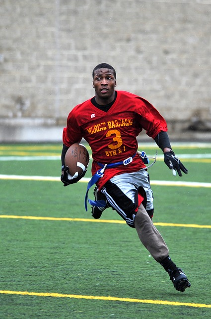

> "천문학이 망원경에 관한 것이 아니듯이, 컴퓨터 과학은 컴퓨터에 관한 것이 아니다."  
>
> "Computer Science is no more about computers than astronomy is about telescopes"  
> --- Edsger Dijkstra

### 사용자 정의 함수

사용자 정의 함수(custom function)는 프로그램 속 '나중에' 호출해서 사용할 작은 프로그램이다. 이러한 작은 프로그램을 사용해서 문제를 독립된 부분조각으로 쪼갤 수 있다.

나중에 여러분이 호출할 때까지 파이썬은 함수를 무시한다.
여러분이 함수를 호출할 때, 파이썬은 그제서야 함수 정의를 찾아서 순서에 맞춰 명령어를 실행한다; 함수에 있는 모든 명령어가 실행되면, 함수를 호출한 명령어로 파이썬이 되돌린다.

파이썬은 함수에 속한 명령어를 인식할 수 있는데, 이유는 오른쪽으로 4칸 들여쓰기 했기 때문이다. 함수는 다음과 같이 정의한다:

~~~ {.python}
def foo( ):       # 함수명 'foo'를 정의한다.
    command_1     # 함수 몸통을 시작한다.
    command_2     # 파이썬에서 함수 몸통 명령어는 4칸 들여쓰기 한다.
    ....
    command_n     # 함수 몸통의 끝
 
foo()             # foo() 함수를 호출한다.
~~~

함수는 프로그래밍에서 학습하게 되는 가장 중요한 단일 개념이다. 
함수를 작성할 때, 핵심이 되는 사항은 다음과 같다:

- 작성한 함수는 한가지 작업만 한다.
- 함수를 짧게 작성한다.
- 유의미하게 함수명을 작명한다.
- 작성한 모든 함수 길이는 대략 동일하게 유지한다.

### 별명(Aliases)

단순하게 함수명을 다시 이름 지으면, 다른 함수에 대한 별명이 된다. 예를 들어, 라이브러리에, `turn_left()` 내장함수에 대한 별명으로 `left()`가 있다.

~~~ {.python}
def left():          #  left() 가 호출될 때...
    turn_left()      # left()는 순서대로 turn_left()를 호출한다.
~~~

`left()`는 `turn_left()`에 대한 별명으로... 둘은 정확하게 동일한 작업을 수행한다.
별명을 사용해서 함수명을 줄이거나, 명확히 하거나, 다른 언어로 변역하는데 사용한다.

###  문제 해결에 대한 하향식 접근법

이번 학습의 목적은 문제를 조각으로 쪼개서 문제를 학습하는 방법을 배운다. 이번 단계에서, 문제 해결에 대한 접근방법은 다음과 같다:

1. 문제가 무엇인지 이해한다: 어떤 작업을 수행하는가에 대한 정확한 이해를 하기 전에 프로그램을 바로 작성하러 달려가지 않는다.
1. 문제를 체계적으로 표현한다: 서로 독립이 되는 문제 조각을 식별해 낸다.
1. 패턴을 찾아낸다: 패턴이 있다면, 패턴 시작과 끝을 식별해 낸다.
1. 구현한다: 문제에 대한 독립된 부분을 쭉 연결해서 프로그램을 작성해 나간다. 코드는 영어로 작문한 것과 같아야 된다.
1. 기존에 존재하는 함수(즉, 내장 혹은 라이브러리 함수)로, 각각에 대한 해결책을 표현할 때까지, 작성한 함수 각각에 대해 이런 과정을 반복한다.

### 라이브러리 새함수

라이브러리에 이제 함수 두개가 추가되었다:

~~~ {.python}
sidestep_right()  # 최초 방향을 유지하며 오른쪽 셀로 이동
sidestep_left()   # 최초 방향을 유지하며 왼쪽 셀로 이동
~~~

### 훈련 작업임무

#### 남가주(SoCal) 생활 - 터치다운

[학생 교안](http://codeperspectives.com/reeborg-dev/world.html?proglang=python-en&world=%7B%22robots%22%3A%5B%7B%22x%22%3A7%2C%22y%22%3A2%2C%22tokens%22%3A0%2C%22orientation%22%3A1%2C%22_prev_x%22%3A7%2C%22_prev_y%22%3A2%2C%22_prev_orientation%22%3A1%7D%5D%2C%22tokens%22%3A%7B%227%2C5%22%3A1%7D%2C%22walls%22%3A%7B%226%2C11%22%3A%5B%22north%22%5D%2C%227%2C11%22%3A%5B%22north%22%5D%2C%228%2C11%22%3A%5B%22north%22%5D%2C%229%2C11%22%3A%5B%22north%22%2C%22east%22%5D%2C%225%2C11%22%3A%5B%22north%22%5D%2C%224%2C11%22%3A%5B%22east%22%5D%7D%2C%22shapes%22%3A%7B%224%2C11%22%3A%22star%22%2C%2210%2C11%22%3A%22star%22%7D%2C%22goal%22%3A%7B%22position%22%3A%7B%22x%22%3A7%2C%22y%22%3A11%7D%2C%22tokens%22%3A%7B%227%2C11%22%3A1%7D%7D%7D&editor=%23%20single%20file%0A%23%20pick%20up%20the%20football%20and%20score%20a%20touchdown&library=%23%20%27from%20my_lib%20import%20*%27%20in%20Python%20Code%20is%20required%20to%20use%0A%23%20the%20code%20in%20this%20library.%20%0A%0Asound(True)%20%20%20%20%23%20turn%20sound%20effects%20on%0A%0Adef%20left()%3A%0A%20%20%20%20turn_left()%0A%20%20%20%20%0Adef%20turn_around()%3A%0A%20%20%20%20repeat(turn_left%2C%202)%0A%20%20%20%20%0Adef%20right()%3A%0A%20%20%20%20repeat(turn_left%2C%203)%0A%20%20%20%20%0Adef%20sidestep_right()%3A%0A%20%20%20%20right()%0A%20%20%20%20move()%0A%20%20%20%20left()%0A%20%20%20%20%0Adef%20sidestep_left()%3A%0A%20%20%20%20left()%0A%20%20%20%20move()%0A%20%20%20%20right())

이번 작업임무에서, 독립적인 조작으로 문제를 쪼개는데 함수를 사용한다.

카렐이 공을 집어 들고 터치다운을 해야 한다. 작성해 본다! 

| 출발전 - 준비 | 종료후 - 터치다운|   |
|---------------------------------|---------------------------------|---------------------------------|
|  |  |  |

해답: [보여주기](http://codeperspectives.com/reeborg-dev/world.html?proglang=python-en&world=%7B%22robots%22%3A%5B%7B%22x%22%3A7%2C%22y%22%3A2%2C%22tokens%22%3A0%2C%22orientation%22%3A1%2C%22_prev_x%22%3A7%2C%22_prev_y%22%3A2%2C%22_prev_orientation%22%3A1%7D%5D%2C%22tokens%22%3A%7B%227%2C5%22%3A1%7D%2C%22walls%22%3A%7B%226%2C11%22%3A%5B%22north%22%5D%2C%227%2C11%22%3A%5B%22north%22%5D%2C%228%2C11%22%3A%5B%22north%22%5D%2C%229%2C11%22%3A%5B%22north%22%2C%22east%22%5D%2C%225%2C11%22%3A%5B%22north%22%5D%2C%224%2C11%22%3A%5B%22east%22%5D%7D%2C%22shapes%22%3A%7B%224%2C11%22%3A%22star%22%2C%2210%2C11%22%3A%22star%22%7D%2C%22goal%22%3A%7B%22position%22%3A%7B%22x%22%3A7%2C%22y%22%3A11%7D%2C%22tokens%22%3A%7B%227%2C11%22%3A1%7D%7D%7D&editor=%23%20single%20file%0A%23%20pick%20up%20the%20football%20and%20score%20a%20touchdown%0A%0Adef%20go_to_ball()%3A%0A%20%20%20%20repeat(move%2C%203)%0A%20%0Adef%20go_to_endzone()%3A%0A%20%20%20%20repeat(move%2C%206)%0A%20%0Adef%20pick_ball_up()%3A%0A%20%20%20%20take()%0A%20%0Adef%20score()%3A%0A%20%20%20%20put()%0A%20%0A%23%20main%20function%0Ago_to_ball()%0Apick_ball_up()%0Ago_to_endzone()%0Ascore()&library=%23%20%27from%20my_lib%20import%20*%27%20in%20Python%20Code%20is%20required%20to%20use%0A%23%20the%20code%20in%20this%20library.%20%0A%0Asound(True)%20%20%20%20%23%20turn%20sound%20effects%20on%0A%0Adef%20left()%3A%0A%20%20%20%20turn_left()%0A%20%20%20%20%0Adef%20turn_around()%3A%0A%20%20%20%20repeat(turn_left%2C%202)%0A%20%20%20%20%0Adef%20right()%3A%0A%20%20%20%20repeat(turn_left%2C%203)%0A%20%20%20%20%0Adef%20sidestep_right()%3A%0A%20%20%20%20right()%0A%20%20%20%20move()%0A%20%20%20%20left()%0A%20%20%20%20%0Adef%20sidestep_left()%3A%0A%20%20%20%20left()%0A%20%20%20%20move()%0A%20%20%20%20right())

메인 함수 (다른 모든 함수 `최상단`에 위치한 함수)는 카렐을 공이 있는 곳으로 이동시키고, 공을 집고 나서, 카렐을 미식축구 엔드존(end zone)으로 이동시켜, 마지막으로 공을 터치다운한다. 다음 프로그램이 작업임무를 완벽하게 해결한다:

~~~ {.callout}
# 메인 함수
go_to_ball()
pick_ball_up()
go_to_endzone()
score()
~~~

최상단 함수를 해결했으니, 그 아래 하단 함수를 해결해 나간다: 내장함수와 사용자 정의 함수를 사용해서, 명령어 각각에 대해 함수를 차근히 생성해 나간다. 함수 두개는 별명이다: 

~~~ {.python}
def pick_ball_up():
    take()
 
def score():
    put()
~~~

다른 함수 두개도 또한 무척 단순하다:

~~~ {.python}
def go_to_ball():
    repeat(move, 3)
 
def go_to_endzone():
    repeat(move, 6)
~~~

최종 프로그램으로, 작성한 함수를 메인 프로그램과 합친다. 
메인 함수가 마지막에 위치하기만 하면, 함수가 위치한 순서는 그다지 문제되지 않는다.

~~~ {.python}
def go_to_ball():
    repeat(move, 3)
 
def go_to_endzone():
    repeat(move, 6)
 
def pick_ball_up():
    take()
 
def score():
    put()
 
# main function
go_to_ball()
pick_ball_up()
go_to_endzone()
score()
~~~

