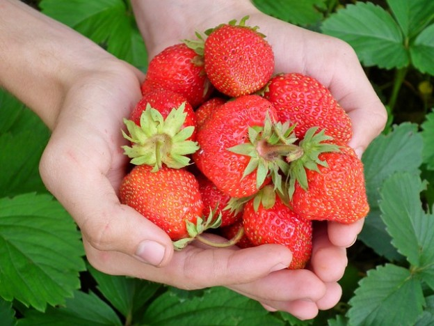

> "천문학이 망원경에 관한 것이 아니듯이, 컴퓨터 과학은 컴퓨터에 관한 것이 아니다."  
>
> "Computer Science is no more about computers than astronomy is about telescopes"  
> --- Edsger Dijkstra

### 사용자 정의 함수

사용자 정의 함수(custom function)는 프로그램 속 '나중에' 호출해서 사용할 작은 프로그램이다. 이러한 작은 프로그램을 사용해서 문제를 독립된 부분조각으로 쪼갤 수 있다.

나중에 여러분이 호출할 때까지 파이썬은 함수를 무시한다.
여러분이 함수를 호출할 때, 파이썬은 그제서야 함수 정의를 찾아서 순서에 맞춰 명령어를 실행한다; 함수에 있는 모든 명령어가 실행되면, 함수를 호출한 명령어로 파이썬이 되돌린다.

파이썬은 함수에 속한 명령어를 인식할 수 있는데, 이유는 오른쪽으로 4칸 들여쓰기 했기 때문이다. 함수는 다음과 같이 정의한다:

~~~ {.python}
def foo( ):       # 함수명 'foo'를 정의한다.
    command_1     # 함수 몸통을 시작한다.
    command_2     # 파이썬에서 함수 몸통 명령어는 4칸 들여쓰기 한다.
    ....
    command_n     # 함수 몸통의 끝
 
foo()             # foo() 함수를 호출한다.
~~~

함수는 프로그래밍에서 학습하게 되는 가장 중요한 단일 개념이다. 
함수를 작성할 때, 핵심이 되는 사항은 다음과 같다:

- 작성한 함수는 한가지 작업만 한다.
- 함수를 짧게 작성한다.
- 유의미하게 함수명을 작명한다.
- 작성한 모든 함수 길이는 대략 동일하게 유지한다.

### 별명(Aliases)

단순하게 함수명을 다시 이름 지으면, 다른 함수에 대한 별명이 된다. 예를 들어, 라이브러리에, `turn_left()` 내장함수에 대한 별명으로 `left()`가 있다.

~~~ {.python}
def left():          #  left() 가 호출될 때...
    turn_left()      # left()는 순서대로 turn_left()를 호출한다.
~~~

`left()`는 `turn_left()`에 대한 별명으로... 둘은 정확하게 동일한 작업을 수행한다.
별명을 사용해서 함수명을 줄이거나, 명확히 하거나, 다른 언어로 변역하는데 사용한다.

###  문제 해결에 대한 하향식 접근법

이번 학습의 목적은 문제를 조각으로 쪼개서 문제를 학습하는 방법을 배운다. 이번 단계에서, 문제 해결에 대한 접근방법은 다음과 같다:

1. 문제가 무엇인지 이해한다: 어떤 작업을 수행하는가에 대한 정확한 이해를 하기 전에 프로그램을 바로 작성하러 달려가지 않는다.
1. 문제를 체계적으로 표현한다: 서로 독립이 되는 문제 조각을 식별해 낸다.
1. 패턴을 찾아낸다: 패턴이 있다면, 패턴 시작과 끝을 식별해 낸다.
1. 구현한다: 문제에 대한 독립된 부분을 쭉 연결해서 프로그램을 작성해 나간다. 코드는 영어로 작문한 것과 같아야 된다.
1. 기존에 존재하는 함수(즉, 내장 혹은 라이브러리 함수)로, 각각에 대한 해결책을 표현할 때까지, 작성한 함수 각각에 대해 이런 과정을 반복한다.

### 라이브러리 새함수

라이브러리에 이제 함수 두개가 추가되었다:

~~~ {.python}
sidestep_right()  # 최초 방향을 유지하며 오른쪽 셀로 이동
sidestep_left()   # 최초 방향을 유지하며 왼쪽 셀로 이동
~~~

### 훈련 작업임무

#### TM1. 남가주(SoCal) 생활 - 터치다운

[학생 교안](http://codeperspectives.com/reeborg-dev/world.html?proglang=python-en&world=%7B%22robots%22%3A%5B%7B%22x%22%3A7%2C%22y%22%3A2%2C%22tokens%22%3A0%2C%22orientation%22%3A1%2C%22_prev_x%22%3A7%2C%22_prev_y%22%3A2%2C%22_prev_orientation%22%3A1%7D%5D%2C%22tokens%22%3A%7B%227%2C5%22%3A1%7D%2C%22walls%22%3A%7B%226%2C11%22%3A%5B%22north%22%5D%2C%227%2C11%22%3A%5B%22north%22%5D%2C%228%2C11%22%3A%5B%22north%22%5D%2C%229%2C11%22%3A%5B%22north%22%2C%22east%22%5D%2C%225%2C11%22%3A%5B%22north%22%5D%2C%224%2C11%22%3A%5B%22east%22%5D%7D%2C%22shapes%22%3A%7B%224%2C11%22%3A%22star%22%2C%2210%2C11%22%3A%22star%22%7D%2C%22goal%22%3A%7B%22position%22%3A%7B%22x%22%3A7%2C%22y%22%3A11%7D%2C%22tokens%22%3A%7B%227%2C11%22%3A1%7D%7D%7D&editor=%23%20single%20file%0A%23%20pick%20up%20the%20football%20and%20score%20a%20touchdown&library=%23%20%27from%20my_lib%20import%20*%27%20in%20Python%20Code%20is%20required%20to%20use%0A%23%20the%20code%20in%20this%20library.%20%0A%0Asound(True)%20%20%20%20%23%20turn%20sound%20effects%20on%0A%0Adef%20left()%3A%0A%20%20%20%20turn_left()%0A%20%20%20%20%0Adef%20turn_around()%3A%0A%20%20%20%20repeat(turn_left%2C%202)%0A%20%20%20%20%0Adef%20right()%3A%0A%20%20%20%20repeat(turn_left%2C%203)%0A%20%20%20%20%0Adef%20sidestep_right()%3A%0A%20%20%20%20right()%0A%20%20%20%20move()%0A%20%20%20%20left()%0A%20%20%20%20%0Adef%20sidestep_left()%3A%0A%20%20%20%20left()%0A%20%20%20%20move()%0A%20%20%20%20right())

이번 작업임무에서, 독립적인 조작으로 문제를 쪼개는데 함수를 사용한다.

카렐이 공을 집어 들고 터치다운을 해야 한다. 작성해 본다! 

| 출발전 - 준비 | 종료후 - 터치다운|   |
|---------------------------------|---------------------------------|---------------------------------|
|  |  |  |

해답: [보여주기](http://codeperspectives.com/reeborg-dev/world.html?proglang=python-en&world=%7B%22robots%22%3A%5B%7B%22x%22%3A7%2C%22y%22%3A2%2C%22tokens%22%3A0%2C%22orientation%22%3A1%2C%22_prev_x%22%3A7%2C%22_prev_y%22%3A2%2C%22_prev_orientation%22%3A1%7D%5D%2C%22tokens%22%3A%7B%227%2C5%22%3A1%7D%2C%22walls%22%3A%7B%226%2C11%22%3A%5B%22north%22%5D%2C%227%2C11%22%3A%5B%22north%22%5D%2C%228%2C11%22%3A%5B%22north%22%5D%2C%229%2C11%22%3A%5B%22north%22%2C%22east%22%5D%2C%225%2C11%22%3A%5B%22north%22%5D%2C%224%2C11%22%3A%5B%22east%22%5D%7D%2C%22shapes%22%3A%7B%224%2C11%22%3A%22star%22%2C%2210%2C11%22%3A%22star%22%7D%2C%22goal%22%3A%7B%22position%22%3A%7B%22x%22%3A7%2C%22y%22%3A11%7D%2C%22tokens%22%3A%7B%227%2C11%22%3A1%7D%7D%7D&editor=%23%20single%20file%0A%23%20pick%20up%20the%20football%20and%20score%20a%20touchdown%0A%0Adef%20go_to_ball()%3A%0A%20%20%20%20repeat(move%2C%203)%0A%20%0Adef%20go_to_endzone()%3A%0A%20%20%20%20repeat(move%2C%206)%0A%20%0Adef%20pick_ball_up()%3A%0A%20%20%20%20take()%0A%20%0Adef%20score()%3A%0A%20%20%20%20put()%0A%20%0A%23%20main%20function%0Ago_to_ball()%0Apick_ball_up()%0Ago_to_endzone()%0Ascore()&library=%23%20%27from%20my_lib%20import%20*%27%20in%20Python%20Code%20is%20required%20to%20use%0A%23%20the%20code%20in%20this%20library.%20%0A%0Asound(True)%20%20%20%20%23%20turn%20sound%20effects%20on%0A%0Adef%20left()%3A%0A%20%20%20%20turn_left()%0A%20%20%20%20%0Adef%20turn_around()%3A%0A%20%20%20%20repeat(turn_left%2C%202)%0A%20%20%20%20%0Adef%20right()%3A%0A%20%20%20%20repeat(turn_left%2C%203)%0A%20%20%20%20%0Adef%20sidestep_right()%3A%0A%20%20%20%20right()%0A%20%20%20%20move()%0A%20%20%20%20left()%0A%20%20%20%20%0Adef%20sidestep_left()%3A%0A%20%20%20%20left()%0A%20%20%20%20move()%0A%20%20%20%20right())

메인 함수 (다른 모든 함수 `최상단`에 위치한 함수)는 카렐을 공이 있는 곳으로 이동시키고, 공을 집고 나서, 카렐을 미식축구 엔드존(end zone)으로 이동시켜, 마지막으로 공을 터치다운한다. 다음 프로그램이 작업임무를 완벽하게 해결한다:

~~~ {.callout}
# 메인 함수
go_to_ball()
pick_ball_up()
go_to_endzone()
score()
~~~

최상단 함수를 해결했으니, 그 아래 하단 함수를 해결해 나간다: 내장함수와 사용자 정의 함수를 사용해서, 명령어 각각에 대해 함수를 차근히 생성해 나간다. 함수 두개는 별명이다: 

~~~ {.python}
def pick_ball_up():
    take()
 
def score():
    put()
~~~

다른 함수 두개도 또한 무척 단순하다:

~~~ {.python}
def go_to_ball():
    repeat(move, 3)
 
def go_to_endzone():
    repeat(move, 6)
~~~

최종 프로그램으로, 작성한 함수를 메인 프로그램과 합친다. 
메인 함수가 마지막에 위치하기만 하면, 함수가 위치한 순서는 그다지 문제되지 않는다.

~~~ {.python}
def go_to_ball():
    repeat(move, 3)
 
def go_to_endzone():
    repeat(move, 6)
 
def pick_ball_up():
    take()
 
def score():
    put()
 
# main function
go_to_ball()
pick_ball_up()
go_to_endzone()
score()
~~~

#### TM2. 딸기 - 단일 파일

[학습 교안](http://codeperspectives.com/reeborg-dev/world.html?proglang=python-en&world=%7B%22robots%22%3A%5B%7B%22x%22%3A4%2C%22y%22%3A5%2C%22tokens%22%3A70%2C%22orientation%22%3A1%2C%22_prev_x%22%3A4%2C%22_prev_y%22%3A5%2C%22_prev_orientation%22%3A1%7D%5D%2C%22tokens%22%3A%7B%7D%2C%22walls%22%3A%7B%225%2C6%22%3A%5B%22north%22%5D%2C%226%2C6%22%3A%5B%22north%22%5D%2C%227%2C6%22%3A%5B%22north%22%5D%2C%228%2C6%22%3A%5B%22north%22%5D%2C%229%2C6%22%3A%5B%22north%22%5D%2C%2210%2C6%22%3A%5B%22north%22%5D%2C%2211%2C6%22%3A%5B%22north%22%5D%7D%2C%22goal%22%3A%7B%22position%22%3A%7B%22x%22%3A12%2C%22y%22%3A5%7D%2C%22tokens%22%3A%7B%225%2C5%22%3A10%2C%226%2C5%22%3A10%2C%227%2C5%22%3A10%2C%228%2C5%22%3A10%2C%229%2C5%22%3A10%2C%2210%2C5%22%3A10%2C%2211%2C5%22%3A10%7D%7D%7D&editor=%23%20tm2%20single%20file%0A%23%20plant%2010%20berries%20in%20each%20slot%20and%20then%20go%20home%0Asound(True)%0Athink(251)&library=%23%20%27from%20my_lib%20import%20*%27%20in%20Python%20Code%20is%20required%20to%20use%0A%23%20the%20code%20in%20this%20library.%20%0A%0Asound(True)%20%20%20%20%23%20turn%20sound%20effects%20on%0A%0Adef%20left()%3A%0A%20%20%20%20turn_left()%0A%20%20%20%20%0Adef%20turn_around()%3A%0A%20%20%20%20repeat(turn_left%2C%202)%0A%20%20%20%20%0Adef%20right()%3A%0A%20%20%20%20repeat(turn_left%2C%203)%0A%20%20%20%20%0Adef%20sidestep_right()%3A%0A%20%20%20%20right()%0A%20%20%20%20move()%0A%20%20%20%20left()%0A%20%20%20%20%0Adef%20sidestep_left()%3A%0A%20%20%20%20left()%0A%20%20%20%20move()%0A%20%20%20%20right())

이번 작업임무에서, 함수를 사용해서 패턴을 기술할 것이다.

카렐은 집앞 7개 각셀에 딸기 10개를 파종하고자 한다.
카렐은 가방에 70개 딸기씨를 가지고 출발한다.
카렐은 최고 딸기 농부가 되서, 집으로 돌아와야 된다.

| 출발전 - 딸기 파종준비 | 종료후 - 딸기 파종완료| 
|---------------------------------|---------------------------------|
|  |  |

해답: [보여주기](http://codeperspectives.com/reeborg-dev/world.html?proglang=python-en&world=%7B%22robots%22%3A%5B%7B%22x%22%3A4%2C%22y%22%3A5%2C%22tokens%22%3A70%2C%22orientation%22%3A1%2C%22_prev_x%22%3A4%2C%22_prev_y%22%3A5%2C%22_prev_orientation%22%3A1%7D%5D%2C%22tokens%22%3A%7B%7D%2C%22walls%22%3A%7B%225%2C6%22%3A%5B%22north%22%5D%2C%226%2C6%22%3A%5B%22north%22%5D%2C%227%2C6%22%3A%5B%22north%22%5D%2C%228%2C6%22%3A%5B%22north%22%5D%2C%229%2C6%22%3A%5B%22north%22%5D%2C%2210%2C6%22%3A%5B%22north%22%5D%2C%2211%2C6%22%3A%5B%22north%22%5D%7D%2C%22goal%22%3A%7B%22position%22%3A%7B%22x%22%3A12%2C%22y%22%3A5%7D%2C%22tokens%22%3A%7B%225%2C5%22%3A10%2C%226%2C5%22%3A10%2C%227%2C5%22%3A10%2C%228%2C5%22%3A10%2C%229%2C5%22%3A10%2C%2210%2C5%22%3A10%2C%2211%2C5%22%3A10%7D%7D%7D&editor=%23%20tm2%20single%20file%0A%23%20plant%2010%20berries%20in%20each%20slot%20and%20then%20go%20home%0Asound(True)%0Athink(251)%0A%0Adef%20left()%3A%0A%20%20%20%20turn_left()%0A%0Adef%20right()%3A%0A%20%20%20%20repeat(%20left%2C%203%20)%0A%0Adef%20move_and_put()%3A%0A%20%20%20%20move()%0A%20%20%20%20repeat(%20put%2C%2010%20)%0A%0Adef%20plant_berries()%3A%0A%20%20%20%20repeat(%20move_and_put%2C%207%20)%0A%0Adef%20go_home()%3A%0A%20%20%20%20move()%0A%0A%23%20main%20function%0Aright()%0Aplant_berries()%0Ago_home()&library=%23%20%27from%20my_lib%20import%20*%27%20in%20Python%20Code%20is%20required%20to%20use%0A%23%20the%20code%20in%20this%20library.%20%0A%0Asound(True)%20%20%20%20%23%20turn%20sound%20effects%20on%0A%0Adef%20left()%3A%0A%20%20%20%20turn_left()%0A%20%20%20%20%0Adef%20turn_around()%3A%0A%20%20%20%20repeat(turn_left%2C%202)%0A%20%20%20%20%0Adef%20right()%3A%0A%20%20%20%20repeat(turn_left%2C%203)%0A%20%20%20%20%0Adef%20sidestep_right()%3A%0A%20%20%20%20right()%0A%20%20%20%20move()%0A%20%20%20%20left()%0A%20%20%20%20%0Adef%20sidestep_left()%3A%0A%20%20%20%20left()%0A%20%20%20%20move()%0A%20%20%20%20right())

메인 프로그램은 카렐이 우회전하고 나서, 딸기 파종을 모두 마치고 나서, 집으로 돌아간다.
다음 프로그램은 완전히 `최상단`에서 문제를 해결한다.

~~~ {.python}
# 메인 함수
right()
plant_berries()
go_home()
~~~

이제, `최상단` 하위문제를 차례로 해결해 나가자.
우회전 하는 명령어가 없지만, 좌회전을 3번 하면 사실상 우회전하는 효과가 난다.
프로그램을 좀더 가독성 있게 만들려면, `turn_left()` 함수에 별명을 붙이고, 이를 `right()` 함수 작성에 사용한다:

~~~ {.python}
def left():
    turn_left()
 
def right():
    repeat( left, 3 )
~~~

딸기를 심는 방식이 두가지 있다. 
첫번째 방식은, 카렐이 수행할 작업을 쭉 적어나간다;
두번째 방식은, 패턴을 찾아, 패턴을 기술하는 함수를 작성하고 나서, 함수를 사용한다. 분명히, 두번째 접근법이 첫번째 것보다 낫다.

**첫번째 방법: 버젼 1**

~~~ {.python} 
def pick_up_berries():
    move()
    repeat( put, 10 )
    move()
    repeat( put, 10 )
    move()
    repeat( put, 10 )
    move()
    repeat( put, 10 )
    move()
    repeat( put, 10 )
    move()
    repeat( put, 10 )
    move()
    repeat( put, 10 )
~~~

**두번째 방법: 버젼 1**

~~~ {.python} 
def move_and_put():
    move()
    repeat( put, 10 )
 
def plant_berries():
    repeat( move_and_put, 7 )
~~~

딸기를 모두 파종한 후에, 카렐은 사각형 집 좌측 셀에 위치하게 된다. 따라서, `go_home()` 은 단순히 `move()` 명령어에 대한 별명이 된다. 최종 완성된 프로그램은 다음과 같다:

~~~ {.python}
def left():
    turn_left()
 
def right():
    repeat( left, 3 )
 
def move_and_put():
    move()
    repeat( put, 10 )
 
def plant_berries():
    repeat( move_and_put, 7 )
 
def go_home():
    move()
 
# 메인 함수
right()
plant_berries()
go_home()
~~~    

#### 3학년 - 잃어버린 거위 새끼

[학습 교안](http://codeperspectives.com/reeborg-dev/world.html?proglang=python-en&world=%7B%22robots%22%3A%5B%7B%22x%22%3A3%2C%22y%22%3A3%2C%22tokens%22%3A%22infinite%22%2C%22orientation%22%3A0%2C%22_prev_x%22%3A3%2C%22_prev_y%22%3A3%2C%22_prev_orientation%22%3A0%2C%22start_positions%22%3A%5B%5B3%2C3%5D%5D%7D%5D%2C%22walls%22%3A%7B%7D%2C%22tokens%22%3A%7B%224%2C3%22%3A1%7D%2C%22goal%22%3A%7B%22tokens%22%3A%7B%224%2C4%22%3A1%7D%2C%22possible_positions%22%3A%5B%5B4%2C5%5D%5D%2C%22position%22%3A%7B%22x%22%3A4%2C%22y%22%3A5%7D%7D%7D&editor=%23%20put%20the%20gosling%20in%20the%20pen%20and%20then%20go%20home&library=%23%20%27from%20my_lib%20import%20*%27%20in%20Python%20Code%20is%20required%20to%20use%0A%23%20the%20code%20in%20this%20library.%20%0A%0Asound(True)%20%20%20%20%23%20turn%20sound%20effects%20on%0A%0Adef%20left()%3A%0A%20%20%20%20turn_left()%0A%20%20%20%20%0Adef%20turn_around()%3A%0A%20%20%20%20repeat(turn_left%2C%202)%0A%20%20%20%20%0Adef%20right()%3A%0A%20%20%20%20repeat(turn_left%2C%203)%0A%20%20%20%20%0Adef%20sidestep_right()%3A%0A%20%20%20%20right()%0A%20%20%20%20move()%0A%20%20%20%20left()%0A%20%20%20%20%0Adef%20sidestep_left()%3A%0A%20%20%20%20left()%0A%20%20%20%20move()%0A%20%20%20%20right())

먼저 병아리, 이제는 거위 새끼!
우리에 구멍이 있음에 틀림없다.
카렐은 거위 새끼를 우리에 잡아 넣고 나서, 사각형 집으로 돌아와야 한다.

힌트: 메인 프로그램은 다음과 같다:

~~~ {.python}
# 메인 프로그램
take_the_token()
put_the_token()
go_to_home_square()
say( "done" )
~~~

| 출발전 ... | ... 종료후| 
|---------------------------------|---------------------------------|
|  |  |

해답: [보여주기](http://codeperspectives.com/reeborg-dev/world.html?proglang=python-en&world=%7B%22robots%22%3A%5B%7B%22x%22%3A3%2C%22y%22%3A3%2C%22tokens%22%3A%22infinite%22%2C%22orientation%22%3A0%2C%22_prev_x%22%3A3%2C%22_prev_y%22%3A3%2C%22_prev_orientation%22%3A0%2C%22start_positions%22%3A%5B%5B3%2C3%5D%5D%7D%5D%2C%22walls%22%3A%7B%7D%2C%22tokens%22%3A%7B%224%2C3%22%3A1%7D%2C%22goal%22%3A%7B%22tokens%22%3A%7B%224%2C4%22%3A1%7D%2C%22possible_positions%22%3A%5B%5B4%2C5%5D%5D%2C%22position%22%3A%7B%22x%22%3A4%2C%22y%22%3A5%7D%7D%7D&editor=%23%20put%20the%20gosling%20in%20the%20pen%20and%20then%20go%20home%0Athink(%20900%20)%0A%20%0Adef%20left()%3A%0A%20%20%20%20turn_left()%0A%20%0Adef%20take_the_token()%3A%0A%20%20%20%20say(%20%22taking%20the%20token%22%20)%0A%20%20%20%20move()%0A%20%20%20%20take()%0A%20%0Adef%20put_the_token()%3A%0A%20%20%20%20say(%20%22putting%20the%20token%22%20)%0A%20%20%20%20left()%0A%20%20%20%20move()%0A%20%20%20%20put()%0A%20%0Adef%20go_to_home_square()%3A%0A%20%20%20%20say(%20%22going%20home%22%20)%0A%20%20%20%20move()%0A%20%0A%23%20main%20program%0Atake_the_token()%0Aput_the_token()%0Ago_to_home_square()%0Asay(%20%22done%22%20)&library=%23%20%27from%20my_lib%20import%20*%27%20in%20Python%20Code%20is%20required%20to%20use%0A%23%20the%20code%20in%20this%20library.%20%0A%0Asound(True)%20%20%20%20%23%20turn%20sound%20effects%20on%0A%0Adef%20left()%3A%0A%20%20%20%20turn_left()%0A%20%20%20%20%0Adef%20turn_around()%3A%0A%20%20%20%20repeat(turn_left%2C%202)%0A%20%20%20%20%0Adef%20right()%3A%0A%20%20%20%20repeat(turn_left%2C%203)%0A%20%20%20%20%0Adef%20sidestep_right()%3A%0A%20%20%20%20right()%0A%20%20%20%20move()%0A%20%20%20%20left()%0A%20%20%20%20%0Adef%20sidestep_left()%3A%0A%20%20%20%20left()%0A%20%20%20%20move()%0A%20%20%20%20right())

#### 4학년 - 대각선 정원

[학습 교안](http://codeperspectives.com/reeborg-dev/world.html?proglang=python-en&world=%7B%22robots%22%3A%5B%7B%22x%22%3A3%2C%22y%22%3A1%2C%22tokens%22%3A%22infinite%22%2C%22orientation%22%3A0%2C%22_prev_x%22%3A3%2C%22_prev_y%22%3A1%2C%22_prev_orientation%22%3A0%2C%22start_positions%22%3A%5B%5B3%2C1%5D%5D%7D%5D%2C%22walls%22%3A%7B%227%2C9%22%3A%5B%22east%22%5D%2C%228%2C9%22%3A%5B%22north%22%2C%22east%22%5D%7D%2C%22goal%22%3A%7B%22possible_positions%22%3A%5B%5B8%2C9%5D%5D%2C%22position%22%3A%7B%22x%22%3A8%2C%22y%22%3A9%7D%7D%2C%22tokens%22%3A%7B%223%2C3%22%3A3%2C%224%2C4%22%3A3%2C%225%2C5%22%3A3%2C%226%2C6%22%3A3%2C%227%2C7%22%3A3%7D%7D&editor=%23%20strawberries%20-%20diagonal%20garden&library=%23%20%27from%20my_lib%20import%20*%27%20in%20Python%20Code%20is%20required%20to%20use%0A%23%20the%20code%20in%20this%20library.%20%0A%0Asound(True)%20%20%20%20%23%20turn%20sound%20effects%20on%0A%0Adef%20left()%3A%0A%20%20%20%20turn_left()%0A%20%20%20%20%0Adef%20turn_around()%3A%0A%20%20%20%20repeat(turn_left%2C%202)%0A%20%20%20%20%0Adef%20right()%3A%0A%20%20%20%20repeat(turn_left%2C%203)%0A%20%20%20%20%0Adef%20sidestep_right()%3A%0A%20%20%20%20right()%0A%20%20%20%20move()%0A%20%20%20%20left()%0A%20%20%20%20%0Adef%20sidestep_left()%3A%0A%20%20%20%20left()%0A%20%20%20%20move()%0A%20%20%20%20right())

딸기를 수확해서, 카렐 집으로 귀향한다. 라이브러리 함수를 사용하면 프로그램은 매우 짧다.

해답: [보여주기](http://codeperspectives.com/reeborg-dev/world.html?proglang=python-en&world=%7B%22robots%22%3A%5B%7B%22x%22%3A3%2C%22y%22%3A1%2C%22tokens%22%3A%22infinite%22%2C%22orientation%22%3A0%2C%22_prev_x%22%3A3%2C%22_prev_y%22%3A1%2C%22_prev_orientation%22%3A0%2C%22start_positions%22%3A%5B%5B3%2C1%5D%5D%7D%5D%2C%22walls%22%3A%7B%227%2C9%22%3A%5B%22east%22%5D%2C%228%2C9%22%3A%5B%22north%22%2C%22east%22%5D%7D%2C%22goal%22%3A%7B%22possible_positions%22%3A%5B%5B8%2C9%5D%5D%2C%22position%22%3A%7B%22x%22%3A8%2C%22y%22%3A9%7D%7D%2C%22tokens%22%3A%7B%223%2C3%22%3A3%2C%224%2C4%22%3A3%2C%225%2C5%22%3A3%2C%226%2C6%22%3A3%2C%227%2C7%22%3A3%7D%7D&editor=%23%20strawberries%20-%20diagonal%20garden%0Afrom%20my_lib%20import%20*%0Athink(300)%20%20%23%20delay%20between%20commands%20is%201%2F4%20s%0A%0Adef%20go_to_berries()%3A%0A%20%20%20%20left()%0A%20%20%20%20move()%0A%0Adef%20take_berry()%3A%0A%20%20%20%20move()%0A%20%20%20%20repeat(take%2C%203)%0A%20%20%20%20sidestep_right()%0A%20%20%20%20%0Adef%20go_home()%3A%0A%20%20%20%20repeat(move%2C%202)%0A%0A%23%20main%20program%0Ago_to_berries()%0Arepeat(take_berry%2C%205)%0Ago_home()&library=%23%20%27from%20my_lib%20import%20*%27%20in%20Python%20Code%20is%20required%20to%20use%0A%23%20the%20code%20in%20this%20library.%20%0A%0Asound(True)%20%20%20%20%23%20turn%20sound%20effects%20on%0A%0Adef%20left()%3A%0A%20%20%20%20turn_left()%0A%20%20%20%20%0Adef%20turn_around()%3A%0A%20%20%20%20repeat(turn_left%2C%202)%0A%20%20%20%20%0Adef%20right()%3A%0A%20%20%20%20repeat(turn_left%2C%203)%0A%20%20%20%20%0Adef%20sidestep_right()%3A%0A%20%20%20%20right()%0A%20%20%20%20move()%0A%20%20%20%20left()%0A%20%20%20%20%0Adef%20sidestep_left()%3A%0A%20%20%20%20left()%0A%20%20%20%20move()%0A%20%20%20%20right())

| 출발전 ... | ... 종료후| 
|---------------------------------|---------------------------------|
|  |  |

**힌트:**

함수를 사용해서 작업임무를 독립된 부분으로 쪼갠다.
메인 함수는 다음과 같을 수 있다:

~~~ {.python}
# 메인 프로그램
go_to_berries()
repeat(take_berry, 5)
go_home()
~~~

#### 5학년 - 딸기 비료

[학습 교안](http://codeperspectives.com/reeborg-dev/world.html?proglang=python-en&world=%7B%22robots%22%3A%5B%7B%22x%22%3A2%2C%22y%22%3A10%2C%22tokens%22%3A%22infinite%22%2C%22orientation%22%3A0%2C%22_prev_x%22%3A2%2C%22_prev_y%22%3A10%2C%22_prev_orientation%22%3A0%7D%5D%2C%22walls%22%3A%7B%2210%2C10%22%3A%5B%22north%22%2C%22east%22%5D%2C%2210%2C9%22%3A%5B%22north%22%2C%22east%22%5D%2C%2210%2C8%22%3A%5B%22north%22%2C%22east%22%5D%2C%2210%2C7%22%3A%5B%22north%22%2C%22east%22%5D%2C%2210%2C6%22%3A%5B%22north%22%2C%22east%22%5D%2C%2210%2C5%22%3A%5B%22north%22%2C%22east%22%5D%2C%2210%2C4%22%3A%5B%22north%22%2C%22east%22%5D%2C%2210%2C3%22%3A%5B%22north%22%2C%22east%22%5D%2C%2210%2C2%22%3A%5B%22north%22%5D%7D%2C%22goal%22%3A%7B%22position%22%3A%7B%22x%22%3A2%2C%22y%22%3A2%7D%2C%22tokens%22%3A%7B%2210%2C10%22%3A10%2C%2210%2C9%22%3A10%2C%2210%2C8%22%3A10%2C%2210%2C7%22%3A10%2C%2210%2C6%22%3A10%2C%2210%2C5%22%3A10%2C%2210%2C4%22%3A10%2C%2210%2C3%22%3A10%7D%7D%2C%22large_world%22%3Afalse%2C%22tokens%22%3A%7B%223%2C10%22%3A10%2C%223%2C9%22%3A10%2C%223%2C8%22%3A10%2C%223%2C7%22%3A10%2C%223%2C6%22%3A10%2C%223%2C5%22%3A10%2C%223%2C4%22%3A10%2C%223%2C3%22%3A10%7D%7D&editor=%23%20fertilizer.%20Move%20the%20bags%20of%20fertilizer%20to%20their%20sheds&library=%23%20%27from%20my_lib%20import%20*%27%20in%20Python%20Code%20is%20required%20to%20use%0A%23%20the%20code%20in%20this%20library.%20%0A%0Asound(True)%20%20%20%20%23%20turn%20sound%20effects%20on%0A%0Adef%20left()%3A%0A%20%20%20%20turn_left()%0A%20%20%20%20%0Adef%20turn_around()%3A%0A%20%20%20%20repeat(turn_left%2C%202)%0A%20%20%20%20%0Adef%20right()%3A%0A%20%20%20%20repeat(turn_left%2C%203)%0A%20%20%20%20%0Adef%20sidestep_right()%3A%0A%20%20%20%20right()%0A%20%20%20%20move()%0A%20%20%20%20left()%0A%20%20%20%20%0Adef%20sidestep_left()%3A%0A%20%20%20%20left()%0A%20%20%20%20move()%0A%20%20%20%20right())

이제 딸기에 비료를 주자.
카렐은 작업지시를 받아서 8개 돗짚자리에는 각각 비료상자 10개만 갖고 있는데, 각각을 대응되는 헛간에 저장해야 한다.
힘든 작업이지만,  맛난 딸기 쇼트케이크[^1]를 먹고 싶다면, 딸기가 필요하다... 그래서... 

[^1]: 케이크 윗분에 딸기 과일을 올린 케이크.  
늘 그렇듯이, 라이브러리에 나온 함수를 이용하자.

| 출발전 ... | ... 종료후| 
|---------------------------------|---------------------------------|
|  |  |

**힌트:**

패턴을 기술하는데 함수를 사용한다.

해답: [보여주기](http://codeperspectives.com/reeborg-dev/world.html?proglang=python-en&world=%7B%22robots%22%3A%5B%7B%22x%22%3A2%2C%22y%22%3A10%2C%22tokens%22%3A%22infinite%22%2C%22orientation%22%3A0%2C%22_prev_x%22%3A2%2C%22_prev_y%22%3A10%2C%22_prev_orientation%22%3A0%7D%5D%2C%22walls%22%3A%7B%2210%2C10%22%3A%5B%22north%22%2C%22east%22%5D%2C%2210%2C9%22%3A%5B%22north%22%2C%22east%22%5D%2C%2210%2C8%22%3A%5B%22north%22%2C%22east%22%5D%2C%2210%2C7%22%3A%5B%22north%22%2C%22east%22%5D%2C%2210%2C6%22%3A%5B%22north%22%2C%22east%22%5D%2C%2210%2C5%22%3A%5B%22north%22%2C%22east%22%5D%2C%2210%2C4%22%3A%5B%22north%22%2C%22east%22%5D%2C%2210%2C3%22%3A%5B%22north%22%2C%22east%22%5D%2C%2210%2C2%22%3A%5B%22north%22%5D%7D%2C%22goal%22%3A%7B%22position%22%3A%7B%22x%22%3A2%2C%22y%22%3A2%7D%2C%22tokens%22%3A%7B%2210%2C10%22%3A10%2C%2210%2C9%22%3A10%2C%2210%2C8%22%3A10%2C%2210%2C7%22%3A10%2C%2210%2C6%22%3A10%2C%2210%2C5%22%3A10%2C%2210%2C4%22%3A10%2C%2210%2C3%22%3A10%7D%7D%2C%22large_world%22%3Afalse%2C%22tokens%22%3A%7B%223%2C10%22%3A10%2C%223%2C9%22%3A10%2C%223%2C8%22%3A10%2C%223%2C7%22%3A10%2C%223%2C6%22%3A10%2C%223%2C5%22%3A10%2C%223%2C4%22%3A10%2C%223%2C3%22%3A10%7D%7D&editor=%23%20fertilizer.%20Move%20the%20bags%20of%20fertilizer%20to%20their%20sheds%0Afrom%20my_lib%20import%20*%0Athink(50)%0A%0Adef%20move_bag()%3A%0A%20%20%20%20move()%0A%20%20%20%20repeat(take%2C%2010)%0A%20%20%20%20repeat(move%2C%207)%0A%20%20%20%20repeat(put%2C%2010)%0A%20%20%20%20%0Adef%20go_back()%3A%0A%20%20%20%20turn_around()%0A%20%20%20%20repeat(move%2C%208)%0A%20%20%20%20left()%0A%20%20%20%20move()%0A%20%20%20%20left()%0A%20%20%20%20%0Adef%20move_bag_to_shed()%3A%0A%20%20%20%20move_bag()%0A%20%20%20%20go_back()%0A%0A%23%20main%20function%0Arepeat(move_bag_to_shed%2C%208)%0Asay(%20%22Time%20to%20take%20a%20shower%22%20)&library=%23%20%27from%20my_lib%20import%20*%27%20in%20Python%20Code%20is%20required%20to%20use%0A%23%20the%20code%20in%20this%20library.%20%0A%0Asound(True)%20%20%20%20%23%20turn%20sound%20effects%20on%0A%0Adef%20left()%3A%0A%20%20%20%20turn_left()%0A%20%20%20%20%0Adef%20turn_around()%3A%0A%20%20%20%20repeat(turn_left%2C%202)%0A%20%20%20%20%0Adef%20right()%3A%0A%20%20%20%20repeat(turn_left%2C%203)%0A%20%20%20%20%0Adef%20sidestep_right()%3A%0A%20%20%20%20right()%0A%20%20%20%20move()%0A%20%20%20%20left()%0A%20%20%20%20%0Adef%20sidestep_left()%3A%0A%20%20%20%20left()%0A%20%20%20%20move()%0A%20%20%20%20right())

#### 6학년 - 올림픽 신화 - 스피드 스케이팅

[학습 교안](http://codeperspectives.com/reeborg-dev/world.html?proglang=python-en&world=%7B%22robots%22%3A%5B%7B%22x%22%3A6%2C%22y%22%3A8%2C%22tokens%22%3A0%2C%22orientation%22%3A2%2C%22_prev_x%22%3A6%2C%22_prev_y%22%3A8%2C%22_prev_orientation%22%3A2%2C%22start_positions%22%3A%5B%5B6%2C8%5D%5D%7D%5D%2C%22walls%22%3A%7B%2210%2C5%22%3A%5B%22east%22%5D%2C%229%2C3%22%3A%5B%22north%22%5D%2C%228%2C3%22%3A%5B%22north%22%5D%2C%226%2C4%22%3A%5B%22east%22%5D%2C%226%2C5%22%3A%5B%22east%22%2C%22north%22%5D%2C%228%2C8%22%3A%5B%22north%22%5D%2C%229%2C8%22%3A%5B%22north%22%5D%2C%2210%2C7%22%3A%5B%22north%22%5D%2C%2210%2C6%22%3A%5B%22east%22%2C%22north%22%5D%2C%229%2C4%22%3A%5B%22east%22%5D%2C%227%2C5%22%3A%5B%22east%22%5D%2C%227%2C7%22%3A%5B%22east%22%5D%2C%228%2C7%22%3A%5B%22north%22%5D%2C%229%2C7%22%3A%5B%22north%22%5D%2C%222%2C11%22%3A%5B%22north%22%5D%2C%223%2C11%22%3A%5B%22north%22%5D%2C%224%2C11%22%3A%5B%22north%22%5D%2C%225%2C11%22%3A%5B%22east%22%2C%22north%22%5D%2C%221%2C11%22%3A%5B%22east%22%5D%2C%221%2C10%22%3A%5B%22east%22%5D%2C%221%2C9%22%3A%5B%22east%22%5D%2C%221%2C8%22%3A%5B%22east%22%5D%2C%222%2C7%22%3A%5B%22north%22%5D%2C%223%2C7%22%3A%5B%22north%22%5D%2C%224%2C7%22%3A%5B%22north%22%2C%22east%22%5D%2C%225%2C9%22%3A%5B%22east%22%5D%2C%225%2C10%22%3A%5B%22east%22%5D%2C%223%2C8%22%3A%5B%22north%22%5D%2C%222%2C9%22%3A%5B%22east%22%5D%2C%222%2C10%22%3A%5B%22east%22%5D%2C%223%2C10%22%3A%5B%22north%22%5D%2C%224%2C10%22%3A%5B%22north%22%2C%22east%22%5D%2C%224%2C9%22%3A%5B%22east%22%5D%2C%224%2C8%22%3A%5B%22north%22%5D%2C%224%2C6%22%3A%5B%22north%22%5D%2C%223%2C6%22%3A%5B%22north%22%5D%2C%222%2C6%22%3A%5B%22north%22%5D%2C%221%2C6%22%3A%5B%22east%22%5D%2C%221%2C5%22%3A%5B%22east%22%5D%2C%222%2C5%22%3A%5B%22east%22%5D%2C%223%2C5%22%3A%5B%22north%22%5D%2C%224%2C5%22%3A%5B%22north%22%2C%22east%22%5D%2C%224%2C4%22%3A%5B%22east%22%5D%2C%224%2C3%22%3A%5B%22north%22%5D%2C%223%2C3%22%3A%5B%22north%22%5D%2C%222%2C4%22%3A%5B%22east%22%5D%2C%221%2C4%22%3A%5B%22east%22%5D%2C%221%2C3%22%3A%5B%22east%22%5D%2C%222%2C2%22%3A%5B%22north%22%5D%2C%223%2C2%22%3A%5B%22north%22%5D%2C%224%2C2%22%3A%5B%22north%22%5D%2C%225%2C2%22%3A%5B%22north%22%5D%2C%225%2C3%22%3A%5B%22east%22%5D%2C%225%2C4%22%3A%5B%22east%22%5D%2C%225%2C5%22%3A%5B%22east%22%5D%2C%226%2C3%22%3A%5B%22east%22%5D%2C%227%2C2%22%3A%5B%22north%22%5D%2C%228%2C2%22%3A%5B%22north%22%5D%2C%229%2C2%22%3A%5B%22north%22%5D%2C%2210%2C2%22%3A%5B%22north%22%5D%2C%2210%2C3%22%3A%5B%22east%22%5D%2C%227%2C4%22%3A%5B%22east%22%5D%2C%228%2C5%22%3A%5B%22north%22%5D%2C%229%2C5%22%3A%5B%22north%22%2C%22east%22%5D%2C%2210%2C4%22%3A%5B%22east%22%5D%2C%226%2C8%22%3A%5B%22north%22%5D%2C%226%2C9%22%3A%5B%22east%22%5D%2C%226%2C10%22%3A%5B%22east%22%5D%2C%226%2C11%22%3A%5B%22east%22%5D%2C%227%2C11%22%3A%5B%22north%22%5D%2C%228%2C11%22%3A%5B%22north%22%5D%2C%229%2C11%22%3A%5B%22north%22%5D%2C%2210%2C11%22%3A%5B%22east%22%2C%22north%22%5D%2C%228%2C10%22%3A%5B%22north%22%5D%2C%227%2C10%22%3A%5B%22east%22%5D%2C%227%2C9%22%3A%5B%22east%22%5D%2C%229%2C9%22%3A%5B%22east%22%5D%2C%229%2C10%22%3A%5B%22east%22%2C%22north%22%5D%2C%2210%2C10%22%3A%5B%22east%22%5D%2C%2210%2C9%22%3A%5B%22east%22%5D%2C%228%2C6%22%3A%5B%22north%22%5D%2C%229%2C6%22%3A%5B%22north%22%5D%2C%2210%2C8%22%3A%5B%22east%22%5D%7D%2C%22goal%22%3A%7B%22possible_positions%22%3A%5B%5B6%2C7%5D%5D%2C%22position%22%3A%7B%22x%22%3A6%2C%22y%22%3A7%7D%2C%22tokens%22%3A%7B%226%2C7%22%3A16%7D%7D%2C%22tokens%22%3A%7B%222%2C8%22%3A1%2C%222%2C11%22%3A1%2C%225%2C11%22%3A1%2C%225%2C8%22%3A1%2C%227%2C8%22%3A1%2C%227%2C11%22%3A1%2C%2210%2C11%22%3A1%2C%2210%2C8%22%3A1%2C%227%2C6%22%3A1%2C%2210%2C6%22%3A1%2C%2210%2C3%22%3A1%2C%227%2C3%22%3A1%2C%222%2C6%22%3A1%2C%225%2C6%22%3A1%2C%225%2C3%22%3A1%2C%222%2C3%22%3A1%7D%7D&editor=%23%20Speed%20skating%20-%20collect%20the%20flags%20and%20place%20them%20%0A%23%20at%20the%20podium&library=%23%20%27from%20my_lib%20import%20*%27%20in%20Python%20Code%20is%20required%20to%20use%0A%23%20the%20code%20in%20this%20library.%20%0A%0Asound(True)%20%20%20%20%23%20turn%20sound%20effects%20on%0A%0Adef%20left()%3A%0A%20%20%20%20turn_left()%0A%20%20%20%20%0Adef%20turn_around()%3A%0A%20%20%20%20repeat(turn_left%2C%202)%0A%20%20%20%20%0Adef%20right()%3A%0A%20%20%20%20repeat(turn_left%2C%203)%0A%20%20%20%20%0Adef%20sidestep_right()%3A%0A%20%20%20%20right()%0A%20%20%20%20move()%0A%20%20%20%20left()%0A%20%20%20%20%0Adef%20sidestep_left()%3A%0A%20%20%20%20left()%0A%20%20%20%20move()%0A%20%20%20%20right())

출처: McSmit-Own 작품, "Paulien van Deutekom (08-12-2007)", Creative Commons Attribution-Share Alike 3.0-2.5-2.0-1.0, 위키미디어 커먼즈

카렐이 스케이트를 착용하는 문제를 상상할 수는 없다... 오 그런데... 카렐이 스피드 스케이트 경기장으로 향하고 있다:  정향 클로버 문양 트랙을 한바퀴 도는 경기장. 깃발 16개 모두 집고 나서, 시상대에 깃발을 모두 내려놓는다. 메달일까 아니면 타박상일까?

메달을 수상할 기회다. 행운을 빈다.

| 출발전 ... | ... 종료후| 
|---------------------------------|---------------------------------|
|  |  |

해답: [보여주기](http://codeperspectives.com/reeborg-dev/world.html?proglang=python-en&world=%7B%22robots%22%3A%5B%7B%22x%22%3A6%2C%22y%22%3A8%2C%22tokens%22%3A0%2C%22orientation%22%3A2%2C%22_prev_x%22%3A6%2C%22_prev_y%22%3A8%2C%22_prev_orientation%22%3A2%2C%22start_positions%22%3A%5B%5B6%2C8%5D%5D%7D%5D%2C%22walls%22%3A%7B%2210%2C5%22%3A%5B%22east%22%5D%2C%229%2C3%22%3A%5B%22north%22%5D%2C%228%2C3%22%3A%5B%22north%22%5D%2C%226%2C4%22%3A%5B%22east%22%5D%2C%226%2C5%22%3A%5B%22east%22%2C%22north%22%5D%2C%228%2C8%22%3A%5B%22north%22%5D%2C%229%2C8%22%3A%5B%22north%22%5D%2C%2210%2C7%22%3A%5B%22north%22%5D%2C%2210%2C6%22%3A%5B%22east%22%2C%22north%22%5D%2C%229%2C4%22%3A%5B%22east%22%5D%2C%227%2C5%22%3A%5B%22east%22%5D%2C%227%2C7%22%3A%5B%22east%22%5D%2C%228%2C7%22%3A%5B%22north%22%5D%2C%229%2C7%22%3A%5B%22north%22%5D%2C%222%2C11%22%3A%5B%22north%22%5D%2C%223%2C11%22%3A%5B%22north%22%5D%2C%224%2C11%22%3A%5B%22north%22%5D%2C%225%2C11%22%3A%5B%22east%22%2C%22north%22%5D%2C%221%2C11%22%3A%5B%22east%22%5D%2C%221%2C10%22%3A%5B%22east%22%5D%2C%221%2C9%22%3A%5B%22east%22%5D%2C%221%2C8%22%3A%5B%22east%22%5D%2C%222%2C7%22%3A%5B%22north%22%5D%2C%223%2C7%22%3A%5B%22north%22%5D%2C%224%2C7%22%3A%5B%22north%22%2C%22east%22%5D%2C%225%2C9%22%3A%5B%22east%22%5D%2C%225%2C10%22%3A%5B%22east%22%5D%2C%223%2C8%22%3A%5B%22north%22%5D%2C%222%2C9%22%3A%5B%22east%22%5D%2C%222%2C10%22%3A%5B%22east%22%5D%2C%223%2C10%22%3A%5B%22north%22%5D%2C%224%2C10%22%3A%5B%22north%22%2C%22east%22%5D%2C%224%2C9%22%3A%5B%22east%22%5D%2C%224%2C8%22%3A%5B%22north%22%5D%2C%224%2C6%22%3A%5B%22north%22%5D%2C%223%2C6%22%3A%5B%22north%22%5D%2C%222%2C6%22%3A%5B%22north%22%5D%2C%221%2C6%22%3A%5B%22east%22%5D%2C%221%2C5%22%3A%5B%22east%22%5D%2C%222%2C5%22%3A%5B%22east%22%5D%2C%223%2C5%22%3A%5B%22north%22%5D%2C%224%2C5%22%3A%5B%22north%22%2C%22east%22%5D%2C%224%2C4%22%3A%5B%22east%22%5D%2C%224%2C3%22%3A%5B%22north%22%5D%2C%223%2C3%22%3A%5B%22north%22%5D%2C%222%2C4%22%3A%5B%22east%22%5D%2C%221%2C4%22%3A%5B%22east%22%5D%2C%221%2C3%22%3A%5B%22east%22%5D%2C%222%2C2%22%3A%5B%22north%22%5D%2C%223%2C2%22%3A%5B%22north%22%5D%2C%224%2C2%22%3A%5B%22north%22%5D%2C%225%2C2%22%3A%5B%22north%22%5D%2C%225%2C3%22%3A%5B%22east%22%5D%2C%225%2C4%22%3A%5B%22east%22%5D%2C%225%2C5%22%3A%5B%22east%22%5D%2C%226%2C3%22%3A%5B%22east%22%5D%2C%227%2C2%22%3A%5B%22north%22%5D%2C%228%2C2%22%3A%5B%22north%22%5D%2C%229%2C2%22%3A%5B%22north%22%5D%2C%2210%2C2%22%3A%5B%22north%22%5D%2C%2210%2C3%22%3A%5B%22east%22%5D%2C%227%2C4%22%3A%5B%22east%22%5D%2C%228%2C5%22%3A%5B%22north%22%5D%2C%229%2C5%22%3A%5B%22north%22%2C%22east%22%5D%2C%2210%2C4%22%3A%5B%22east%22%5D%2C%226%2C8%22%3A%5B%22north%22%5D%2C%226%2C9%22%3A%5B%22east%22%5D%2C%226%2C10%22%3A%5B%22east%22%5D%2C%226%2C11%22%3A%5B%22east%22%5D%2C%227%2C11%22%3A%5B%22north%22%5D%2C%228%2C11%22%3A%5B%22north%22%5D%2C%229%2C11%22%3A%5B%22north%22%5D%2C%2210%2C11%22%3A%5B%22east%22%2C%22north%22%5D%2C%228%2C10%22%3A%5B%22north%22%5D%2C%227%2C10%22%3A%5B%22east%22%5D%2C%227%2C9%22%3A%5B%22east%22%5D%2C%229%2C9%22%3A%5B%22east%22%5D%2C%229%2C10%22%3A%5B%22east%22%2C%22north%22%5D%2C%2210%2C10%22%3A%5B%22east%22%5D%2C%2210%2C9%22%3A%5B%22east%22%5D%2C%228%2C6%22%3A%5B%22north%22%5D%2C%229%2C6%22%3A%5B%22north%22%5D%2C%2210%2C8%22%3A%5B%22east%22%5D%7D%2C%22goal%22%3A%7B%22possible_positions%22%3A%5B%5B6%2C7%5D%5D%2C%22position%22%3A%7B%22x%22%3A6%2C%22y%22%3A7%7D%2C%22tokens%22%3A%7B%226%2C7%22%3A16%7D%7D%2C%22tokens%22%3A%7B%222%2C8%22%3A1%2C%222%2C11%22%3A1%2C%225%2C11%22%3A1%2C%225%2C8%22%3A1%2C%227%2C8%22%3A1%2C%227%2C11%22%3A1%2C%2210%2C11%22%3A1%2C%2210%2C8%22%3A1%2C%227%2C6%22%3A1%2C%2210%2C6%22%3A1%2C%2210%2C3%22%3A1%2C%227%2C3%22%3A1%2C%222%2C6%22%3A1%2C%225%2C6%22%3A1%2C%225%2C3%22%3A1%2C%222%2C3%22%3A1%7D%7D&editor=%23%20Speed%20skating%20-%20collect%20the%20flags%20and%20place%20them%20%0A%23%20at%20the%20podium%0Afrom%20my_lib%20import%20*%0Athink(251)%0A%0Adef%20one_side()%3A%0A%20%20%20%20take()%0A%20%20%20%20repeat(%20move%2C%203%20)%0A%20%20%20%20right()%0A%20%20%20%20%0Adef%20lap()%3A%0A%20%20%20%20repeat(%20one_side%2C%204%20)%0A%20%20%20%20left()%0A%20%20%20%20repeat(%20move%2C%202%20)%0A%20%20%20%20%0Adef%20go_home()%3A%0A%20%20%20%20left()%0A%20%20%20%20move()%0A%20%20%20%20left()%0A%20%20%20%20move()%0A%0A%23%20main%20program%0Amove()%0Arepeat(lap%2C%204)%0Ago_home()%0Arepeat(put%2C%2016)%0Asay(%22Gold%20medal%2C%20yay!%22)&library=%23%20%27from%20my_lib%20import%20*%27%20in%20Python%20Code%20is%20required%20to%20use%0A%23%20the%20code%20in%20this%20library.%20%0A%0Asound(True)%20%20%20%20%23%20turn%20sound%20effects%20on%0A%0Adef%20left()%3A%0A%20%20%20%20turn_left()%0A%20%20%20%20%0Adef%20turn_around()%3A%0A%20%20%20%20repeat(turn_left%2C%202)%0A%20%20%20%20%0Adef%20right()%3A%0A%20%20%20%20repeat(turn_left%2C%203)%0A%20%20%20%20%0Adef%20sidestep_right()%3A%0A%20%20%20%20right()%0A%20%20%20%20move()%0A%20%20%20%20left()%0A%20%20%20%20%0Adef%20sidestep_left()%3A%0A%20%20%20%20left()%0A%20%20%20%20move()%0A%20%20%20%20right())