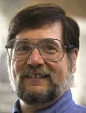
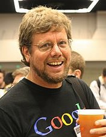
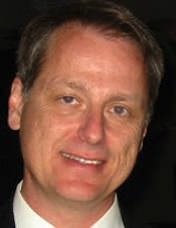

## 명예의 전당 (Hall of Fame)

오늘날 우리가 갖고 있는 멋진 로봇 모의시험기(Robot Simulator)를 만드신 세분을 소개합니다.

| **패티스(Richard Pattis)** | **로썸(Guido Van Rossum)** | **로버지(André Roberge)** |
|------------------------------------------------------------|------------------------------------------------------------|------------------------------------------------------------|
||| | 
| 캐롤 설계자 | 파이썬 설계자 | 리보그 설계자 |
| 1981년 스탠포드 대학에서 리차드 패티스 교수가 캐럴을 설계했다.| 1990년 경, 기도 반 로썸이 파이썬을 설계했다. | 2004년 캐나다 물리학자 안드레 로버지가 이 문제를 정면으로 다루었다.|

