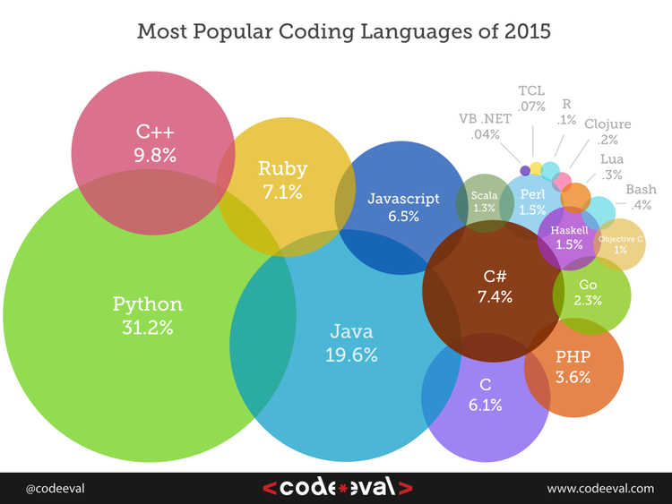
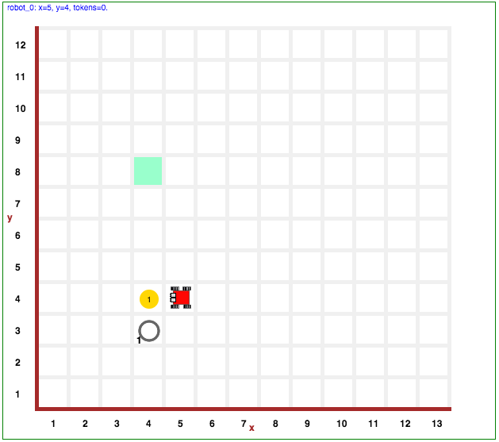
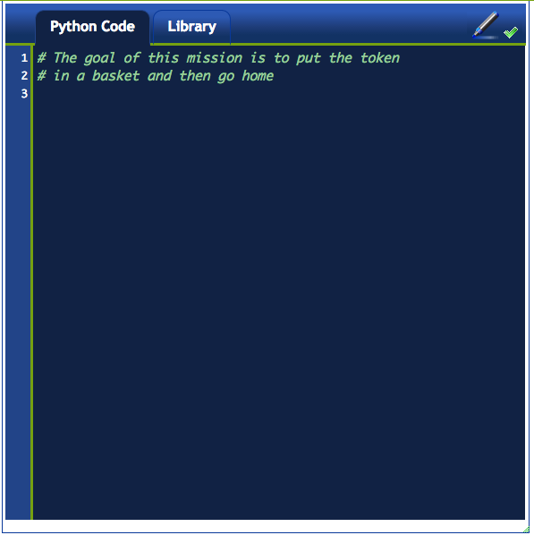
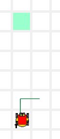
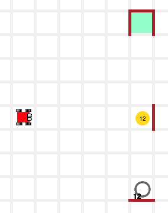

> "수많은 프로그래머를 보아왔지만, 프로그래머는 모든 언어에 능숙하거나 어떤 언어에도 능숙하지 않거나 둘 중 하나다.  
> C 언어에 능숙한 프로그래머는 Erlang에도 능숙할 것이다 --- 놀라도록 훌륭한 예측 변수다.  
> 예외도 보아 왔지만, 한가지 언어에 능숙하는데 필요한 정신적인 기술이 다른 언어에도 관여하는 것으로 보인다."  
>
> "For what I’ve seen of programmers, they’re either good at all languages or good at none.  
> The guy who’s a good C programmer will be good at Erlang — it’s an incredibly good predictor.  
>I’ve seen exceptions to that but the mental skills necessary to be good at one language seem to cover to other languages."  
> --- Joe Armstrong, designer of the Erlang computer language

### 리보그, 카렐 모의 실험장치, 그리고 파이썬, 리보그 엄마 언어

여기서 사용되는 로봇 모의 실험장치, [리보그(Reeborg)](http://reeborg.ca/world.html)는 캐나다 물리학자 [안드레 로버지(André Roberge)](cp-hall-of-fame.html) 박사가 저작했으며 특별한 관심을 표명했고, 이번 수업과정에 기여했다; 오늘날 리보그에서 찾을 수 있는 많은 기능은 PCR 수업에서 나온 피드백 결과다. 로버지 박사에 대한 노고에 대한 감사의 말씀을 전하는 것은 적극 환영한다(andre.roberge@gmail.com). 

로봇 실험장치는 [파이썬](http://en.wikipedia.org/wiki/Python_%28programming_language%29)에서 돌아가고, 파이썬은 학교, 연구소, 산업계에서 폭넓게 사용되는 가장 인기있는 컴퓨터 언어다. 
특히, 쉽고, 명료성과 가독성이 좋기 때문에 첫 컴퓨터 언어로 흔히 사용된다.

### 리보그 GUI

시작해서 첫번째 임무를 해결해 보자: [클릭해 본다](http://codeperspectives.com/reeborg-dev/world.html?proglang=python-en&world=%7B%22robots%22%3A%5B%7B%22x%22%3A5%2C%22y%22%3A4%2C%22tokens%22%3A0%2C%22orientation%22%3A2%2C%22_is_leaky%22%3Atrue%2C%22_prev_x%22%3A5%2C%22_prev_y%22%3A4%2C%22_prev_orientation%22%3A2%2C%22triangle%22%3A0%2C%22square%22%3A0%2C%22star%22%3A0%2C%22start_positions%22%3A%5B%5B5%2C4%5D%5D%7D%5D%2C%22walls%22%3A%7B%7D%2C%22goal%22%3A%7B%22tokens%22%3A%7B%224%2C3%22%3A1%7D%2C%22possible_positions%22%3A%5B%5B4%2C8%5D%5D%2C%22position%22%3A%7B%22x%22%3A4%2C%22y%22%3A8%7D%7D%2C%22tokens%22%3A%7B%224%2C4%22%3A1%7D%7D&editor=&library=%23%20%27from%20my_lib%20import%20*%27%20in%20Python%20Code%20is%20required%20to%20use%0A%23%20the%20code%20in%20this%20library.%20%0A%0Asound(True)%0A%0Adef%20left()%3A%0A%20%20%20%20turn_left()%0A%20%20%20%20%0Adef%20turn_around()%3A%0A%20%20%20%20repeat(turn_left%2C%202)%0A%20%20%20%20%0Adef%20right()%3A%0A%20%20%20%20repeat(turn_left%2C%203)).

먼저 인터페이스 각 부분을 식별해 본다:

#### 카렐, 리보그 세상

- 이곳은 카렐이 살고 있는 세상으로, 격자로 되어 있다.
- 각 격자는 비어 있거나, 객체가 포함되어 있다.
    - 카렐은 하나 혹은 그 이상 토큰을 집어들 수 있다.
    - 임무를 올바르게 끝마치게 되면 '빈' 토큰 상태가 된다.
    - 카렐 목적지, 즉 '집(home)' 정사각형이 목적지가 된다.
- 격자 사이, 즉 셀(cell) 사이에 벽이 있을 수 있다.
- 좌측 상단에, 카렐이 가방에 가지고 있는 토큰 갯수를 볼 수 있다.

#### 코드 편집기

- 코드 편집기에는 `파이썬 코드` 탭과 `라이브러리` 탭이 있다.
- `파이썬 코드` 영역에만 프로그램 코드를 우선 작성한다.
- `라이브러리` 영역은 작성된 프로그램이 사용한 함수를 담고 있다.
- 작성한 프로그램은 30줄 이상 되면 안된다.

#### 제어 버튼

왼쪽 상단 영역에, 다음 버튼이 왼쪽에서 오른쪽으로 위치해 있다:

- 실행 버튼: 프로그램을 실행한다.
- 스텝 버튼: 다음 명령어만 실행한다.
- 임시중지 버튼: 임시로 프로그램을 멈춘다.
- 정지 버튼: 세상을 새로 초기화하지 않고, 프로그램을 정지시킨다.
- 재감기 버튼: 프로그램을 정지시키고, 세상을 새로 초기화한다.

### 작업임무 해결하기

앞에서 살펴본 세상에 나온 작업임무를 해결할 것이다.
카렐은 노란색 토큰을 집어서, 바구니에 넣고 나서, 집으로 돌아온다. 
이제 시작해보자. 

#### 주석

[보여주기](http://codeperspectives.com/reeborg-dev/world.html?proglang=python-en&world=%7B%22robots%22%3A%5B%7B%22x%22%3A5%2C%22y%22%3A4%2C%22tokens%22%3A0%2C%22orientation%22%3A2%2C%22_is_leaky%22%3Atrue%2C%22_prev_x%22%3A5%2C%22_prev_y%22%3A4%2C%22_prev_orientation%22%3A2%2C%22triangle%22%3A0%2C%22square%22%3A0%2C%22star%22%3A0%2C%22start_positions%22%3A%5B%5B5%2C4%5D%5D%7D%5D%2C%22walls%22%3A%7B%7D%2C%22goal%22%3A%7B%22tokens%22%3A%7B%224%2C3%22%3A1%7D%2C%22possible_positions%22%3A%5B%5B4%2C8%5D%5D%2C%22position%22%3A%7B%22x%22%3A4%2C%22y%22%3A8%7D%7D%2C%22tokens%22%3A%7B%224%2C4%22%3A1%7D%7D&editor=%23%20The%20goal%20of%20this%20mission%20is%20to%20put%20the%20token%0A%23%20in%20a%20basket%20and%20then%20go%20home%0A&library=%23%20%27from%20my_lib%20import%20*%27%20in%20Python%20Code%20is%20required%20to%20use%0A%23%20the%20code%20in%20this%20library.%20%0A%0Asound(True)%0A%0Adef%20left()%3A%0A%20%20%20%20turn_left()%0A%20%20%20%20%0Adef%20turn_around()%3A%0A%20%20%20%20repeat(turn_left%2C%202)%0A%20%20%20%20%0Adef%20right()%3A%0A%20%20%20%20repeat(turn_left%2C%203))

*주석*은 프로그램의 일부가 아닌 텍스트다; 컴퓨터가 아닌 프로그래머를 위한 정보가 담겨있다. 즉, 왼쪽 혹은 오른쪽에 페이지 여백에 쓴 메모같은 것이다.
파이썬에서, `#` 해쉬기호로 시작되는 어떤 텍스트도 주석이 된다.

다음 주석으로 시작하는 프로그램을 작성한다:

~~~ {.python}
# 이번 작업임무는 토큰을 집어서, 바구니에 넣고 나서, 
# 집으로 귀향하는 것이다.
~~~

이제 프로그램을 실행한다 (즉, `실행` 버튼을 클릭한다).
프로그램이 실행되고 나서 실패한다. 왜냐하면, 설사 프로그램이 적법하게 작성되었지만, 작업임무에 나온 어떤 목적도 달성하지 못했다. 즉, 바구니에 토큰이 없고, 녹색 정사각형에 로봇이 위치하고 있지 않는다.

#### 시스템 명령어

[보여주기](http://codeperspectives.com/reeborg-dev/world.html?proglang=python-en&world=%7B%22robots%22%3A%5B%7B%22x%22%3A5%2C%22y%22%3A4%2C%22tokens%22%3A0%2C%22orientation%22%3A2%2C%22_is_leaky%22%3Atrue%2C%22_prev_x%22%3A5%2C%22_prev_y%22%3A4%2C%22_prev_orientation%22%3A2%2C%22triangle%22%3A0%2C%22square%22%3A0%2C%22star%22%3A0%2C%22start_positions%22%3A%5B%5B5%2C4%5D%5D%7D%5D%2C%22walls%22%3A%7B%7D%2C%22goal%22%3A%7B%22tokens%22%3A%7B%224%2C3%22%3A1%7D%2C%22possible_positions%22%3A%5B%5B4%2C8%5D%5D%2C%22position%22%3A%7B%22x%22%3A4%2C%22y%22%3A8%7D%7D%2C%22tokens%22%3A%7B%224%2C4%22%3A1%7D%7D&editor=%23%20The%20goal%20of%20this%20mission%20is%20to%20put%20the%20token%0A%23%20in%20a%20basket%20and%20then%20go%20home%0A%0Asound(True)%0Athink(1000)%0A%0A%23%20main%20program%0Amsg%20%3D%20%22I%20am%20ready%20to%20start.%20Press%20play%20to%20continue%22%0Asay(msg)%0Apause()&library=%23%20%27from%20my_lib%20import%20*%27%20in%20Python%20Code%20is%20required%20to%20use%0A%23%20the%20code%20in%20this%20library.%20%0A%0Asound(True)%0A%0Adef%20left()%3A%0A%20%20%20%20turn_left()%0A%20%20%20%20%0Adef%20turn_around()%3A%0A%20%20%20%20repeat(turn_left%2C%202)%0A%20%20%20%20%0Adef%20right()%3A%0A%20%20%20%20repeat(turn_left%2C%203))

다음에 작업임무 수행에 자주 출몰하는 함수가 일부 나와있다.

- **sound(True/False)** : 음향효과를 켜고 끈다.
- **think(n)** : 백만분의 1초로 명령어 사이 지연설정한다.
250 ms 보다 짧게 하면 음향효과가 꺼진다.
- **say(message)** : 팝업 윈도우에 메시지를 뿌려준다.
- **pause()** : 스텝 혹은 재생 버튼을 누를 때까지 프로그램이 잠시 멈춘다.

상기 명령어를 다음 프로그램에 추가하자:

~~~ {.python}
sound(True)
think(1000)
 
# 메인 프로그램
msg = "출발할 준비가 됐습니다. 계속 하려면, 재생 버튼을 눌러주세요."
say(msg)
pause()
~~~

상기 프로그램은 다음 작업을 수행한다:

1. 음향효과를 켠다.
1. 다음 명령어가 실행될 때 1초 지연시간을 설정한다.
1. 문자열을 변수 `msg`에 할당한다.
1. `say()` 함수로 화면에 메시지를 출력한다.
1. 잠시 프로그램을 멈춘다.

#### 붙박이 내장 함수

[보여주기](http://codeperspectives.com/reeborg-dev/world.html?proglang=python-en&world=%7B%22robots%22%3A%5B%7B%22x%22%3A5%2C%22y%22%3A4%2C%22tokens%22%3A0%2C%22orientation%22%3A2%2C%22_is_leaky%22%3Atrue%2C%22_prev_x%22%3A5%2C%22_prev_y%22%3A4%2C%22_prev_orientation%22%3A2%2C%22triangle%22%3A0%2C%22square%22%3A0%2C%22star%22%3A0%2C%22start_positions%22%3A%5B%5B5%2C4%5D%5D%7D%5D%2C%22walls%22%3A%7B%7D%2C%22goal%22%3A%7B%22tokens%22%3A%7B%224%2C3%22%3A1%7D%2C%22possible_positions%22%3A%5B%5B4%2C8%5D%5D%2C%22position%22%3A%7B%22x%22%3A4%2C%22y%22%3A8%7D%7D%2C%22tokens%22%3A%7B%224%2C4%22%3A1%7D%7D&editor=%23%20The%20goal%20of%20this%20mission%20is%20to%20put%20the%20token%0A%23%20in%20a%20basket%20and%20then%20go%20home%0A%0Asound(True)%0Athink(1000)%0A%0A%23%20main%20program%0Amsg%20%3D%20%22I%20am%20ready%20to%20start.%20Press%20play%20to%20continue%22%0Asay(msg)%0Apause()%0A%0Amove()%20%20%20%20%20%20%20%23%20step%20on%20the%20cell%20that%20has%20the%20token%0Atake()%20%20%20%20%20%20%20%23%20take%20token%20and%20put%20it%20in%20bag%0Aturn_left()%20%20%23%20turn%20to%20the%20left%20of%20the%20robot%2C%20not%20your%20left%0Amove()%20%20%20%20%20%20%20%23%20step%20on%20the%20cell%20that%20has%20the%20basked%0Aput()%20%20%20%20%20%20%20%20%23%20put%20on%20the%20floor%20the%20token%20in%20the%20bag&library=%23%20%27from%20my_lib%20import%20*%27%20in%20Python%20Code%20is%20required%20to%20use%0A%23%20the%20code%20in%20this%20library.%20%0A%0Asound(True)%0A%0Adef%20left()%3A%0A%20%20%20%20turn_left()%0A%20%20%20%20%0Adef%20turn_around()%3A%0A%20%20%20%20repeat(turn_left%2C%202)%0A%20%20%20%20%0Adef%20right()%3A%0A%20%20%20%20repeat(turn_left%2C%203))

작동명령(혹은 함수)이 로봇을 동작하게 한다. 카렐에는 4가지 내장 작동명령이 있다:

~~~ {.python}
move()       # 로봇 앞에 있는 셀로 이동한다.
turn_left()  # (제자리에서) 좌측으로 90° 회전한다.
take()         # 바닥에서 토큰을 하나 집어 가방에 넣는다.
put()           # 토큰을 가방에서 빼서, 바닥에 내려놓는다.
~~~

상기 명령어를 사용해서, 첫번째 작업임무를 완수한다.
즉, 토큰을 바구니에 넣는데, 다음 코드를 사용한다.

~~~ {.python}
move()       # 로봇 앞에 있는 셀로 이동한다.
take()       # 바닥에서 토큰을 하나 집어 가방에 넣는다.
turn_left()  # 여러분의 좌측이 아니라, 로봇이 좌측으로 회전한다.
move()       # 바구니가 있는 셀 위에 선다.
put()        # 토큰을 바닥에 내려놓는다.
~~~

이번에 프로그램을 실행하면, 여전히 실패하지만,
토큰이 올바른 최종 지점에 놓여진 것을 나타낸다.

> ### 중요 {.callout}
> 
> 작업임무는 다음 경우에 실패한다...  
> ... 벽에 카렐이 충돌한다.  
> ... 아무것도 없는 셀에 위치할 때 토큰을 집어 올리게 한다.  
> ... 토큰을 가방에 빼서 놓게 하지만, 가방에 토큰이 없다.  

#### 반복

[보여주기](http://codeperspectives.com/reeborg-dev/world.html?proglang=python-en&world=%7B%22robots%22%3A%5B%7B%22x%22%3A5%2C%22y%22%3A4%2C%22tokens%22%3A0%2C%22orientation%22%3A2%2C%22_is_leaky%22%3Atrue%2C%22_prev_x%22%3A5%2C%22_prev_y%22%3A4%2C%22_prev_orientation%22%3A2%2C%22triangle%22%3A0%2C%22square%22%3A0%2C%22star%22%3A0%2C%22start_positions%22%3A%5B%5B5%2C4%5D%5D%7D%5D%2C%22walls%22%3A%7B%7D%2C%22goal%22%3A%7B%22tokens%22%3A%7B%224%2C3%22%3A1%7D%2C%22possible_positions%22%3A%5B%5B4%2C8%5D%5D%2C%22position%22%3A%7B%22x%22%3A4%2C%22y%22%3A8%7D%7D%2C%22tokens%22%3A%7B%224%2C4%22%3A1%7D%7D&editor=%23%20The%20goal%20of%20this%20mission%20is%20to%20put%20the%20token%0A%23%20in%20a%20basket%20and%20then%20go%20home%0A%0Asound(True)%0Athink(1000)%0A%0A%23%20main%20program%0Amsg%20%3D%20%22I%20am%20ready%20to%20start.%20Press%20play%20to%20continue%22%0Asay(msg)%0Apause()%0A%0Amove()%20%20%20%20%20%20%20%23%20step%20on%20the%20cell%20that%20has%20the%20token%0Atake()%20%20%20%20%20%20%20%23%20take%20token%20and%20put%20it%20in%20bag%0Aturn_left()%20%20%23%20turn%20to%20the%20left%20of%20the%20robot%2C%20not%20your%20left%0Amove()%20%20%20%20%20%20%20%23%20step%20on%20the%20cell%20that%20has%20the%20basked%0Aput()%20%20%20%20%20%20%20%20%23%20put%20on%20the%20floor%20the%20token%20in%20the%20bag%0A%0Arepeat(turn_left%2C%202)%20%20%23%20turn_around&library=%23%20%27from%20my_lib%20import%20*%27%20in%20Python%20Code%20is%20required%20to%20use%0A%23%20the%20code%20in%20this%20library.%20%0A%0Asound(True)%0A%0Adef%20left()%3A%0A%20%20%20%20turn_left()%0A%20%20%20%20%0Adef%20turn_around()%3A%0A%20%20%20%20repeat(turn_left%2C%202)%0A%20%20%20%20%0Adef%20right()%3A%0A%20%20%20%20repeat(turn_left%2C%203))

`repeat()` 함수는 단일 명령어를 여러번 반복한다:

~~~ {.python}
repeat(command, n )  # command 명령을 n 번 반복
~~~

예를 들어, 카렐이 바구니에 토큰을 넣었다; 이제, 뒤로 돌아 집으로 귀향한다.
뒤로 돌려면, `turn_left()` 명령을 두번 수행하도록 하거나,
`repeat()` 명령어를 사용해서 `turn_left()` 명령을 2회 반복시킨다.

요약하면, 다음과 같이 작성하는 대신에,

~~~ {.python}
turn_left()
turn_left()
~~~

다음과 같이 적성한다:

~~~ {.python}
repeat(turn_left, 2) # 뒤돌아 선다.
~~~

상기 코드 모두 동일한 작업을 수행하지만, 두번째 코드가 더 낫다.
이유는 동일한 작업을 더 명료하게 수행하기 때문이다. 다시 강조하면:

**두번째 코드가 더 낫다. 왜냐하면 첫번째 코드보다 더 짧기 때문이 아니라, 더 명확하기 때문이다.**

#### 라이브러리

[보여주기](http://codeperspectives.com/reeborg-dev/world.html?proglang=python-en&world=%7B%22robots%22%3A%5B%7B%22x%22%3A5%2C%22y%22%3A4%2C%22tokens%22%3A0%2C%22orientation%22%3A2%2C%22_is_leaky%22%3Atrue%2C%22_prev_x%22%3A5%2C%22_prev_y%22%3A4%2C%22_prev_orientation%22%3A2%2C%22triangle%22%3A0%2C%22square%22%3A0%2C%22star%22%3A0%2C%22start_positions%22%3A%5B%5B5%2C4%5D%5D%7D%5D%2C%22walls%22%3A%7B%7D%2C%22goal%22%3A%7B%22tokens%22%3A%7B%224%2C3%22%3A1%7D%2C%22possible_positions%22%3A%5B%5B4%2C8%5D%5D%2C%22position%22%3A%7B%22x%22%3A4%2C%22y%22%3A8%7D%7D%2C%22tokens%22%3A%7B%224%2C4%22%3A1%7D%7D&editor=%23%20The%20goal%20of%20this%20mission%20is%20to%20put%20the%20token%0A%23%20in%20a%20basket%20and%20then%20go%20home%0Afrom%20my_lib%20import%20%20*%0Asound(True)%0Athink(1000)%0A%0A%23%20main%20program%0Amsg%20%3D%20%22I%20am%20ready%20to%20start.%20Press%20play%20to%20continue%22%0Asay(msg)%0Apause()%0A%0Amove()%20%20%20%20%20%20%20%23%20step%20on%20the%20cell%20that%20has%20the%20token%0Atake()%20%20%20%20%20%20%20%23%20take%20token%20and%20put%20it%20in%20bag%0Aturn_left()%20%20%23%20turn%20to%20the%20left%20of%20the%20robot%2C%20not%20your%20left%0Amove()%20%20%20%20%20%20%20%23%20step%20on%20the%20cell%20that%20has%20the%20basked%0Aput()%20%20%20%20%20%20%20%20%23%20put%20on%20the%20floor%20the%20token%20in%20the%20bag%0A%0Aturn_around()%20%20%23%20turn_around&library=%23%20%27from%20my_lib%20import%20*%27%20in%20Python%20Code%20is%20required%20to%20use%0A%23%20the%20code%20in%20this%20library.%20%0A%0Asound(True)%0A%0Adef%20left()%3A%0A%20%20%20%20turn_left()%0A%20%20%20%20%0Adef%20turn_around()%3A%0A%20%20%20%20repeat(turn_left%2C%202)%0A%20%20%20%20%0Adef%20right()%3A%0A%20%20%20%20repeat(turn_left%2C%203))

카렐을 켰을 때, 카렐은 명령어 4개만 알고 있지만, 카렐이 이미 알고 있는 명령어 4개에 기초해서 새로운 명령어를 가르칠 수 있따. 라이브러리에는 추가적인 명령어가 3개 더 있다:

- left()
- right()
- turn_around()

특히, `turn_around()` 명령어는 방금전에 작성한 것을 정확하게 수행한다: `repeat()`을 사용해서 로봇을 뒤돌아서게 한다. 따라서, 코드를 반복하는 대신에, 라이브러리에 이미 작성된 명령어만 사용한다. 프로그램 상단에 다음처럼 한줄을 추가하면 라이브러리에 포함된 명령어를 사용하도록 파이썬에게 일러준다.

~~~ {.python}
from my_lib import  *
~~~

상기 명령어는 `my_lib` 에 있는 모든 것을 프로그램이 사용할 수 있도록 한다는 의미다.

따라서, 다음과 같이 하면 라이브러리를 사용하도록 프로그램이 변경된다:

~~~ {.python}
from my_lib import  *
....
turn_around()
~~~

### 3학년 - 거의 도착했습니다.

 [학습 교안](http://codeperspectives.com/reeborg-dev/world.html?proglang=python-en&world=%7B%22robots%22%3A%5B%7B%22x%22%3A5%2C%22y%22%3A4%2C%22tokens%22%3A0%2C%22orientation%22%3A2%2C%22_is_leaky%22%3Atrue%2C%22_prev_x%22%3A5%2C%22_prev_y%22%3A4%2C%22_prev_orientation%22%3A2%2C%22triangle%22%3A0%2C%22square%22%3A0%2C%22star%22%3A0%2C%22start_positions%22%3A%5B%5B5%2C4%5D%5D%7D%5D%2C%22walls%22%3A%7B%7D%2C%22goal%22%3A%7B%22tokens%22%3A%7B%224%2C3%22%3A1%7D%2C%22possible_positions%22%3A%5B%5B4%2C8%5D%5D%2C%22position%22%3A%7B%22x%22%3A4%2C%22y%22%3A8%7D%7D%2C%22tokens%22%3A%7B%224%2C4%22%3A1%7D%7D&editor=%23%20The%20goal%20of%20this%20mission%20is%20to%20put%20the%20token%0A%23%20in%20a%20basket%20and%20then%20go%20home%0Afrom%20my_lib%20import%20%20*%0Asound(True)%0Athink(1000)%0A%0A%23%20main%20program%0Amsg%20%3D%20%22I%20am%20ready%20to%20start.%20Press%20play%20to%20continue%22%0Asay(msg)%0Apause()%0A%0Amove()%20%20%20%20%20%20%20%23%20step%20on%20the%20cell%20that%20has%20the%20token%0Atake()%20%20%20%20%20%20%20%23%20take%20token%20and%20put%20it%20in%20bag%0Aturn_left()%20%20%23%20turn%20to%20the%20left%20of%20the%20robot%2C%20not%20your%20left%0Amove()%20%20%20%20%20%20%20%23%20step%20on%20the%20cell%20that%20has%20the%20basked%0Aput()%20%20%20%20%20%20%20%20%23%20put%20on%20the%20floor%20the%20token%20in%20the%20bag%0A%0Aturn_around()%20%20%23%20turn_around&library=%23%20%27from%20my_lib%20import%20*%27%20in%20Python%20Code%20is%20required%20to%20use%0A%23%20the%20code%20in%20this%20library.%20%0A%0Asound(True)%0A%0Adef%20left()%3A%0A%20%20%20%20turn_left()%0A%20%20%20%20%0Adef%20turn_around()%3A%0A%20%20%20%20repeat(turn_left%2C%202)%0A%20%20%20%20%0Adef%20right()%3A%0A%20%20%20%20repeat(turn_left%2C%203))

뭐라고? 훈련 작업임무가 완벽하게 완수된 것이 아니다: 카렐은 정사각형 집으로 귀향해야만 된다. 작업임무를 완수해서, 토큰을 바구니에 넣은 후에 집에서 편안한 휴식을 갖도록 한다.

해답: [보여주기](http://codeperspectives.com/reeborg-dev/world.html?proglang=python-en&world=%7B%22robots%22%3A%5B%7B%22x%22%3A5%2C%22y%22%3A4%2C%22tokens%22%3A0%2C%22orientation%22%3A2%2C%22_is_leaky%22%3Atrue%2C%22_prev_x%22%3A5%2C%22_prev_y%22%3A4%2C%22_prev_orientation%22%3A2%2C%22triangle%22%3A0%2C%22square%22%3A0%2C%22star%22%3A0%2C%22start_positions%22%3A%5B%5B5%2C4%5D%5D%7D%5D%2C%22walls%22%3A%7B%7D%2C%22goal%22%3A%7B%22tokens%22%3A%7B%224%2C3%22%3A1%7D%2C%22possible_positions%22%3A%5B%5B4%2C8%5D%5D%2C%22position%22%3A%7B%22x%22%3A4%2C%22y%22%3A8%7D%7D%2C%22tokens%22%3A%7B%224%2C4%22%3A1%7D%7D&editor=%23%20The%20goal%20of%20this%20mission%20is%20to%20put%20the%20token%0A%23%20in%20a%20basket%20and%20then%20go%20home%0Afrom%20my_lib%20import%20%20*%0Asound(True)%0Athink(1000)%0A%0A%23%20main%20program%0Amsg%20%3D%20%22I%20am%20ready%20to%20start.%20Press%20play%20to%20continue%22%0Asay(msg)%0Apause()%0A%0Amove()%20%20%20%20%20%20%20%23%20step%20on%20the%20cell%20that%20has%20the%20token%0Atake()%20%20%20%20%20%20%20%23%20take%20token%20and%20put%20it%20in%20bag%0Aturn_left()%20%20%23%20turn%20to%20the%20left%20of%20the%20robot%2C%20not%20your%20left%0Amove()%20%20%20%20%20%20%20%23%20step%20on%20the%20cell%20that%20has%20the%20basked%0Aput()%20%20%20%20%20%20%20%20%23%20put%20on%20the%20floor%20the%20token%20in%20the%20bag%0A%0Aturn_around()%20%20%23%20turn_around%0A%0Arepeat(move%2C%205)&library=%23%20%27from%20my_lib%20import%20*%27%20in%20Python%20Code%20is%20required%20to%20use%0A%23%20the%20code%20in%20this%20library.%20%0A%0Asound(True)%0A%0Adef%20left()%3A%0A%20%20%20%20turn_left()%0A%20%20%20%20%0Adef%20turn_around()%3A%0A%20%20%20%20repeat(turn_left%2C%202)%0A%20%20%20%20%0Adef%20right()%3A%0A%20%20%20%20repeat(turn_left%2C%203))

### 4학년 - 병아리 12 마리

[학습 교안](http://codeperspectives.com/reeborg-dev/world.html?proglang=python-en&world=%7B%22robots%22%3A%5B%7B%22x%22%3A4%2C%22y%22%3A6%2C%22tokens%22%3A0%2C%22orientation%22%3A0%2C%22_is_leaky%22%3Atrue%2C%22_prev_x%22%3A4%2C%22_prev_y%22%3A6%2C%22_prev_orientation%22%3A0%2C%22triangle%22%3A0%2C%22square%22%3A0%2C%22star%22%3A0%2C%22start_positions%22%3A%5B%5B4%2C6%5D%5D%7D%5D%2C%22walls%22%3A%7B%228%2C10%22%3A%5B%22east%22%5D%2C%229%2C10%22%3A%5B%22north%22%2C%22east%22%5D%2C%229%2C2%22%3A%5B%22north%22%5D%2C%229%2C6%22%3A%5B%22east%22%5D%7D%2C%22goal%22%3A%7B%22tokens%22%3A%7B%229%2C3%22%3A12%7D%2C%22possible_positions%22%3A%5B%5B9%2C10%5D%5D%2C%22position%22%3A%7B%22x%22%3A9%2C%22y%22%3A10%7D%7D%2C%22tokens%22%3A%7B%229%2C6%22%3A12%7D%7D&editor=&library=%23%20%27from%20my_lib%20import%20*%27%20in%20Python%20Code%20is%20required%20to%20use%0A%23%20the%20code%20in%20this%20library.%20%0A%0Asound(True)%0A%0Adef%20left()%3A%0A%20%20%20%20turn_left()%0A%20%20%20%20%0Adef%20turn_around()%3A%0A%20%20%20%20repeat(turn_left%2C%202)%0A%20%20%20%20%0Adef%20right()%3A%0A%20%20%20%20repeat(turn_left%2C%203))

 

아!... 병아리가 닭장을 뛰쳐나갔다. 빨리 병아리를 잡어서 닭장에 몰아 넣고, 카렐 집으로 귀향한다.

해답: [보여주기](http://codeperspectives.com/reeborg-dev/world.html?proglang=python-en&world=%7B%22robots%22%3A%5B%7B%22x%22%3A4%2C%22y%22%3A6%2C%22tokens%22%3A0%2C%22orientation%22%3A0%2C%22_is_leaky%22%3Atrue%2C%22_prev_x%22%3A4%2C%22_prev_y%22%3A6%2C%22_prev_orientation%22%3A0%2C%22triangle%22%3A0%2C%22square%22%3A0%2C%22star%22%3A0%2C%22start_positions%22%3A%5B%5B4%2C6%5D%5D%7D%5D%2C%22walls%22%3A%7B%228%2C10%22%3A%5B%22east%22%5D%2C%229%2C10%22%3A%5B%22north%22%2C%22east%22%5D%2C%229%2C2%22%3A%5B%22north%22%5D%2C%229%2C6%22%3A%5B%22east%22%5D%7D%2C%22goal%22%3A%7B%22tokens%22%3A%7B%229%2C3%22%3A12%7D%2C%22possible_positions%22%3A%5B%5B9%2C10%5D%5D%2C%22position%22%3A%7B%22x%22%3A9%2C%22y%22%3A10%7D%7D%2C%22tokens%22%3A%7B%229%2C6%22%3A12%7D%7D&editor=%23%20The%20goal%20of%20this%20mission%20is%20to%20put%20the%20token%0A%23%20in%20a%20basket%20and%20then%20go%20home%0Afrom%20my_lib%20import%20%20*%0Asound(True)%0Athink(251)%0A%0A%23%20main%20program%0Amsg%20%3D%20%22I%20am%20ready%20to%20start.%20Press%20play%20to%20continue%22%0Asay(msg)%0Apause()%0A%0Arepeat(move%2C%205)%20%20%20%23%20step%20on%20the%20cell%20that%20has%20the%20token%0Arepeat(take%2C%2012)%20%20%23%20take%20token%20and%20put%20it%20in%20bag%0Aright()%0Arepeat(move%2C%203)%20%20%20%23%20step%20on%20the%20cell%20that%20has%20the%20basked%0Arepeat(put%2C%2012)%20%20%20%23%20put%20on%20the%20floor%20the%20token%20in%20the%20bag%0A%0Aturn_around()%20%20%23%20turn_around%0A%0Arepeat(move%2C%207)&library=%23%20%27from%20my_lib%20import%20*%27%20in%20Python%20Code%20is%20required%20to%20use%0A%23%20the%20code%20in%20this%20library.%20%0A%0Asound(True)%0A%0Adef%20left()%3A%0A%20%20%20%20turn_left()%0A%20%20%20%20%0Adef%20turn_around()%3A%0A%20%20%20%20repeat(turn_left%2C%202)%0A%20%20%20%20%0Adef%20right()%3A%0A%20%20%20%20repeat(turn_left%2C%203))

| 현재 상황   |  집에 도착한 후     |
|---------------------------------------------------------|---------------------------------------------------------|
| ||

### 5학년/6학년

5학년과 6학년에는 작업임무가 없다. 왜냐하면, 이미 상당한 학습량을 다루었기 때문이다. 4학년 작업임무를 수행할 수 있다면, 완벽하게 진도를 따라나가고 있다. 축하합니다.

