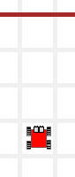
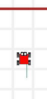
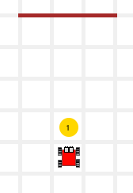
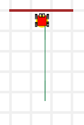
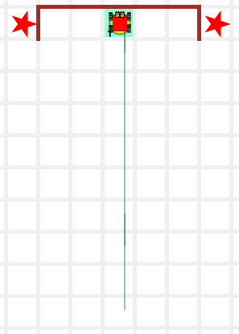
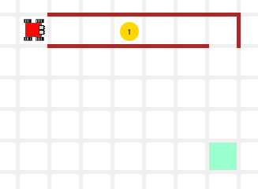
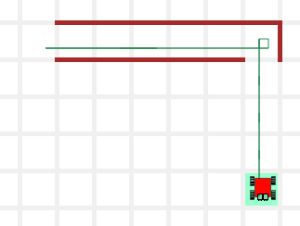
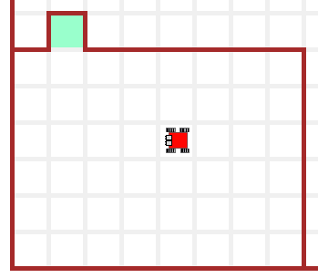
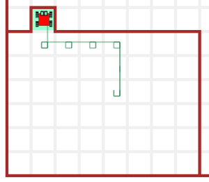

> "절대로, 절대로, 절대 포기하지 마라"  
> "Never, never, never give up"  
> --- Churchill

### 재귀

재귀는 함수 자신을 반복해서 호출해서 점진적으로 동일한 문제를 작은 문제로 풀어나가는 기법이다.
모든 재귀 함수는 다음과 유사한 작업 매뉴얼 견본모양을 취한다:

~~~ {.python} 
def <함수명>:
    if <기본 조건>:   # 문제가 해결되었거나 거의 해결되었나?
        <기본 사례>        # 해결한다.
        return
   else:                   # 그렇지 않은 경우 문제가 해결되지 않았다면...
        <재귀 사례>   # ...문제를 조금 축소한다... 그리고...
        <재귀 호출>   # ...다시 문제를 풀려고 시도한다.
        return
~~~

파이썬에서, `if`문과 `else`문 몸통부문 말미에 `return` 반환문이 필요하지는 않지만, 무슨 일이 일어나고 있는지 명확히 하려고 지금은 남겨둔다.

지금까지 살펴본 함수와 달리, 재귀 함수는 항상 다른 두 지점에서 반환할 수 있다.
다음에 재귀함수 구성요소가 나와있다:

- **기본 조건:** 기본 조건은 문제가 이미 해결되었거나 해법이 매우 쉽다는 점을 일러준다. 따라서, 기본 조건이 참(True)이면, 단순히 문제가 해결되어서 반환하고 종료된다.
- **기본 사례:** 기본 조건이 참(True)이면 실행되는 기본 사례다; 많은 경우에 기본 사례는 비어있다; 즉, 수행할 작업이 없어서, 단순히 반환하고 종료된다.
- **재귀 사례:** 이 부분이 재귀에 대한 핵심이다: 문제를 동일한 더 작은 버젼 문제로 쪼갠다. 더 작은 문제는 기본 사례에 대한 최초문제에 더 가까워진다.
- **재귀 호출:** 함수를 다시 호출해서, 최초 문제에 대한 더 작은 문제를 풀려고 시도한다.

### 예제: `go_to_wall()`

[추적하기](http://codeperspectives.com/reeborg-dev/world.html?proglang=python-en&world=%7B%22robots%22%3A%5B%7B%22x%22%3A7%2C%22y%22%3A8%2C%22tokens%22%3A0%2C%22orientation%22%3A1%2C%22_prev_x%22%3A7%2C%22_prev_y%22%3A8%2C%22_prev_orientation%22%3A1%2C%22start_positions%22%3A%5B%5B7%2C8%5D%5D%7D%5D%2C%22tokens%22%3A%7B%7D%2C%22walls%22%3A%7B%226%2C11%22%3A%5B%22north%22%5D%2C%227%2C11%22%3A%5B%22north%22%5D%2C%228%2C11%22%3A%5B%22north%22%5D%7D%2C%22small_tiles%22%3Afalse%2C%22rows%22%3A12%2C%22cols%22%3A14%7D&editor=%23%20%20go_to_wall()%0Afrom%20my_lib%20import%20*%0A%0Adef%20ok_mess(%20mess%20)%3A%0A%20%20%20%20say(%20mess%20)%0A%20%20%20%20pause()%0A%0Adef%20go_to_wall()%3A%0A%20%20%20%20ok_mess(%20%22entering%20to%20go_to_wall()%22%20)%20%20%20%20%0A%20%20%20%20if%20wall_in_front()%3A%0A%20%20%20%20%20%20%20%20pass%0A%20%20%20%20%20%20%20%20ok_mess(%20%22returning%20from%20call%3A%20wall%20FOUND%22%20)%0A%20%20%20%20%20%20%20%20return%0A%20%20%20%20else%3A%0A%20%20%20%20%20%20%20%20move()%0A%20%20%20%20%20%20%20%20go_to_wall()%0A%20%20%20%20%20%20%20%20ok_mess(%20%22returning%20from%20call%3A%20wall%20NOT%20FOUND%22%20)%0A%20%20%20%20%20%20%20%20return%0A%0A%0Asay(%20%22about%20to%20begin%22%20)%0Ago_to_wall()%0Asay(%20%22I%27ve%20arrived%22%20)%0A&library=%23%20%27import%20my_lib%27%20in%20Python%20Code%20is%20required%20to%20use%0A%23%20the%20code%20in%20this%20library.%20%0A%0Asound(True)%0A%0Adef%20left()%3A%0A%20%20%20%20turn_left()%0A%20%20%20%20%0Adef%20right()%3A%0A%20%20%20%20repeat(%20left%2C%203%20)%0A%20%20%20%20%0Adef%20turn_around()%3A%0A%20%20%20%20repeat(%20left%2C%202%20)%0A%20%20%20%20%0Adef%20sidestep_left()%3A%0A%20%20%20%20left()%0A%20%20%20%20move()%0A%20%20%20%20right()%0A%20%20%20%20%0Adef%20sidestep_right()%3A%0A%20%20%20%20right()%0A%20%20%20%20move()%0A%20%20%20%20left()%0A%20%20%20%20%0Adef%20step_back()%3A%0A%20%20%20%20turn_around()%0A%20%20%20%20move()%0A%20%20%20%20turn_around()%0A%20%20%20%20%0Adef%20safe_move()%3A%0A%20%20%20%20if%20front_is_clear()%3A%0A%20%20%20%20%20%20%20%20move()%0A%20%20%20%20%20%20%20%20%0Adef%20safe_take()%3A%0A%20%20%20%20if%20token_here()%3A%0A%20%20%20%20%20%20%20%20take()%0A%20%20%20%20%20%20%20%20%0Adef%20safe_put()%3A%0A%20%20%20%20if%20has_token()%3A%0A%20%20%20%20%20%20%20%20put()%0A%20%20%20%20%20%20%20%20%0A%0A%23%20sensing%20functions%0A%0Adef%20wall_in_front()%3A%0A%20%20%20%20return%20not%20front_is_clear()%0A%0Adef%20cell_is_empty()%3A%0A%20%20%20%20return%20not%20token_here()%0A%0Adef%20bag_is_empty()%3A%0A%20%20%20%20return%20not%20has_token())

| `wall_in_front()` == False; do else | `wall_in_front()` == False; do else | `wall_in_front()` == False; do else | `wall_in_front()` == True; do if |
|------------------------------------------------|------------------------------------------------|------------------------------------------------|------------------------------------------------|
|||||

작업 매뉴얼 견본모양....

~~~ {.python}
def <함수명>:
    if <기본 조건>:   # 쉬운 사례
        <기본 사례>        # if문 몸통부문
        return
   else:                   # 재귀 사례
        <재귀 사례>   # 문제를 축소한다.
        <재귀 호출>   # ...다시 문제를 풀려고 시도한다.
        return
~~~

작업 매뉴얼 채워 넣은 후...

~~~ {.python}
def go_to_wall():
   if wall_in_front(): # 쉬운 사례
      pass             # if문 몸통부문
      return
   else:               # 재귀 사례
      move()           # 문제를 축소한다.
      go_to_wall()     # ...다시 문제를 풀려고 시도한다.
      return
~~~

`pass`는 파이썬 키워드로 어떤 작업도 수행하지 않는 명령어다.
카렐 정방에 벽이 있기만 하면, 상기 작성한 함수는 카렐의 초기 위치에 관계없이 동작한다.

### 예제: `touchdown()` 터치다운 득점하기

[학습 교안](http://codeperspectives.com/reeborg-dev/world.html?proglang=python-en&world=%7B%22robots%22%3A%5B%7B%22x%22%3A7%2C%22y%22%3A7%2C%22tokens%22%3A0%2C%22orientation%22%3A1%2C%22_prev_x%22%3A7%2C%22_prev_y%22%3A7%2C%22_prev_orientation%22%3A1%7D%5D%2C%22tokens%22%3A%7B%227%2C8%22%3A1%7D%2C%22walls%22%3A%7B%226%2C11%22%3A%5B%22north%22%5D%2C%227%2C11%22%3A%5B%22north%22%5D%2C%228%2C11%22%3A%5B%22north%22%5D%7D%7D&editor=%23%20level%207%20-%20recursion%0Afrom%20my_lib%20import%20*%0A%0Asound(True)%0A%0Adef%20go_to_wall()%3A%0A%20%20%20%20if%20wall_in_front()%3A%0A%20%20%20%20%20%20%20%20pass%0A%20%20%20%20%20%20%20%20return%0A%20%20%20%20else%3A%0A%20%20%20%20%20%20%20%20move()%0A%20%20%20%20%20%20%20%20go_to_wall()%0A%20%20%20%20%20%20%20%20return%0A%0A%20%20%20%20%0A%23%20main%20program%0Amove()%0Atake()%0Ago_to_wall()%0Aput()&library=%23%20%27import%20my_lib%27%20in%20Python%20Code%20is%20required%20to%20use%0A%23%20the%20code%20in%20this%20library.%20%0A%0Asound(True)%0A%0Adef%20left()%3A%0A%20%20%20%20turn_left()%0A%20%20%20%20%0Adef%20right()%3A%0A%20%20%20%20repeat(%20left%2C%203%20)%0A%20%20%20%20%0Adef%20turn_around()%3A%0A%20%20%20%20repeat(%20left%2C%202%20)%0A%20%20%20%20%0Adef%20sidestep_left()%3A%0A%20%20%20%20left()%0A%20%20%20%20move()%0A%20%20%20%20right()%0A%20%20%20%20%0Adef%20sidestep_right()%3A%0A%20%20%20%20right()%0A%20%20%20%20move()%0A%20%20%20%20left()%0A%20%20%20%20%0Adef%20step_back()%3A%0A%20%20%20%20turn_around()%0A%20%20%20%20move()%0A%20%20%20%20turn_around()%0A%20%20%20%20%0Adef%20safe_move()%3A%0A%20%20%20%20if%20front_is_clear()%3A%0A%20%20%20%20%20%20%20%20move()%0A%20%20%20%20%20%20%20%20%0Adef%20safe_take()%3A%0A%20%20%20%20if%20token_here()%3A%0A%20%20%20%20%20%20%20%20take()%0A%20%20%20%20%20%20%20%20%0Adef%20safe_put()%3A%0A%20%20%20%20if%20has_token()%3A%0A%20%20%20%20%20%20%20%20put()%0A%20%20%20%20%20%20%20%20%0A%0A%23%20sensing%20functions%0A%0Adef%20wall_in_front()%3A%0A%20%20%20%20return%20not%20front_is_clear()%0A%0Adef%20cell_is_empty()%3A%0A%20%20%20%20return%20not%20token_here()%0A%0Adef%20bag_is_empty()%3A%0A%20%20%20%20return%20not%20has_token())

| 출발 준비! | 터치다운 득점|
|--------------------------------------------------|--------------------------------------------------|
|||

~~~ {.python}
def go_to_wall():
   if wall_in_front(): # 쉬운 사례
      pass             # if문 몸통부문
      return
   else:               # 재귀 사례
      move()           # 문제를 축소한다.
      go_to_wall()     # ...다시 문제를 풀려고 시도한다.
      return

# 메인 프로그램
move()
take()
go_to_wall()
put()      
~~~

### 예제: 해법 깔끔히 정리

재귀 개념에 대해 친숙해진 후에, 작업 매뉴얼 견본을 재배치해서 함수를 깔끔히 정리한다.
예를 들어, `go_to_wall()` 함수를 깔끔히 정리하자:

**1. 최초 원본**

~~~ {.python}
def go_to_wall():
    if wall_in_front():
        pass
        return
    else:
        move()
        go_to_wall()
        return
~~~

**2. `if`문과 `else`문 교환**
조건 부정(`not`)을 기억하라.

~~~ {.python}
def go_to_wall():
    if not wall_in_front():
        move()
        go_to_wall()
        return
    else:
        pass
        return
~~~

**3. 보수 연산 함수를 사용**
만약 가능하면, 기본 조건에 보수 연산 함수를 사용한다.

~~~ {.python}
def go_to_wall():
    if front_is_clear():
        move()
        go_to_wall()
        return
    else:
        pass
        return
~~~

**4. `return` 문을 뽑아낸다.**

~~~ {.python}
def go_to_wall():
    if front_is_clear():
        move()
        go_to_wall()
    else:
        pass
    return
~~~

**5. 함수 말미 `return`문 제거**
아무 것도 반환하지 않는 `return`문은 선택옵션이다;
제거한다.

~~~ {.python}
def go_to_wall():
    if front_is_clear():
        move()
        go_to_wall()
    else:
        pass
~~~

**6. `else`문 제거**
`else`문 몸통부문은 아무 작업도 수행하지 않는다; 제거한다.

~~~ {.python}
def go_to_wall():
    if front_is_clear():
        move()
        go_to_wall()
~~~

위에 나온 모든 go_to_wall() 함수는 재귀함수다.
첫번째 버젼 함수가 매우 명확하다; 기본 사례와 일반 사례가 나타나 있다.
재귀에 친숙해지면, 마지막 버젼 함수도 의미가 분명하다;
기본 사례는 어떤 작업도 수행하지 않고, 단순히 반환하는 역할만 수행하고 있음을 의미한다.

함수 크기가 함수를 변경해야 되는 좋은 사유가 절대로 되지 못한다;
명확성이 지도원칙이다: 명확성을 잃지 않고 함수 크기를 축소할 수 있다면, 함수 크기를 줄여야 된다, 그렇지 않은 경우 줄이면 않된다.

### 훈련 작업임무

#### TM1. 남가주(SoCal) 생활 -  와이드 리시버

[학습 교안](http://codeperspectives.com/reeborg-dev/world.html?proglang=python-en&world=%7B%22robots%22%3A%5B%7B%22x%22%3A7%2C%22y%22%3A4%2C%22tokens%22%3A0%2C%22orientation%22%3A1%2C%22_prev_x%22%3A7%2C%22_prev_y%22%3A4%2C%22_prev_orientation%22%3A1%2C%22start_positions%22%3A%5B%5B7%2C2%5D%2C%5B7%2C3%5D%2C%5B7%2C4%5D%5D%7D%5D%2C%22tokens%22%3A%7B%227%2C9%22%3A1%2C%227%2C7%22%3A0%2C%227%2C5%22%3A0%7D%2C%22walls%22%3A%7B%226%2C11%22%3A%5B%22north%22%5D%2C%227%2C11%22%3A%5B%22north%22%5D%2C%228%2C11%22%3A%5B%22north%22%5D%2C%229%2C11%22%3A%5B%22north%22%2C%22east%22%5D%2C%225%2C11%22%3A%5B%22north%22%5D%2C%224%2C11%22%3A%5B%22east%22%5D%7D%2C%22shapes%22%3A%7B%224%2C11%22%3A%22star%22%2C%2210%2C11%22%3A%22star%22%7D%2C%22min_tokens%22%3A%7B%227%2C7%22%3A0%2C%227%2C5%22%3A0%7D%2C%22max_tokens%22%3A%7B%227%2C7%22%3A1%2C%227%2C5%22%3A1%7D%2C%22tokens_range%22%3A%7B%227%2C7%22%3A%220-1%22%2C%227%2C5%22%3A%220-1%22%7D%2C%22goal%22%3A%7B%22possible_positions%22%3A%5B%5B7%2C11%5D%5D%2C%22position%22%3A%7B%22x%22%3A7%2C%22y%22%3A11%7D%7D%7D&editor=%23%205-tm1%20%20wide%20receiver&library=%23%20%27from%20my_lib%20import%20*%27%20in%20Python%20Code%20is%20required%20to%20use%0A%23%20the%20code%20in%20this%20library.%20%0A%0Asound(True)%0Athink(251)%0A%0Adef%20left()%3A%0A%20%20%20%20turn_left()%0A%20%20%20%20%0Adef%20right()%3A%0A%20%20%20%20repeat(%20left%2C%203%20)%0A%20%20%20%20%0Adef%20turn_around()%3A%0A%20%20%20%20repeat(%20left%2C%202%20)%0A%20%20%20%20%0Adef%20sidestep_left()%3A%0A%20%20%20%20left()%0A%20%20%20%20move()%0A%20%20%20%20right()%0A%20%20%20%20%0Adef%20sidestep_right()%3A%0A%20%20%20%20right()%0A%20%20%20%20move()%0A%20%20%20%20left()%0A%20%20%20%20%0Adef%20safe_take()%3A%0A%20%20%20%20if%20token_here()%3A%0A%20%20%20%20%20%20%20%20take()%0A%20%20%20%20%20%20%20%20%0Adef%20safe_put()%3A%0A%20%20%20%20if%20has_token()%3A%0A%20%20%20%20%20%20%20%20put()%0A%20%20%20%20%0Adef%20safe_move()%3A%0A%20%20%20%20if%20front_is_clear()%3A%0A%20%20%20%20%20%20%20%20move()%0A%20%20%20%20%20%20%20%20%0Adef%20go_to_wall()%3A%0A%20%20%20%20if%20front_is_clear()%3A%0A%20%20%20%20%20%20%20%20move()%0A%20%20%20%20%20%20%20%20go_to_wall()%0A%0A%23%20sensing%20functions%0A%0Adef%20wall_in_front()%3A%0A%20%20%20%20return%20not%20front_is_clear()%0A%0Adef%20cell_is_empty()%3A%0A%20%20%20%20return%20not%20token_here()%0A%0Adef%20bag_is_empty()%3A%0A%20%20%20%20return%20not%20has_token()%0A%0Adef%20at_home()%3A%0A%20%20%20%20return%20at_goal())

카렐이 엔드존까지 전력질주 연습을 하고 있다.
앞으로 달려가다, 마주치는 첫번째 공을 집어 들고, 
엔드존까지 전력질주 한다.
볼의 위치와 엔드존까지 카렐과 거리는 경기에 따라 변한다;
모든 경우에 동작하는 프로그램을 작성하세요.

메인 프로그램을 다음과 같이 작성해서 시작한다:

~~~ {.python}
# 메인 프로그램
go_to_token()  # 공까지 달려가기
take()
go_to_wall()   # 엔드존
put()          # 터치다운 득점
~~~

| 경기전: 출발준비! | 경기후: 터치다운 득접!|
|-----------------------------------------------|-----------------------------------------------|
|||

**해답:** [보여주기](http://codeperspectives.com/reeborg-dev/world.html?proglang=python-en&world=%7B%22robots%22%3A%5B%7B%22x%22%3A7%2C%22y%22%3A4%2C%22tokens%22%3A0%2C%22orientation%22%3A1%2C%22_prev_x%22%3A7%2C%22_prev_y%22%3A4%2C%22_prev_orientation%22%3A1%2C%22start_positions%22%3A%5B%5B7%2C2%5D%2C%5B7%2C3%5D%2C%5B7%2C4%5D%5D%7D%5D%2C%22tokens%22%3A%7B%227%2C9%22%3A1%2C%227%2C7%22%3A0%2C%227%2C5%22%3A0%7D%2C%22walls%22%3A%7B%226%2C11%22%3A%5B%22north%22%5D%2C%227%2C11%22%3A%5B%22north%22%5D%2C%228%2C11%22%3A%5B%22north%22%5D%2C%229%2C11%22%3A%5B%22north%22%2C%22east%22%5D%2C%225%2C11%22%3A%5B%22north%22%5D%2C%224%2C11%22%3A%5B%22east%22%5D%7D%2C%22shapes%22%3A%7B%224%2C11%22%3A%22star%22%2C%2210%2C11%22%3A%22star%22%7D%2C%22min_tokens%22%3A%7B%227%2C7%22%3A0%2C%227%2C5%22%3A0%7D%2C%22max_tokens%22%3A%7B%227%2C7%22%3A1%2C%227%2C5%22%3A1%7D%2C%22tokens_range%22%3A%7B%227%2C7%22%3A%220-1%22%2C%227%2C5%22%3A%220-1%22%7D%2C%22goal%22%3A%7B%22possible_positions%22%3A%5B%5B7%2C11%5D%5D%2C%22position%22%3A%7B%22x%22%3A7%2C%22y%22%3A11%7D%7D%7D&editor=%23%205-tm1%20%20wide%20receiver%0Afrom%20my_lib%20import%20*%0A%0Adef%20go_to_token()%3A%0A%20%20%20%20if%20cell_is_empty()%3A%0A%20%20%20%20%20%20%20%20move()%0A%20%20%20%20%20%20%20%20go_to_token()%0A%20%20%20%20%20%20%20%20%20%20%20%20%20%20%20%20%0Adef%20go_to_wall()%3A%0A%20%20%20%20if%20front_is_clear()%3A%0A%20%20%20%20%20%20%20%20move()%0A%20%20%20%20%20%20%20%20go_to_wall()%0A%0A%23%20main%20program%0Ago_to_token()%0Atake()%0Ago_to_wall()%0Aput()%20%20%20%20%20%20%20%23%20%20%20%20Touchdown%20!!!!!!!!&library=%23%20%27from%20my_lib%20import%20*%27%20in%20Python%20Code%20is%20required%20to%20use%0A%23%20the%20code%20in%20this%20library.%20%0A%0Asound(True)%0Athink(251)%0A%0Adef%20left()%3A%0A%20%20%20%20turn_left()%0A%20%20%20%20%0Adef%20right()%3A%0A%20%20%20%20repeat(%20left%2C%203%20)%0A%20%20%20%20%0Adef%20turn_around()%3A%0A%20%20%20%20repeat(%20left%2C%202%20)%0A%20%20%20%20%0Adef%20sidestep_left()%3A%0A%20%20%20%20left()%0A%20%20%20%20move()%0A%20%20%20%20right()%0A%20%20%20%20%0Adef%20sidestep_right()%3A%0A%20%20%20%20right()%0A%20%20%20%20move()%0A%20%20%20%20left()%0A%20%20%20%20%0Adef%20safe_take()%3A%0A%20%20%20%20if%20token_here()%3A%0A%20%20%20%20%20%20%20%20take()%0A%20%20%20%20%20%20%20%20%0Adef%20safe_put()%3A%0A%20%20%20%20if%20has_token()%3A%0A%20%20%20%20%20%20%20%20put()%0A%20%20%20%20%0Adef%20safe_move()%3A%0A%20%20%20%20if%20front_is_clear()%3A%0A%20%20%20%20%20%20%20%20move()%0A%20%20%20%20%20%20%20%20%0Adef%20go_to_wall()%3A%0A%20%20%20%20if%20front_is_clear()%3A%0A%20%20%20%20%20%20%20%20move()%0A%20%20%20%20%20%20%20%20go_to_wall()%0A%0A%23%20sensing%20functions%0A%0Adef%20wall_in_front()%3A%0A%20%20%20%20return%20not%20front_is_clear()%0A%0Adef%20cell_is_empty()%3A%0A%20%20%20%20return%20not%20token_here()%0A%0Adef%20bag_is_empty()%3A%0A%20%20%20%20return%20not%20has_token()%0A%0Adef%20at_home()%3A%0A%20%20%20%20return%20at_goal())

이미 `go_to_wall()` 함수를 살펴봤다; `go_to_token()` 함수도 유사한데, 벽 대신에 토큰을 찾는 것만 조건에서 차이가 난다:

**1. 작업 매뉴얼 견본모양**

~~~ {.python}
def <함수명>:
    if <기본 조건>:
        <기본 사례>
        return
   else:             
        <재귀 사례>
        <재귀 호출>
        return
~~~

**2. 견본이 다음과 같이 변경되고...**

~~~ {.python}
def go_to_token():
   if token_here:
      pass
      return
   else:
      move()
      go_to_token()
      return
~~~

**3. 그리고... 깔끔히 정리한 후에:**

~~~ {.python}
def go_to_token():
   if cell_is_empty():
      move()
      go_to_token()
~~~

`go_to_wall()` 함수는 작업임무에 너무 자주 출몰해서 라이브러리에 추가한다.

#### TM2. 딸기 - 후식

[학습 교안](http://codeperspectives.com/reeborg-dev/world.html?proglang=python-en&world=%7B%22robots%22%3A%5B%7B%22x%22%3A4%2C%22y%22%3A6%2C%22tokens%22%3A0%2C%22orientation%22%3A0%2C%22_prev_x%22%3A4%2C%22_prev_y%22%3A6%2C%22_prev_orientation%22%3A0%2C%22start_positions%22%3A%5B%5B3%2C6%5D%2C%5B2%2C6%5D%2C%5B4%2C6%5D%5D%7D%5D%2C%22large_world%22%3Afalse%2C%22walls%22%3A%7B%224%2C6%22%3A%5B%22north%22%5D%2C%225%2C6%22%3A%5B%22north%22%5D%2C%226%2C6%22%3A%5B%22north%22%5D%2C%227%2C6%22%3A%5B%22north%22%5D%2C%228%2C6%22%3A%5B%22north%22%5D%2C%229%2C6%22%3A%5B%22north%22%2C%22east%22%5D%2C%224%2C5%22%3A%5B%22north%22%5D%2C%225%2C5%22%3A%5B%22north%22%5D%2C%226%2C5%22%3A%5B%22north%22%5D%2C%227%2C5%22%3A%5B%22north%22%5D%2C%228%2C5%22%3A%5B%22north%22%5D%7D%2C%22goal%22%3A%7B%22position%22%3A%7B%22x%22%3A9%2C%22y%22%3A2%7D%2C%22possible_positions%22%3A%5B%5B9%2C3%5D%2C%5B9%2C4%5D%2C%5B9%2C2%5D%5D%7D%2C%22tokens%22%3A%7B%226%2C6%22%3A0%2C%229%2C6%22%3A0%7D%2C%22min_tokens%22%3A%7B%226%2C6%22%3A0%2C%229%2C6%22%3A0%7D%2C%22max_tokens%22%3A%7B%226%2C6%22%3A1%2C%229%2C6%22%3A1%7D%2C%22tokens_range%22%3A%7B%226%2C6%22%3A%220-1%22%2C%229%2C6%22%3A%220-1%22%7D%7D&editor=%235.tm2%20Dessert&library=%23%20%27from%20my_lib%20import%20*%27%20in%20Python%20Code%20is%20required%20to%20use%0A%23%20the%20code%20in%20this%20library.%20%0A%0Asound(True)%0Athink(251)%0A%0Adef%20left()%3A%0A%20%20%20%20turn_left()%0A%20%20%20%20%0Adef%20right()%3A%0A%20%20%20%20repeat(%20left%2C%203%20)%0A%20%20%20%20%0Adef%20turn_around()%3A%0A%20%20%20%20repeat(%20left%2C%202%20)%0A%20%20%20%20%0Adef%20sidestep_left()%3A%0A%20%20%20%20left()%0A%20%20%20%20move()%0A%20%20%20%20right()%0A%20%20%20%20%0Adef%20sidestep_right()%3A%0A%20%20%20%20right()%0A%20%20%20%20move()%0A%20%20%20%20left()%0A%20%20%20%20%0Adef%20safe_take()%3A%0A%20%20%20%20if%20token_here()%3A%0A%20%20%20%20%20%20%20%20take()%0A%20%20%20%20%20%20%20%20%0Adef%20safe_put()%3A%0A%20%20%20%20if%20has_token()%3A%0A%20%20%20%20%20%20%20%20put()%0A%20%20%20%20%0Adef%20safe_move()%3A%0A%20%20%20%20if%20front_is_clear()%3A%0A%20%20%20%20%20%20%20%20move()%0A%20%20%20%20%20%20%20%20%0Adef%20go_to_wall()%3A%0A%20%20%20%20if%20front_is_clear()%3A%0A%20%20%20%20%20%20%20%20move()%0A%20%20%20%20%20%20%20%20go_to_wall()%0A%0A%23%20sensing%20functions%0A%0Adef%20wall_in_front()%3A%0A%20%20%20%20return%20not%20front_is_clear()%0A%0Adef%20cell_is_empty()%3A%0A%20%20%20%20return%20not%20token_here()%0A%0Adef%20bag_is_empty()%3A%0A%20%20%20%20return%20not%20has_token()%0A%0Adef%20at_home()%3A%0A%20%20%20%20return%20at_goal())

카렐 집에 가려면, 길을 쭉 따라 끝가지 가서, 우회전하고 나서, 집을 찾을 때까지 곧장 걸어가야 한다. 집으로 찾아 가는 길에, 카렐이 만약 딸기를 하나 발견하면, 딸기 하나를 집어 들고 방문하고자 한다: 통로길 각셀에는 0 혹은 1 딸기가 있다. 
카렐은 빈 가방을 들고 통로 입구에서 출발한다. 가능하면 딸기 하나를 들고 카렐을 집으로 안내한다.

**해답:** [보여주기](http://codeperspectives.com/reeborg-dev/world.html?proglang=python-en&world=%7B%22robots%22%3A%5B%7B%22x%22%3A4%2C%22y%22%3A6%2C%22tokens%22%3A0%2C%22orientation%22%3A0%2C%22_prev_x%22%3A4%2C%22_prev_y%22%3A6%2C%22_prev_orientation%22%3A0%2C%22start_positions%22%3A%5B%5B3%2C6%5D%2C%5B2%2C6%5D%2C%5B4%2C6%5D%5D%7D%5D%2C%22large_world%22%3Afalse%2C%22walls%22%3A%7B%224%2C6%22%3A%5B%22north%22%5D%2C%225%2C6%22%3A%5B%22north%22%5D%2C%226%2C6%22%3A%5B%22north%22%5D%2C%227%2C6%22%3A%5B%22north%22%5D%2C%228%2C6%22%3A%5B%22north%22%5D%2C%229%2C6%22%3A%5B%22north%22%2C%22east%22%5D%2C%224%2C5%22%3A%5B%22north%22%5D%2C%225%2C5%22%3A%5B%22north%22%5D%2C%226%2C5%22%3A%5B%22north%22%5D%2C%227%2C5%22%3A%5B%22north%22%5D%2C%228%2C5%22%3A%5B%22north%22%5D%7D%2C%22goal%22%3A%7B%22position%22%3A%7B%22x%22%3A9%2C%22y%22%3A2%7D%2C%22possible_positions%22%3A%5B%5B9%2C3%5D%2C%5B9%2C4%5D%2C%5B9%2C2%5D%5D%7D%2C%22tokens%22%3A%7B%226%2C6%22%3A0%2C%229%2C6%22%3A0%7D%2C%22min_tokens%22%3A%7B%226%2C6%22%3A0%2C%229%2C6%22%3A0%7D%2C%22max_tokens%22%3A%7B%226%2C6%22%3A1%2C%229%2C6%22%3A1%7D%2C%22tokens_range%22%3A%7B%226%2C6%22%3A%220-1%22%2C%229%2C6%22%3A%220-1%22%7D%7D&editor=%235.tm2%20Dessert%0Afrom%20my_lib%20import%20*%0A%0Adef%20go_to_token_or_wall()%3A%0A%20%20%20%20if%20token_here()%20or%20wall_in_front()%3A%0A%20%20%20%20%20%20%20%20return%0A%20%20%20%20else%3A%0A%20%20%20%20%20%20%20%20move()%0A%20%20%20%20%20%20%20%20go_to_token_or_wall()%0A%0Adef%20go_home()%3A%0A%20%20%20%20if%20not%20at_home()%3A%0A%20%20%20%20%20%20%20%20move()%0A%20%20%20%20%20%20%20%20go_home()%0A%0A%23%20main%20program%0Ago_to_token_or_wall()%0Asafe_take()%0Ago_to_wall()%0Aright()%0Ago_home()&library=%23%20%27from%20my_lib%20import%20*%27%20in%20Python%20Code%20is%20required%20to%20use%0A%23%20the%20code%20in%20this%20library.%20%0A%0Asound(True)%0Athink(251)%0A%0Adef%20left()%3A%0A%20%20%20%20turn_left()%0A%20%20%20%20%0Adef%20right()%3A%0A%20%20%20%20repeat(%20left%2C%203%20)%0A%20%20%20%20%0Adef%20turn_around()%3A%0A%20%20%20%20repeat(%20left%2C%202%20)%0A%20%20%20%20%0Adef%20sidestep_left()%3A%0A%20%20%20%20left()%0A%20%20%20%20move()%0A%20%20%20%20right()%0A%20%20%20%20%0Adef%20sidestep_right()%3A%0A%20%20%20%20right()%0A%20%20%20%20move()%0A%20%20%20%20left()%0A%20%20%20%20%0Adef%20safe_take()%3A%0A%20%20%20%20if%20token_here()%3A%0A%20%20%20%20%20%20%20%20take()%0A%20%20%20%20%20%20%20%20%0Adef%20safe_put()%3A%0A%20%20%20%20if%20has_token()%3A%0A%20%20%20%20%20%20%20%20put()%0A%20%20%20%20%0Adef%20safe_move()%3A%0A%20%20%20%20if%20front_is_clear()%3A%0A%20%20%20%20%20%20%20%20move()%0A%20%20%20%20%20%20%20%20%0Adef%20go_to_wall()%3A%0A%20%20%20%20if%20front_is_clear()%3A%0A%20%20%20%20%20%20%20%20move()%0A%20%20%20%20%20%20%20%20go_to_wall()%0A%0A%23%20sensing%20functions%0A%0Adef%20wall_in_front()%3A%0A%20%20%20%20return%20not%20front_is_clear()%0A%0Adef%20cell_is_empty()%3A%0A%20%20%20%20return%20not%20token_here()%0A%0Adef%20bag_is_empty()%3A%0A%20%20%20%20return%20not%20has_token()%0A%0Adef%20at_home()%3A%0A%20%20%20%20return%20at_goal())

집에 가는 문제를 쪼개서 3가지 방식으로 해결한다.
먼저, 딸기 혹은 벽을 찾아낼 때까지 이동하고 나서, 통로 끝으로 이동한다.
마지막으로 집에 도착한다.
`check_for_strawberries()` 와 `go_to_wall()` 함수 명령어는 조합될 수 있지만, 함수를 쪼갬으로써, 라이브러리에 추가할 수 있는 매우 범용 함수를 생성할 수 있다. 예를 들어, `go_to_wall()`. 다음에 메인 프로그램이 나와 있다:

~~~ {.python}
# 메인 프로그램
go_to_token_or_wall()    # 딸기 혹은 벽을 찾아낸다.
safe_take():             # 딸기를 발견하면 집어 담는다.
go_to_wall()             # 통로 끝으로 이동한다.
right()                  # 우회전 한다...
go_home()                # 카렐이 집에 도착할 때까지 남쪽으로 이동한다.
~~~

이제 각 부분별로 해결해보자:

- `go_to_wall()`: 이미 갖고 있는 함수다.
- `go_home()`: `go_to_wall()` 과 유사하지만, 벽 대신에 집에서 멈추는 차이점이 있다.
- `go_to_token_or_wall()`: `go_to_wall()` 과 유사하지만, 벽 혹은 토큰에서 멈추는 차이점이 있다.

최종 결과가 다음과 같다:

~~~ {.python}
from my_lib import *
 
def go_to_token_or_wall():
    if token_here() or wall_in_front():
        return
    else:
        move()
        go_to_token_or_wall()
 
def go_home():
    if not at_home():
        move()
        go_home()
 
# 메인 프로그램
go_to_token_or_wall()
safe_take()
go_to_wall()
right()
go_home()
~~~

| 출발준비! | 맛난 딸기| 
|---------------------------------|---------------------------------|
|  |  |

### 3학년 - 남가주(SoCal) 생활 - 벽

[학습 교안](http://codeperspectives.com/reeborg-dev/world.html?proglang=python-en&world=%7B%22robots%22%3A%5B%7B%22x%22%3A5%2C%22y%22%3A4%2C%22tokens%22%3A0%2C%22orientation%22%3A-1%2C%22_is_leaky%22%3Atrue%2C%22_prev_x%22%3A5%2C%22_prev_y%22%3A4%2C%22_prev_orientation%22%3A-1%2C%22triangle%22%3A0%2C%22square%22%3A0%2C%22star%22%3A0%2C%22start_positions%22%3A%5B%5B6%2C4%5D%2C%5B7%2C4%5D%2C%5B7%2C3%5D%2C%5B6%2C3%5D%2C%5B6%2C2%5D%2C%5B7%2C2%5D%2C%5B5%2C2%5D%2C%5B5%2C3%5D%2C%5B5%2C4%5D%5D%7D%5D%2C%22large_world%22%3Afalse%2C%22walls%22%3A%7B%221%2C6%22%3A%5B%22north%22%5D%2C%223%2C6%22%3A%5B%22north%22%5D%2C%224%2C6%22%3A%5B%22north%22%5D%2C%225%2C6%22%3A%5B%22north%22%5D%2C%226%2C6%22%3A%5B%22north%22%5D%2C%227%2C6%22%3A%5B%22north%22%5D%2C%228%2C6%22%3A%5B%22north%22%2C%22east%22%5D%2C%228%2C5%22%3A%5B%22east%22%5D%2C%228%2C4%22%3A%5B%22east%22%5D%2C%228%2C3%22%3A%5B%22east%22%5D%2C%228%2C2%22%3A%5B%22east%22%5D%2C%228%2C1%22%3A%5B%22east%22%5D%2C%221%2C7%22%3A%5B%22east%22%5D%2C%222%2C7%22%3A%5B%22north%22%2C%22east%22%5D%7D%2C%22tokens%22%3A%7B%7D%2C%22goal%22%3A%7B%22possible_positions%22%3A%5B%5B2%2C7%5D%5D%2C%22position%22%3A%7B%22x%22%3A2%2C%22y%22%3A7%7D%7D%7D&editor=%235.1%20The%20wall&library=%23%20%27from%20my_lib%20import%20*%27%20in%20Python%20Code%20is%20required%20to%20use%0A%23%20the%20code%20in%20this%20library.%20%0A%0Asound(True)%0Athink(251)%0A%0Adef%20left()%3A%0A%20%20%20%20turn_left()%0A%20%20%20%20%0Adef%20right()%3A%0A%20%20%20%20repeat(%20left%2C%203%20)%0A%20%20%20%20%0Adef%20turn_around()%3A%0A%20%20%20%20repeat(%20left%2C%202%20)%0A%20%20%20%20%0Adef%20sidestep_left()%3A%0A%20%20%20%20left()%0A%20%20%20%20move()%0A%20%20%20%20right()%0A%20%20%20%20%0Adef%20sidestep_right()%3A%0A%20%20%20%20right()%0A%20%20%20%20move()%0A%20%20%20%20left()%0A%20%20%20%20%0Adef%20safe_take()%3A%0A%20%20%20%20if%20token_here()%3A%0A%20%20%20%20%20%20%20%20take()%0A%20%20%20%20%20%20%20%20%0Adef%20safe_put()%3A%0A%20%20%20%20if%20has_token()%3A%0A%20%20%20%20%20%20%20%20put()%0A%20%20%20%20%0Adef%20safe_move()%3A%0A%20%20%20%20if%20front_is_clear()%3A%0A%20%20%20%20%20%20%20%20move()%0A%20%20%20%20%20%20%20%20%0Adef%20go_to_wall()%3A%0A%20%20%20%20if%20front_is_clear()%3A%0A%20%20%20%20%20%20%20%20move()%0A%20%20%20%20%20%20%20%20go_to_wall()%0A%0A%23%20sensing%20functions%0A%0Adef%20wall_in_front()%3A%0A%20%20%20%20return%20not%20front_is_clear()%0A%0Adef%20cell_is_empty()%3A%0A%20%20%20%20return%20not%20token_here()%0A%0Adef%20bag_is_empty()%3A%0A%20%20%20%20return%20not%20has_token()%0A%0Adef%20at_home()%3A%0A%20%20%20%20return%20at_goal())

화성 "Curiosity" 로버.

JPL 연구소는 예측되지 않는 사건을 조사한 후에 기지로 귀환하는 카렐 기능을 시험하고 있다.
화성에 가장 흥미로운 장소 일부는 크레이터 내부에 위치하고 있다.
또한, 가장 위험한 장소이기도 한데, 이유는 로봇에서 베어링이라도 빠지게 되면 기지로 귀환하는 것은 무척 어렵다. 다음 전개되는 시나리오에서, 카렐은 임의로 지정된 위치에 떨어지게 되는데, 벽으로 둘러싸인 크레이터 남쪽 1 킬로미터 떨어진 곳이다. 카렐은 북쪽을 향해, 벽을 찾을 때까지 진행하고 나면, 크레이터 터진 틈을 찾을 때까지 우측 벽을 끼고 쭉 진행한다. 터진 틈을 빠져 나온 곳이 화성탐사기지다.

"음... 아주 쉽다"고 말하고 싶다. 메인 프로그램은 다음과 같다:

~~~ {.python}
# 메인 프로그램
face_north()
go_to_wall()
find_door()
move()
~~~

**해답:** [보여주기](http://codeperspectives.com/reeborg-dev/world.html?proglang=python-en&world=%7B%22robots%22%3A%5B%7B%22x%22%3A5%2C%22y%22%3A4%2C%22tokens%22%3A0%2C%22orientation%22%3A-1%2C%22_is_leaky%22%3Atrue%2C%22_prev_x%22%3A5%2C%22_prev_y%22%3A4%2C%22_prev_orientation%22%3A-1%2C%22triangle%22%3A0%2C%22square%22%3A0%2C%22star%22%3A0%2C%22start_positions%22%3A%5B%5B6%2C4%5D%2C%5B7%2C4%5D%2C%5B7%2C3%5D%2C%5B6%2C3%5D%2C%5B6%2C2%5D%2C%5B7%2C2%5D%2C%5B5%2C2%5D%2C%5B5%2C3%5D%2C%5B5%2C4%5D%5D%7D%5D%2C%22large_world%22%3Afalse%2C%22walls%22%3A%7B%221%2C6%22%3A%5B%22north%22%5D%2C%223%2C6%22%3A%5B%22north%22%5D%2C%224%2C6%22%3A%5B%22north%22%5D%2C%225%2C6%22%3A%5B%22north%22%5D%2C%226%2C6%22%3A%5B%22north%22%5D%2C%227%2C6%22%3A%5B%22north%22%5D%2C%228%2C6%22%3A%5B%22north%22%2C%22east%22%5D%2C%228%2C5%22%3A%5B%22east%22%5D%2C%228%2C4%22%3A%5B%22east%22%5D%2C%228%2C3%22%3A%5B%22east%22%5D%2C%228%2C2%22%3A%5B%22east%22%5D%2C%228%2C1%22%3A%5B%22east%22%5D%2C%221%2C7%22%3A%5B%22east%22%5D%2C%222%2C7%22%3A%5B%22north%22%2C%22east%22%5D%7D%2C%22tokens%22%3A%7B%7D%2C%22goal%22%3A%7B%22possible_positions%22%3A%5B%5B2%2C7%5D%5D%2C%22position%22%3A%7B%22x%22%3A2%2C%22y%22%3A7%7D%7D%7D&editor=%235.1%20The%20wall%0Afrom%20my_lib%20import%20*%0A%0Adef%20face_north()%3A%0A%20%20%20%20if%20not%20is_facing_north()%3A%0A%20%20%20%20%20%20%20%20left()%0A%20%20%20%20%20%20%20%20face_north()%0A%20%20%20%20%20%20%20%20%0Adef%20find_door()%3A%0A%20%20%20%20if%20wall_in_front()%3A%0A%20%20%20%20%20%20%20%20sidestep_left()%0A%20%20%20%20%20%20%20%20find_door()%0A%20%20%20%20%20%20%20%20%0A%23main%20program%0Aface_north()%0Ago_to_wall()%0Afind_door()%0Amove()&library=%23%20%27from%20my_lib%20import%20*%27%20in%20Python%20Code%20is%20required%20to%20use%0A%23%20the%20code%20in%20this%20library.%20%0A%0Asound(True)%0Athink(251)%0A%0Adef%20left()%3A%0A%20%20%20%20turn_left()%0A%20%20%20%20%0Adef%20right()%3A%0A%20%20%20%20repeat(%20left%2C%203%20)%0A%20%20%20%20%0Adef%20turn_around()%3A%0A%20%20%20%20repeat(%20left%2C%202%20)%0A%20%20%20%20%0Adef%20sidestep_left()%3A%0A%20%20%20%20left()%0A%20%20%20%20move()%0A%20%20%20%20right()%0A%20%20%20%20%0Adef%20sidestep_right()%3A%0A%20%20%20%20right()%0A%20%20%20%20move()%0A%20%20%20%20left()%0A%20%20%20%20%0Adef%20safe_take()%3A%0A%20%20%20%20if%20token_here()%3A%0A%20%20%20%20%20%20%20%20take()%0A%20%20%20%20%20%20%20%20%0Adef%20safe_put()%3A%0A%20%20%20%20if%20has_token()%3A%0A%20%20%20%20%20%20%20%20put()%0A%20%20%20%20%0Adef%20safe_move()%3A%0A%20%20%20%20if%20front_is_clear()%3A%0A%20%20%20%20%20%20%20%20move()%0A%20%20%20%20%20%20%20%20%0Adef%20go_to_wall()%3A%0A%20%20%20%20if%20front_is_clear()%3A%0A%20%20%20%20%20%20%20%20move()%0A%20%20%20%20%20%20%20%20go_to_wall()%0A%0A%23%20sensing%20functions%0A%0Adef%20wall_in_front()%3A%0A%20%20%20%20return%20not%20front_is_clear()%0A%0Adef%20cell_is_empty()%3A%0A%20%20%20%20return%20not%20token_here()%0A%0Adef%20bag_is_empty()%3A%0A%20%20%20%20return%20not%20has_token()%0A%0Adef%20at_home()%3A%0A%20%20%20%20return%20at_goal())

| 방금 착륙! | 우주탐사기지 도착!| 
|---------------------------------|---------------------------------|
|  |  |

