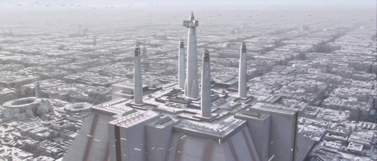
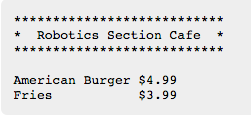
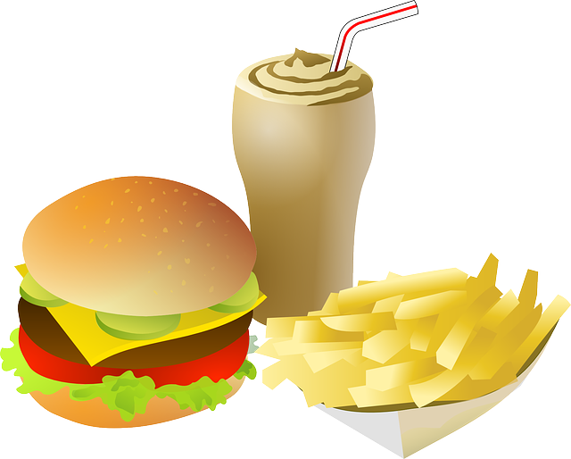

> “Typing is no substitute for Thinking.”

### 훈련 임무

학생 교안을 클릭한다. 선생님은 학생들이 교안을 채워넣도록 도와 준다.

- [학생 교안](http://www.codeskulptor.org/#user40_GSVrDcKJRQGWicq.py)
- [선생님 교안](http://www.codeskulptor.org/#user40_BSWhGQJHBZW5dnD.py)

**고급([교안](http://www.codeskulptor.org/#user40_SsV0yMn77uVA2KI.py))**: 
문자열에서 사용되는 문자 대부분은 눈에 보인다. 문자, 숫자, 구두점이 좋은 예가 된다.
하지만, 문자열에는 눈에 보이지 않는 문자가 포함될 수 있다.

- 공백(space)은 키보드 `스페이스바`를 치면 생성된다; 다음 단어를 작성할 때 빈 공백을 둔다.
- 개행(new line)은 `\n`으로 생성된다; 다음 줄에 다음 문자를 적는다.
- 탭(tab)은 `\t`로 생성된다; 다음 고정 칼럼 위치로 점프 이동한다.

### 3학년 - 본인 소개

[학습 교안](http://www.codeskulptor.org/#user40_FLiflXhMbvjpGaI.py)

문자열을 채워넣어서 본인 소개를 짧게 한다.
다음에 어느 학생에 대한 소개가 예제로 나와 있다:

~~~
Hello

My name is Anakin. I am 10 years old and am in 10 grade,
in Obi-Wan’s class, at the Jedi Temple.

My favorite food is black beans and rice and my favorite
ice cream flavor is cookie dough.
~~~

해답: [보여주기](http://www.codeskulptor.org/#user40_BW9LCXfF4xVAhiF.py)

### 4학년 - 기막히게 뒤죽박죽된 비밀 메시지

[학습 교안](http://www.codeskulptor.org/#user40_Jas5JAVUzfdmY41.py)

다음에 뒤죽박죽된 메시지가 있다. 가장 훌륭한 해독기가 다음 메시지를 가져왔다:

~~~
r thig is nking.no subte fostituTypin
~~~

하지만, 해독기가 해독한 메시지가 맞지 않는다는 생각을 갖는데, 이유는 의미가 통하지 않기 때문이다. 
심지어 제대로된 영어도 아니다! 메시지를 올바르게 복원하도록 해보자.

힌트: 웹페이지 상단에 오늘의 말씀을 살펴본다.

정답: [보여주기](http://www.codeskulptor.org/#user40_S27P3ajJ26mL3I4.py)

### 5학년 - 로봇 카페

[학습 교안](http://www.codeskulptor.org/#user40_XDcPV5fxcpzNfoZ.py)

식당 메뉴판을 작성하도록 프로그래머를 고용했다. 
하지만 불행하게도 프로그래머는 식중독으로 병원에 입원해 있다.
프로그래머가 시작한 프로그램 작업을 마무리 했으면 한다.
지금 시점에서, 가지고 있는 것은 다음이 전부다:

그리고... 뭘랄까... 모든 사람들이 버거와 감자 프라이에 물렸다.
제발, 제발... 메뉴 작업을 마무리해주세요. 알파벳 순으로 메뉴를 완료해 주세요. 

정답: [보여주기](http://www.codeskulptor.org/#user40_cGB68jfYeJvRGQN.py)

만약 `탭`, `\t` 문자를 사용해서 항목을 수직으로 정렬할 수 있다면, 열렬히 환영합니다.

### 6 학년 - 짝짖기 게임

[학습 교안](http://www.codeskulptor.org/#user40_e2mKjAlhN33AsJb.py)

흠... 메가트론은 스타워즈에서 나온 로봇... 혹은 스타트렉에서 나온 건가?
정확하게 기억할 수 없네요... 도움이 필요해요!

TV 혹은 영화에서 나온 유명한 로봇을 짝지어 목록을 마무리 하세요.
지금까지 찾은 것은 다음과 같다:

빠진 것이 있나요? 생각해낼 수 있는 짝이 있다면 추가해도 좋습니다.

정답: [보여주기](http://www.codeskulptor.org/#user40_F43CzS6h5UlJo1r.py)

칼럼을 수직으로 정렬할 수 있다면 열렬히 환영합니다.

