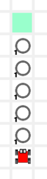
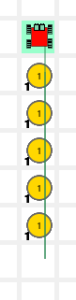
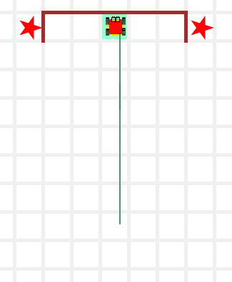
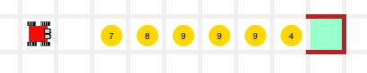
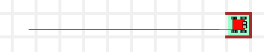
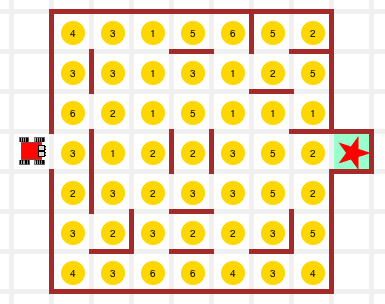
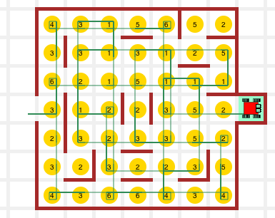

> "계속 헤엄처라... 계속 헤엄처라..."  
>
> "Just keep swimming.. just keep swimming."  
> --- Dory

### While 루프

**While 루프 해답:** [보여주기](http://codeperspectives.com/reeborg-dev/world.html?proglang=python-en&world=%7B%22robots%22%3A%5B%7B%22x%22%3A5%2C%22y%22%3A5%2C%22tokens%22%3A0%2C%22orientation%22%3A-1%2C%22_prev_x%22%3A5%2C%22_prev_y%22%3A5%2C%22_prev_orientation%22%3A-1%2C%22start_positions%22%3A%5B%5B5%2C5%5D%5D%7D%5D%2C%22tokens%22%3A%7B%7D%2C%22walls%22%3A%7B%7D%7D&editor=%23%20solution%20using%20nested%20if%20%2F%20else%0Afrom%20my_lib%20import%20*%0A%0Adef%20face_north()%3A%0A%20%20%20%20while%20not%20is_facing_north()%3A%0A%20%20%20%20%20%20%20%20left()%0A%20%20%20%20%20%20%20%20%0Aface_north()&library=%23%20%27from%20my_lib%20import%20*%27%20in%20Python%20Code%20is%20required%20to%20use%0A%23%20the%20code%20in%20this%20library.%0Asound(True)%0Athink(251)%0A%0Adef%20left()%3A%0A%20%20%20%20turn_left())

while 루프를 갖는 해답은 짧고, 명료하고, 반복 사이클을 낭비하지 않고, 메모리도 낭비하지 않는다: 목적이 달성되자마자 바로 종료한다.

~~~ {.python}
# while 루프를 사용한 해답
def face_north():
    while not is_facing_north():
        left()
~~~

재귀와 while 루프는 동일한 작업을 수행한다;
둘은 다른 방식으로 작업을 처리한다.
재귀를 사용해서 문제를 해결하면 재귀적(recursive)이라고 하고; 루프를 사용해서
문제를 해결하면 반복적(iterative)이라고 한다.

반복적 해법이 재귀적 해법보다 우아하지는 않다.
하지만, 반복적인 해법이 재귀적인 해법처럼 함수 사본 다수가 필요하지 않아서, 보통 더 빠르고, 메모리 측면에서 항상 더 경제성이 있다.

### 훈련 임무

#### TM1. 벽으로 다가서기 (`go_to_wall()`)

[시도해 보기](http://codeperspectives.com/reeborg-dev/world.html?proglang=python-en&world=%7B%22robots%22%3A%5B%7B%22x%22%3A7%2C%22y%22%3A8%2C%22tokens%22%3A0%2C%22orientation%22%3A1%2C%22_prev_x%22%3A7%2C%22_prev_y%22%3A8%2C%22_prev_orientation%22%3A1%7D%5D%2C%22tokens%22%3A%7B%7D%2C%22walls%22%3A%7B%226%2C11%22%3A%5B%22north%22%5D%2C%227%2C11%22%3A%5B%22north%22%5D%2C%228%2C11%22%3A%5B%22north%22%5D%7D%7D&editor=%23%20TM1%20-%20counting%20steps%20to%20a%20wall&library=%23%20%27from%20my_lib%20import%20*%27%20in%20Python%20Code%20is%20required%20to%20use%0A%23%20the%20code%20in%20this%20library.%0ARUR.MAX_STEPS%20%3D%202000%0A%0Asound(True)%0Athink(251)%0A%0Adef%20left()%3A%0A%20%20%20%20turn_left()%0A%20%20%20%20%0Adef%20right()%3A%0A%20%20%20%20repeat(%20left%2C%203%20)%0A%20%20%20%20%0Adef%20turn_around()%3A%0A%20%20%20%20repeat(%20left%2C%202%20)%0A%20%20%20%20%0Adef%20sidestep_left()%3A%0A%20%20%20%20left()%0A%20%20%20%20move()%0A%20%20%20%20right()%0A%20%20%20%20%0Adef%20sidestep_right()%3A%0A%20%20%20%20right()%0A%20%20%20%20move()%0A%20%20%20%20left()%0A%20%20%20%20%0Adef%20safe_take()%3A%0A%20%20%20%20if%20token_here()%3A%0A%20%20%20%20%20%20%20%20take()%0A%20%20%20%20%20%20%20%20%0Adef%20safe_put()%3A%0A%20%20%20%20if%20has_token()%3A%0A%20%20%20%20%20%20%20%20put()%0A%20%20%20%20%0Adef%20safe_move()%3A%0A%20%20%20%20if%20front_is_clear()%3A%0A%20%20%20%20%20%20%20%20move()%0A%20%20%20%20%20%20%20%20%0Adef%20go_to_wall()%3A%0A%20%20%20%20if%20front_is_clear()%3A%0A%20%20%20%20%20%20%20%20move()%0A%20%20%20%20%20%20%20%20go_to_wall()%0A%0A%23%20sensing%20functions%0A%0Adef%20wall_in_front()%3A%0A%20%20%20%20return%20not%20front_is_clear()%0A%0Adef%20cell_is_empty()%3A%0A%20%20%20%20return%20not%20token_here()%0A%0Adef%20bag_is_empty()%3A%0A%20%20%20%20return%20not%20has_token()%0A%0Adef%20at_home()%3A%0A%20%20%20%20return%20at_goal())

`go_to_wall()` 반복함수를 작성해서 카렐을 벽앞으로 이동시킨다.

| steps = 0 | steps = 1 | steps = 2 | steps = 3 | 
|---------------------------------------------|---------------------------------------------|---------------------------------------------|---------------------------------------------|
|||||

**해답:** [보여주기](http://codeperspectives.com/reeborg-dev/world.html?proglang=python-en&world=%7B%22robots%22%3A%5B%7B%22x%22%3A7%2C%22y%22%3A8%2C%22tokens%22%3A0%2C%22orientation%22%3A1%2C%22_prev_x%22%3A7%2C%22_prev_y%22%3A8%2C%22_prev_orientation%22%3A1%7D%5D%2C%22tokens%22%3A%7B%7D%2C%22walls%22%3A%7B%226%2C11%22%3A%5B%22north%22%5D%2C%227%2C11%22%3A%5B%22north%22%5D%2C%228%2C11%22%3A%5B%22north%22%5D%7D%7D&editor=%23%20TM1%20-%20counting%20steps%20to%20a%20wall%0A%0Adef%20go_to_wall()%3A%0A%20%20%20%20while%20front_is_clear()%3A%20%20%20%23%20test%20the%20condition%0A%20%20%20%20%20%20%20%20move()%20%20%20%20%20%20%20%20%20%20%20%20%20%20%20%20%23%20reduce%20the%20problem%0A%20%0A%23%20main%20program%0Ago_to_wall()&library=%23%20%27from%20my_lib%20import%20*%27%20in%20Python%20Code%20is%20required%20to%20use%0A%23%20the%20code%20in%20this%20library.%0ARUR.MAX_STEPS%20%3D%202000%0A%0Asound(True)%0Athink(251)%0A%0Adef%20left()%3A%0A%20%20%20%20turn_left()%0A%20%20%20%20%0Adef%20right()%3A%0A%20%20%20%20repeat(%20left%2C%203%20)%0A%20%20%20%20%0Adef%20turn_around()%3A%0A%20%20%20%20repeat(%20left%2C%202%20)%0A%20%20%20%20%0Adef%20sidestep_left()%3A%0A%20%20%20%20left()%0A%20%20%20%20move()%0A%20%20%20%20right()%0A%20%20%20%20%0Adef%20sidestep_right()%3A%0A%20%20%20%20right()%0A%20%20%20%20move()%0A%20%20%20%20left()%0A%20%20%20%20%0Adef%20safe_take()%3A%0A%20%20%20%20if%20token_here()%3A%0A%20%20%20%20%20%20%20%20take()%0A%20%20%20%20%20%20%20%20%0Adef%20safe_put()%3A%0A%20%20%20%20if%20has_token()%3A%0A%20%20%20%20%20%20%20%20put()%0A%20%20%20%20%0Adef%20safe_move()%3A%0A%20%20%20%20if%20front_is_clear()%3A%0A%20%20%20%20%20%20%20%20move()%0A%20%20%20%20%20%20%20%20%0Adef%20go_to_wall()%3A%0A%20%20%20%20if%20front_is_clear()%3A%0A%20%20%20%20%20%20%20%20move()%0A%20%20%20%20%20%20%20%20go_to_wall()%0A%0A%23%20sensing%20functions%0A%0Adef%20wall_in_front()%3A%0A%20%20%20%20return%20not%20front_is_clear()%0A%0Adef%20cell_is_empty()%3A%0A%20%20%20%20return%20not%20token_here()%0A%0Adef%20bag_is_empty()%3A%0A%20%20%20%20return%20not%20has_token()%0A%0Adef%20at_home()%3A%0A%20%20%20%20return%20at_goal())

코드는 다음과 같다. 무척 쉽다:

~~~ {.python}
def go_to_wall():
    while front_is_clear():   # 조건을 시험한다.
        move()                # 문제를 줄여간다
 
# 메인 프로그램
go_to_wall()
~~~

### 3학년 - 길 닦기

[학습 교안](http://codeperspectives.com/reeborg-dev/world.html?proglang=python-en&world=%7B%22robots%22%3A%5B%7B%22x%22%3A4%2C%22y%22%3A2%2C%22tokens%22%3A%22infinite%22%2C%22orientation%22%3A1%2C%22_prev_x%22%3A4%2C%22_prev_y%22%3A2%2C%22_prev_orientation%22%3A1%2C%22start_positions%22%3A%5B%5B4%2C2%5D%5D%7D%5D%2C%22tokens%22%3A%7B%7D%2C%22walls%22%3A%7B%7D%2C%22goal%22%3A%7B%22tokens%22%3A%7B%224%2C3%22%3A1%2C%224%2C4%22%3A1%2C%224%2C5%22%3A1%2C%224%2C6%22%3A1%2C%224%2C7%22%3A1%7D%2C%22possible_positions%22%3A%5B%5B4%2C8%5D%5D%2C%22position%22%3A%7B%22x%22%3A4%2C%22y%22%3A8%7D%7D%7D&editor=%23%20paving%20the%20way%0A%0Adef%20pave_steps()%3A%0A%20%20%20%20pass%0A%0A%23%20main%20program%0Amove()%0Apave_steps()&library=%23%20%27from%20my_lib%20import%20*%27%20in%20Python%20Code%20is%20required%20to%20use%0A%23%20the%20code%20in%20this%20library.%0ARUR.MAX_STEPS%20%3D%202000%0A%0Asound(True)%0Athink(251)%0A%0Adef%20left()%3A%0A%20%20%20%20turn_left()%0A%20%20%20%20%0Adef%20right()%3A%0A%20%20%20%20repeat(%20left%2C%203%20)%0A%20%20%20%20%0Adef%20turn_around()%3A%0A%20%20%20%20repeat(%20left%2C%202%20)%0A%20%20%20%20%0Adef%20sidestep_left()%3A%0A%20%20%20%20left()%0A%20%20%20%20move()%0A%20%20%20%20right()%0A%20%20%20%20%0Adef%20sidestep_right()%3A%0A%20%20%20%20right()%0A%20%20%20%20move()%0A%20%20%20%20left()%0A%20%20%20%20%0Adef%20safe_take()%3A%0A%20%20%20%20if%20token_here()%3A%0A%20%20%20%20%20%20%20%20take()%0A%20%20%20%20%20%20%20%20%0Adef%20safe_put()%3A%0A%20%20%20%20if%20has_token()%3A%0A%20%20%20%20%20%20%20%20put()%0A%20%20%20%20%0Adef%20safe_move()%3A%0A%20%20%20%20if%20front_is_clear()%3A%0A%20%20%20%20%20%20%20%20move()%0A%20%20%20%20%20%20%20%20%0Adef%20go_to_wall()%3A%0A%20%20%20%20if%20front_is_clear()%3A%0A%20%20%20%20%20%20%20%20move()%0A%20%20%20%20%20%20%20%20go_to_wall()%0A%0A%23%20sensing%20functions%0A%0Adef%20wall_in_front()%3A%0A%20%20%20%20return%20not%20front_is_clear()%0A%0Adef%20cell_is_empty()%3A%0A%20%20%20%20return%20not%20token_here()%0A%0Adef%20bag_is_empty()%3A%0A%20%20%20%20return%20not%20has_token()%0A%0Adef%20at_home()%3A%0A%20%20%20%20return%20at_goal())

while 루프를 사용해서 카렐 집 앞에 보도블록을 5개 놓는다.

**해답:** [보여주기](http://codeperspectives.com/reeborg-dev/world.html?proglang=python-en&world=%7B%22robots%22%3A%5B%7B%22x%22%3A4%2C%22y%22%3A2%2C%22tokens%22%3A%22infinite%22%2C%22orientation%22%3A1%2C%22_prev_x%22%3A4%2C%22_prev_y%22%3A2%2C%22_prev_orientation%22%3A1%2C%22start_positions%22%3A%5B%5B4%2C2%5D%5D%7D%5D%2C%22tokens%22%3A%7B%7D%2C%22walls%22%3A%7B%7D%2C%22goal%22%3A%7B%22tokens%22%3A%7B%224%2C3%22%3A1%2C%224%2C4%22%3A1%2C%224%2C5%22%3A1%2C%224%2C6%22%3A1%2C%224%2C7%22%3A1%7D%2C%22possible_positions%22%3A%5B%5B4%2C8%5D%5D%2C%22position%22%3A%7B%22x%22%3A4%2C%22y%22%3A8%7D%7D%7D&editor=%23%20paving%20the%20way%0A%0Adef%20pave_steps()%3A%0A%20%20%20%20while%20not%20at_goal()%3A%0A%20%20%20%20%20%20%20%20put()%0A%20%20%20%20%20%20%20%20move()%0A%0A%23%20main%20program%0Amove()%0Apave_steps()&library=%23%20%27from%20my_lib%20import%20*%27%20in%20Python%20Code%20is%20required%20to%20use%0A%23%20the%20code%20in%20this%20library.%0ARUR.MAX_STEPS%20%3D%202000%0A%0Asound(True)%0Athink(251)%0A%0Adef%20left()%3A%0A%20%20%20%20turn_left()%0A%20%20%20%20%0Adef%20right()%3A%0A%20%20%20%20repeat(%20left%2C%203%20)%0A%20%20%20%20%0Adef%20turn_around()%3A%0A%20%20%20%20repeat(%20left%2C%202%20)%0A%20%20%20%20%0Adef%20sidestep_left()%3A%0A%20%20%20%20left()%0A%20%20%20%20move()%0A%20%20%20%20right()%0A%20%20%20%20%0Adef%20sidestep_right()%3A%0A%20%20%20%20right()%0A%20%20%20%20move()%0A%20%20%20%20left()%0A%20%20%20%20%0Adef%20safe_take()%3A%0A%20%20%20%20if%20token_here()%3A%0A%20%20%20%20%20%20%20%20take()%0A%20%20%20%20%20%20%20%20%0Adef%20safe_put()%3A%0A%20%20%20%20if%20has_token()%3A%0A%20%20%20%20%20%20%20%20put()%0A%20%20%20%20%0Adef%20safe_move()%3A%0A%20%20%20%20if%20front_is_clear()%3A%0A%20%20%20%20%20%20%20%20move()%0A%20%20%20%20%20%20%20%20%0Adef%20go_to_wall()%3A%0A%20%20%20%20if%20front_is_clear()%3A%0A%20%20%20%20%20%20%20%20move()%0A%20%20%20%20%20%20%20%20go_to_wall()%0A%0A%23%20sensing%20functions%0A%0Adef%20wall_in_front()%3A%0A%20%20%20%20return%20not%20front_is_clear()%0A%0Adef%20cell_is_empty()%3A%0A%20%20%20%20return%20not%20token_here()%0A%0Adef%20bag_is_empty()%3A%0A%20%20%20%20return%20not%20has_token()%0A%0Adef%20at_home()%3A%0A%20%20%20%20return%20at_goal())

| 출발준비! | 작업완료! |
|--------------------------------------------------------|--------------------------------------------------------|
||| 

#### 4학년 - 한걸음 한걸음 센다.

[학습 교안](http://codeperspectives.com/reeborg-dev/world.html?proglang=python-en&world=%7B%22robots%22%3A%5B%7B%22x%22%3A7%2C%22y%22%3A4%2C%22tokens%22%3A0%2C%22orientation%22%3A1%2C%22_prev_x%22%3A7%2C%22_prev_y%22%3A4%2C%22_prev_orientation%22%3A1%2C%22start_positions%22%3A%5B%5B7%2C2%5D%2C%5B7%2C3%5D%2C%5B7%2C4%5D%5D%7D%5D%2C%22tokens%22%3A%7B%227%2C9%22%3A1%2C%227%2C7%22%3A0%2C%227%2C5%22%3A0%7D%2C%22walls%22%3A%7B%226%2C11%22%3A%5B%22north%22%5D%2C%227%2C11%22%3A%5B%22north%22%5D%2C%228%2C11%22%3A%5B%22north%22%5D%2C%229%2C11%22%3A%5B%22north%22%2C%22east%22%5D%2C%225%2C11%22%3A%5B%22north%22%5D%2C%224%2C11%22%3A%5B%22east%22%5D%7D%2C%22shapes%22%3A%7B%224%2C11%22%3A%22star%22%2C%2210%2C11%22%3A%22star%22%7D%2C%22min_tokens%22%3A%7B%227%2C7%22%3A0%2C%227%2C5%22%3A0%7D%2C%22max_tokens%22%3A%7B%227%2C7%22%3A1%2C%227%2C5%22%3A1%7D%2C%22tokens_range%22%3A%7B%227%2C7%22%3A%220-1%22%2C%227%2C5%22%3A%220-1%22%7D%2C%22goal%22%3A%7B%22possible_positions%22%3A%5B%5B7%2C11%5D%5D%2C%22position%22%3A%7B%22x%22%3A7%2C%22y%22%3A11%7D%7D%7D&editor=%23%20every%20step%20counts%0A&library=%23%20%27from%20my_lib%20import%20*%27%20in%20Python%20Code%20is%20required%20to%20use%0A%23%20the%20code%20in%20this%20library.%20%0A%0Asound(True)%0Athink(251)%0A%0Adef%20left()%3A%0A%20%20%20%20turn_left()%0A%20%20%20%20%0Adef%20right()%3A%0A%20%20%20%20repeat(%20left%2C%203%20)%0A%20%20%20%20%0Adef%20turn_around()%3A%0A%20%20%20%20repeat(%20left%2C%202%20)%0A%20%20%20%20%0Adef%20sidestep_left()%3A%0A%20%20%20%20left()%0A%20%20%20%20move()%0A%20%20%20%20right()%0A%20%20%20%20%0Adef%20sidestep_right()%3A%0A%20%20%20%20right()%0A%20%20%20%20move()%0A%20%20%20%20left()%0A%20%20%20%20%0Adef%20safe_take()%3A%0A%20%20%20%20if%20token_here()%3A%0A%20%20%20%20%20%20%20%20take()%0A%20%20%20%20%20%20%20%20%0Adef%20safe_put()%3A%0A%20%20%20%20if%20has_token()%3A%0A%20%20%20%20%20%20%20%20put()%0A%20%20%20%20%0Adef%20safe_move()%3A%0A%20%20%20%20if%20front_is_clear()%3A%0A%20%20%20%20%20%20%20%20move()%0A%20%20%20%20%20%20%20%20%0Adef%20go_to_wall()%3A%0A%20%20%20%20if%20front_is_clear()%3A%0A%20%20%20%20%20%20%20%20move()%0A%20%20%20%20%20%20%20%20go_to_wall()%0A%0A%23%20sensing%20functions%0A%0Adef%20wall_in_front()%3A%0A%20%20%20%20return%20not%20front_is_clear()%0A%0Adef%20cell_is_empty()%3A%0A%20%20%20%20return%20not%20token_here()%0A%0Adef%20bag_is_empty()%3A%0A%20%20%20%20return%20not%20has_token()%0A%0Adef%20at_home()%3A%0A%20%20%20%20return%20at_goal())

while 루프를 사용하는 프로그램을 작성해서 카렐로 하여금 터치다운 득점하게 한다. 즉, 경로에 나온 첫번째 볼을 잡고 나서, 엔드존까지 달려간다.

**해답:** [보여주기](http://codeperspectives.com/reeborg-dev/world.html?proglang=python-en&world=%7B%22robots%22%3A%5B%7B%22x%22%3A7%2C%22y%22%3A4%2C%22tokens%22%3A0%2C%22orientation%22%3A1%2C%22_prev_x%22%3A7%2C%22_prev_y%22%3A4%2C%22_prev_orientation%22%3A1%2C%22start_positions%22%3A%5B%5B7%2C2%5D%2C%5B7%2C3%5D%2C%5B7%2C4%5D%5D%7D%5D%2C%22tokens%22%3A%7B%227%2C9%22%3A1%2C%227%2C7%22%3A0%2C%227%2C5%22%3A0%7D%2C%22walls%22%3A%7B%226%2C11%22%3A%5B%22north%22%5D%2C%227%2C11%22%3A%5B%22north%22%5D%2C%228%2C11%22%3A%5B%22north%22%5D%2C%229%2C11%22%3A%5B%22north%22%2C%22east%22%5D%2C%225%2C11%22%3A%5B%22north%22%5D%2C%224%2C11%22%3A%5B%22east%22%5D%7D%2C%22shapes%22%3A%7B%224%2C11%22%3A%22star%22%2C%2210%2C11%22%3A%22star%22%7D%2C%22min_tokens%22%3A%7B%227%2C7%22%3A0%2C%227%2C5%22%3A0%7D%2C%22max_tokens%22%3A%7B%227%2C7%22%3A1%2C%227%2C5%22%3A1%7D%2C%22tokens_range%22%3A%7B%227%2C7%22%3A%220-1%22%2C%227%2C5%22%3A%220-1%22%7D%2C%22goal%22%3A%7B%22possible_positions%22%3A%5B%5B7%2C11%5D%5D%2C%22position%22%3A%7B%22x%22%3A7%2C%22y%22%3A11%7D%7D%7D&editor=%23%206-1%20%20every%20step%20counts%0Afrom%20my_lib%20import%20*%0A%0Adef%20get_ball()%3A%0A%20%20%20%20while%20not%20token_here()%3A%0A%20%20%20%20%20%20%20%20move()%0A%0Adef%20go_to_end_zone()%3A%0A%20%20%20%20while%20not%20at_goal()%3A%0A%20%20%20%20%20%20%20%20move()%0A%20%20%20%20%0A%23%20main%20program%0Aget_ball()%0Atake()%0Ago_to_end_zone()%0Aput()%20%20%20%20%20%20%20%23%20%20%20%20Touchdown%20!!!!!!!!&library=%23%20%27from%20my_lib%20import%20*%27%20in%20Python%20Code%20is%20required%20to%20use%0A%23%20the%20code%20in%20this%20library.%20%0A%0Asound(True)%0Athink(251)%0A%0Adef%20left()%3A%0A%20%20%20%20turn_left()%0A%20%20%20%20%0Adef%20right()%3A%0A%20%20%20%20repeat(%20left%2C%203%20)%0A%20%20%20%20%0Adef%20turn_around()%3A%0A%20%20%20%20repeat(%20left%2C%202%20)%0A%20%20%20%20%0Adef%20sidestep_left()%3A%0A%20%20%20%20left()%0A%20%20%20%20move()%0A%20%20%20%20right()%0A%20%20%20%20%0Adef%20sidestep_right()%3A%0A%20%20%20%20right()%0A%20%20%20%20move()%0A%20%20%20%20left()%0A%20%20%20%20%0Adef%20safe_take()%3A%0A%20%20%20%20if%20token_here()%3A%0A%20%20%20%20%20%20%20%20take()%0A%20%20%20%20%20%20%20%20%0Adef%20safe_put()%3A%0A%20%20%20%20if%20has_token()%3A%0A%20%20%20%20%20%20%20%20put()%0A%20%20%20%20%0Adef%20safe_move()%3A%0A%20%20%20%20if%20front_is_clear()%3A%0A%20%20%20%20%20%20%20%20move()%0A%20%20%20%20%20%20%20%20%0Adef%20go_to_wall()%3A%0A%20%20%20%20if%20front_is_clear()%3A%0A%20%20%20%20%20%20%20%20move()%0A%20%20%20%20%20%20%20%20go_to_wall()%0A%0A%23%20sensing%20functions%0A%0Adef%20wall_in_front()%3A%0A%20%20%20%20return%20not%20front_is_clear()%0A%0Adef%20cell_is_empty()%3A%0A%20%20%20%20return%20not%20token_here()%0A%0Adef%20bag_is_empty()%3A%0A%20%20%20%20return%20not%20has_token()%0A%0Adef%20at_home()%3A%0A%20%20%20%20return%20at_goal())

| 시작전: 출발준비! | ... 득점 후 |
|--------------------------------------------------------|--------------------------------------------------------|
|||

#### 5학년 - 딸기 - 파종한 것 수확하기

[학습교안](http://codeperspectives.com/reeborg-dev/world.html?proglang=python-en&world=%7B%22robots%22%3A%5B%7B%22x%22%3A1%2C%22y%22%3A8%2C%22tokens%22%3A0%2C%22orientation%22%3A0%2C%22_prev_x%22%3A1%2C%22_prev_y%22%3A8%2C%22_prev_orientation%22%3A0%2C%22start_positions%22%3A%5B%5B3%2C8%5D%2C%5B2%2C8%5D%2C%5B1%2C8%5D%5D%7D%5D%2C%22large_world%22%3Afalse%2C%22walls%22%3A%7B%2211%2C8%22%3A%5B%22north%22%2C%22east%22%5D%2C%2211%2C7%22%3A%5B%22north%22%5D%7D%2C%22goal%22%3A%7B%22position%22%3A%7B%22x%22%3A11%2C%22y%22%3A8%7D%2C%22possible_positions%22%3A%5B%5B11%2C8%5D%5D%7D%2C%22tokens%22%3A%7B%224%2C8%22%3A0%2C%225%2C8%22%3A0%2C%226%2C8%22%3A0%2C%227%2C8%22%3A0%2C%228%2C8%22%3A0%2C%229%2C8%22%3A0%2C%2210%2C8%22%3A0%7D%2C%22min_tokens%22%3A%7B%224%2C8%22%3A0%2C%225%2C8%22%3A0%2C%226%2C8%22%3A0%2C%227%2C8%22%3A0%2C%228%2C8%22%3A0%2C%229%2C8%22%3A0%2C%2210%2C8%22%3A0%7D%2C%22max_tokens%22%3A%7B%224%2C8%22%3A10%2C%225%2C8%22%3A10%2C%226%2C8%22%3A10%2C%227%2C8%22%3A10%2C%228%2C8%22%3A10%2C%229%2C8%22%3A10%2C%2210%2C8%22%3A10%7D%2C%22tokens_range%22%3A%7B%224%2C8%22%3A%220-10%22%2C%225%2C8%22%3A%220-10%22%2C%226%2C8%22%3A%220-10%22%2C%227%2C8%22%3A%220-10%22%2C%228%2C8%22%3A%220-10%22%2C%229%2C8%22%3A%220-10%22%2C%2210%2C8%22%3A%220-10%22%7D%7D&editor=%23%20Reaping%20what%20you%20sow&library=%23%20%27from%20my_lib%20import%20*%27%20in%20Python%20Code%20is%20required%20to%20use%0A%23%20the%20code%20in%20this%20library.%20%0A%0Asound(True)%0Athink(251)%0A%0Adef%20left()%3A%0A%20%20%20%20turn_left()%0A%20%20%20%20%0Adef%20right()%3A%0A%20%20%20%20repeat(%20left%2C%203%20)%0A%20%20%20%20%0Adef%20turn_around()%3A%0A%20%20%20%20repeat(%20left%2C%202%20)%0A%20%20%20%20%0Adef%20sidestep_left()%3A%0A%20%20%20%20left()%0A%20%20%20%20move()%0A%20%20%20%20right()%0A%20%20%20%20%0Adef%20sidestep_right()%3A%0A%20%20%20%20right()%0A%20%20%20%20move()%0A%20%20%20%20left()%0A%20%20%20%20%0Adef%20safe_take()%3A%0A%20%20%20%20if%20token_here()%3A%0A%20%20%20%20%20%20%20%20take()%0A%20%20%20%20%20%20%20%20%0Adef%20safe_put()%3A%0A%20%20%20%20if%20has_token()%3A%0A%20%20%20%20%20%20%20%20put()%0A%20%20%20%20%0Adef%20safe_move()%3A%0A%20%20%20%20if%20front_is_clear()%3A%0A%20%20%20%20%20%20%20%20move()%0A%20%20%20%20%20%20%20%20%0Adef%20go_to_wall()%3A%0A%20%20%20%20if%20front_is_clear()%3A%0A%20%20%20%20%20%20%20%20move()%0A%20%20%20%20%20%20%20%20go_to_wall()%0A%0A%23%20sensing%20functions%0A%0Adef%20wall_in_front()%3A%0A%20%20%20%20return%20not%20front_is_clear()%0A%0Adef%20cell_is_empty()%3A%0A%20%20%20%20return%20not%20token_here()%0A%0Adef%20bag_is_empty()%3A%0A%20%20%20%20return%20not%20has_token()%0A%0Adef%20at_home()%3A%0A%20%20%20%20return%20at_goal())

여름이다. 딸기나무가 열매를 맺기 시작한다. 달콤... 집에 가는 길에 카렐 앞에서 찾을 수 있는 모든 딸기를 수확한다...

**해답:** [보여주기](http://codeperspectives.com/reeborg-dev/world.html?proglang=python-en&world=%7B%22robots%22%3A%5B%7B%22x%22%3A1%2C%22y%22%3A8%2C%22tokens%22%3A0%2C%22orientation%22%3A0%2C%22_prev_x%22%3A1%2C%22_prev_y%22%3A8%2C%22_prev_orientation%22%3A0%2C%22start_positions%22%3A%5B%5B3%2C8%5D%2C%5B2%2C8%5D%2C%5B1%2C8%5D%5D%7D%5D%2C%22large_world%22%3Afalse%2C%22walls%22%3A%7B%2211%2C8%22%3A%5B%22north%22%2C%22east%22%5D%2C%2211%2C7%22%3A%5B%22north%22%5D%7D%2C%22goal%22%3A%7B%22position%22%3A%7B%22x%22%3A11%2C%22y%22%3A8%7D%2C%22possible_positions%22%3A%5B%5B11%2C8%5D%5D%7D%2C%22tokens%22%3A%7B%224%2C8%22%3A0%2C%225%2C8%22%3A0%2C%226%2C8%22%3A0%2C%227%2C8%22%3A0%2C%228%2C8%22%3A0%2C%229%2C8%22%3A0%2C%2210%2C8%22%3A0%7D%2C%22min_tokens%22%3A%7B%224%2C8%22%3A0%2C%225%2C8%22%3A0%2C%226%2C8%22%3A0%2C%227%2C8%22%3A0%2C%228%2C8%22%3A0%2C%229%2C8%22%3A0%2C%2210%2C8%22%3A0%7D%2C%22max_tokens%22%3A%7B%224%2C8%22%3A10%2C%225%2C8%22%3A10%2C%226%2C8%22%3A10%2C%227%2C8%22%3A10%2C%228%2C8%22%3A10%2C%229%2C8%22%3A10%2C%2210%2C8%22%3A10%7D%2C%22tokens_range%22%3A%7B%224%2C8%22%3A%220-10%22%2C%225%2C8%22%3A%220-10%22%2C%226%2C8%22%3A%220-10%22%2C%227%2C8%22%3A%220-10%22%2C%228%2C8%22%3A%220-10%22%2C%229%2C8%22%3A%220-10%22%2C%2210%2C8%22%3A%220-10%22%7D%7D&editor=%236.2%20Reaping%20what%20you%20sow%0A%0Adef%20take_all()%3A%0A%20%20%20%20while%20token_here()%3A%0A%20%20%20%20%20%20%20%20take()%0A%20%20%20%20%20%20%20%20%0Adef%20pick_berries()%3A%0A%20%20%20%20while%20not%20at_goal()%3A%0A%20%20%20%20%20%20%20%20take_all()%0A%20%20%20%20%20%20%20%20move()%0A%20%20%20%20%0A%23%20main%20program%0Amove()%0Apick_berries()%0A&library=%23%20%27from%20my_lib%20import%20*%27%20in%20Python%20Code%20is%20required%20to%20use%0A%23%20the%20code%20in%20this%20library.%20%0A%0Asound(True)%0Athink(251)%0A%0Adef%20left()%3A%0A%20%20%20%20turn_left()%0A%20%20%20%20%0Adef%20right()%3A%0A%20%20%20%20repeat(%20left%2C%203%20)%0A%20%20%20%20%0Adef%20turn_around()%3A%0A%20%20%20%20repeat(%20left%2C%202%20)%0A%20%20%20%20%0Adef%20sidestep_left()%3A%0A%20%20%20%20left()%0A%20%20%20%20move()%0A%20%20%20%20right()%0A%20%20%20%20%0Adef%20sidestep_right()%3A%0A%20%20%20%20right()%0A%20%20%20%20move()%0A%20%20%20%20left()%0A%20%20%20%20%0Adef%20safe_take()%3A%0A%20%20%20%20if%20token_here()%3A%0A%20%20%20%20%20%20%20%20take()%0A%20%20%20%20%20%20%20%20%0Adef%20safe_put()%3A%0A%20%20%20%20if%20has_token()%3A%0A%20%20%20%20%20%20%20%20put()%0A%20%20%20%20%0Adef%20safe_move()%3A%0A%20%20%20%20if%20front_is_clear()%3A%0A%20%20%20%20%20%20%20%20move()%0A%20%20%20%20%20%20%20%20%0Adef%20go_to_wall()%3A%0A%20%20%20%20if%20front_is_clear()%3A%0A%20%20%20%20%20%20%20%20move()%0A%20%20%20%20%20%20%20%20go_to_wall()%0A%0A%23%20sensing%20functions%0A%0Adef%20wall_in_front()%3A%0A%20%20%20%20return%20not%20front_is_clear()%0A%0Adef%20cell_is_empty()%3A%0A%20%20%20%20return%20not%20token_here()%0A%0Adef%20bag_is_empty()%3A%0A%20%20%20%20return%20not%20has_token()%0A%0Adef%20at_home()%3A%0A%20%20%20%20return%20at_goal())

| 딸기 수확 준비 끝 | 참 맛있어요 |
|-----------------------------------------------------------|-----------------------------------------------------------|
|||

#### 6 학년 - 파멸의 방 - 스핑크스 배꼽

[학습 교안](http://codeperspectives.com/reeborg-dev/world.html?proglang=python-en&world=%7B%22robots%22%3A%5B%7B%22x%22%3A2%2C%22y%22%3A7%2C%22tokens%22%3A0%2C%22orientation%22%3A0%2C%22_prev_x%22%3A2%2C%22_prev_y%22%3A7%2C%22_prev_orientation%22%3A0%2C%22star%22%3A1%2C%22start_positions%22%3A%5B%5B2%2C7%5D%5D%7D%5D%2C%22large_world%22%3Afalse%2C%22walls%22%3A%7B%2210%2C7%22%3A%5B%22north%22%2C%22east%22%5D%2C%2210%2C6%22%3A%5B%22north%22%5D%2C%229%2C6%22%3A%5B%22east%22%5D%2C%229%2C5%22%3A%5B%22east%22%5D%2C%229%2C8%22%3A%5B%22east%22%5D%2C%229%2C10%22%3A%5B%22east%22%2C%22north%22%5D%2C%229%2C9%22%3A%5B%22east%22%2C%22north%22%5D%2C%229%2C4%22%3A%5B%22east%22%5D%2C%226%2C3%22%3A%5B%22north%22%5D%2C%227%2C3%22%3A%5B%22north%22%5D%2C%228%2C3%22%3A%5B%22north%22%5D%2C%229%2C3%22%3A%5B%22north%22%5D%2C%225%2C10%22%3A%5B%22north%22%5D%2C%226%2C10%22%3A%5B%22north%22%5D%2C%227%2C10%22%3A%5B%22north%22%2C%22east%22%5D%2C%228%2C10%22%3A%5B%22north%22%5D%2C%224%2C10%22%3A%5B%22north%22%5D%2C%223%2C10%22%3A%5B%22north%22%5D%2C%222%2C10%22%3A%5B%22east%22%5D%2C%222%2C9%22%3A%5B%22east%22%5D%2C%222%2C8%22%3A%5B%22east%22%5D%2C%222%2C6%22%3A%5B%22east%22%5D%2C%222%2C5%22%3A%5B%22east%22%5D%2C%222%2C4%22%3A%5B%22east%22%5D%2C%223%2C3%22%3A%5B%22north%22%5D%2C%224%2C3%22%3A%5B%22north%22%5D%2C%225%2C3%22%3A%5B%22north%22%5D%2C%226%2C7%22%3A%5B%22east%22%5D%2C%226%2C5%22%3A%5B%22north%22%5D%2C%223%2C6%22%3A%5B%22east%22%5D%2C%228%2C8%22%3A%5B%22north%22%5D%2C%228%2C4%22%3A%5B%22north%22%5D%2C%224%2C4%22%3A%5B%22north%22%5D%2C%223%2C9%22%3A%5B%22east%22%5D%2C%225%2C7%22%3A%5B%22east%22%5D%2C%223%2C7%22%3A%5B%22east%22%5D%2C%224%2C5%22%3A%5B%22east%22%5D%2C%228%2C5%22%3A%5B%22east%22%5D%2C%226%2C4%22%3A%5B%22north%22%5D%2C%226%2C9%22%3A%5B%22north%22%5D%2C%229%2C7%22%3A%5B%22north%22%5D%7D%2C%22goal%22%3A%7B%22position%22%3A%7B%22x%22%3A10%2C%22y%22%3A7%7D%7D%2C%22tokens%22%3A%7B%223%2C9%22%3A1%2C%223%2C6%22%3A1%2C%224%2C5%22%3A1%2C%229%2C10%22%3A1%2C%228%2C10%22%3A1%2C%228%2C9%22%3A1%2C%229%2C5%22%3A1%2C%228%2C4%22%3A1%2C%226%2C4%22%3A1%2C%227%2C5%22%3A2%2C%226%2C5%22%3A1%2C%223%2C5%22%3A1%2C%224%2C4%22%3A1%2C%225%2C6%22%3A1%2C%228%2C6%22%3A1%2C%229%2C7%22%3A1%2C%228%2C7%22%3A1%2C%226%2C7%22%3A2%2C%226%2C8%22%3A1%2C%225%2C8%22%3A1%2C%224%2C8%22%3A2%2C%225%2C9%22%3A1%2C%226%2C10%22%3A1%2C%223%2C7%22%3A3%2C%223%2C10%22%3A4%2C%227%2C10%22%3A6%2C%227%2C4%22%3A4%2C%223%2C4%22%3A4%2C%223%2C8%22%3A6%2C%229%2C8%22%3A1%2C%229%2C9%22%3A5%2C%224%2C9%22%3A3%2C%224%2C6%22%3A3%2C%227%2C6%22%3A3%2C%227%2C9%22%3A1%2C%226%2C9%22%3A3%2C%226%2C6%22%3A3%2C%229%2C6%22%3A2%2C%229%2C4%22%3A4%2C%225%2C4%22%3A6%2C%225%2C10%22%3A1%2C%224%2C10%22%3A3%2C%224%2C7%22%3A1%2C%225%2C7%22%3A2%2C%225%2C5%22%3A3%2C%228%2C5%22%3A3%2C%228%2C8%22%3A1%2C%227%2C8%22%3A1%2C%227%2C7%22%3A3%7D%2C%22shapes%22%3A%7B%2210%2C7%22%3A%22star%22%7D%2C%22other%22%3A%7B%22mud%22%3A%5B%5D%7D%2C%22min_tokens%22%3A%7B%224%2C5%22%3A1%2C%223%2C6%22%3A1%2C%223%2C5%22%3A1%2C%223%2C9%22%3A1%2C%224%2C4%22%3A1%2C%226%2C4%22%3A1%2C%228%2C4%22%3A1%2C%229%2C5%22%3A1%2C%226%2C5%22%3A1%2C%229%2C7%22%3A1%2C%228%2C10%22%3A1%2C%229%2C10%22%3A1%2C%228%2C9%22%3A1%2C%226%2C10%22%3A1%2C%226%2C8%22%3A1%2C%225%2C6%22%3A1%2C%228%2C6%22%3A1%2C%228%2C7%22%3A1%7D%2C%22max_tokens%22%3A%7B%224%2C5%22%3A6%2C%223%2C6%22%3A6%2C%223%2C5%22%3A6%2C%223%2C9%22%3A6%2C%224%2C4%22%3A6%2C%226%2C4%22%3A6%2C%228%2C4%22%3A6%2C%229%2C5%22%3A6%2C%226%2C5%22%3A6%2C%229%2C7%22%3A6%2C%228%2C10%22%3A6%2C%229%2C10%22%3A6%2C%228%2C9%22%3A6%2C%226%2C10%22%3A6%2C%226%2C8%22%3A6%2C%225%2C6%22%3A6%2C%228%2C6%22%3A6%2C%228%2C7%22%3A6%7D%2C%22tokens_range%22%3A%7B%224%2C5%22%3A%221-6%22%2C%223%2C6%22%3A%221-6%22%2C%223%2C5%22%3A%221-6%22%2C%223%2C9%22%3A%221-6%22%2C%224%2C4%22%3A%221-6%22%2C%226%2C4%22%3A%221-6%22%2C%228%2C4%22%3A%221-6%22%2C%229%2C5%22%3A%221-6%22%2C%226%2C5%22%3A%221-6%22%2C%229%2C7%22%3A%221-6%22%2C%228%2C10%22%3A%221-6%22%2C%229%2C10%22%3A%221-6%22%2C%228%2C9%22%3A%221-6%22%2C%226%2C10%22%3A%221-6%22%2C%226%2C8%22%3A%221-6%22%2C%225%2C6%22%3A%221-6%22%2C%228%2C6%22%3A%221-6%22%2C%228%2C7%22%3A%221-6%22%7D%7D&editor=%236-4%20in%20the%20belly%20of%20the%20sphinx%20of%20Giza%0Afrom%20my_lib%20import%20*%0A%0Adef%20count_tokens()%3A%0A%20%20%20%20n%20%3D%200%0A%20%20%20%20while%20token_here()%3A%0A%20%20%20%20%20%20%20%20take()%0A%20%20%20%20%20%20%20%20n%20%3D%20n%20%2B%201%0A%20%20%20%20put_all()%0A%20%20%20%20return%20n%0A%0A%20%20%20%20%20%20%20%20%0A%23%20main%20program%0Amove()%0Ago_home()%0Atake(%20%22star%22%20)&library=%23%20%27from%20my_lib%20import%20*%27%20in%20Python%20Code%20is%20required%20to%20use%0A%23%20the%20code%20in%20this%20library.%20%0A%0Asound(True)%0Athink(251)%0A%0Adef%20left()%3A%0A%20%20%20%20turn_left()%0A%20%20%20%20%0Adef%20right()%3A%0A%20%20%20%20repeat(%20left%2C%203%20)%0A%20%20%20%20%0Adef%20turn_around()%3A%0A%20%20%20%20repeat(%20left%2C%202%20)%0A%20%20%20%20%0Adef%20sidestep_left()%3A%0A%20%20%20%20left()%0A%20%20%20%20move()%0A%20%20%20%20right()%0A%20%20%20%20%0Adef%20sidestep_right()%3A%0A%20%20%20%20right()%0A%20%20%20%20move()%0A%20%20%20%20left()%0A%20%20%20%20%0Adef%20safe_take()%3A%0A%20%20%20%20if%20token_here()%3A%0A%20%20%20%20%20%20%20%20take()%0A%20%20%20%20%20%20%20%20%0Adef%20safe_put()%3A%0A%20%20%20%20if%20has_token()%3A%0A%20%20%20%20%20%20%20%20put()%0A%20%20%20%20%0Adef%20safe_move()%3A%0A%20%20%20%20if%20front_is_clear()%3A%0A%20%20%20%20%20%20%20%20move()%0A%20%20%20%20%20%20%20%20%0Adef%20go_to_wall()%3A%0A%20%20%20%20if%20front_is_clear()%3A%0A%20%20%20%20%20%20%20%20move()%0A%20%20%20%20%20%20%20%20go_to_wall()%0A%0A%23%20sensing%20functions%0A%0Adef%20wall_in_front()%3A%0A%20%20%20%20return%20not%20front_is_clear()%0A%0Adef%20cell_is_empty()%3A%0A%20%20%20%20return%20not%20token_here()%0A%0Adef%20bag_is_empty()%3A%0A%20%20%20%20return%20not%20has_token()%0A%0Adef%20at_home()%3A%0A%20%20%20%20return%20at_goal())

여기에 사용되는 전략은 다음과 같다. 방에 있는 모든 셀은 1에서 6까지 토큰이 쌓여 있다. 카렐은 토큰갯수를 센다; 만약 결과가 다음과 같다면...

- ... 짝수(즉, 2,4,6)면, 우회전 한다.
- ... 홀수(즉, 1,3,5)면, 좌회전 한다.

그리고 나면, 다음 동전 더미까지 해당 갯수 만큼 전진힌다.

예를 들어, 카렐이 해당 셀에서 동전 더미 4개를 발견하면, 
우회전 해야 하고, 다음 동전더미 셀까지 4칸 앞으로 전진힌다.

이과정을 통해 정사각형 집으로 인도하고, 별을 찾게 된다.

카렐은 빈 가방으로 출발한다. 카렐이 서 있는 셀의 동전갯수를 반환하는 함수는 제공해 준다.

**해답:** [보여주기](http://codeperspectives.com/reeborg-dev/world.html?proglang=python-en&world=%7B%22robots%22%3A%5B%7B%22x%22%3A2%2C%22y%22%3A7%2C%22tokens%22%3A0%2C%22orientation%22%3A0%2C%22_prev_x%22%3A2%2C%22_prev_y%22%3A7%2C%22_prev_orientation%22%3A0%2C%22star%22%3A1%2C%22start_positions%22%3A%5B%5B2%2C7%5D%5D%7D%5D%2C%22large_world%22%3Afalse%2C%22walls%22%3A%7B%2210%2C7%22%3A%5B%22north%22%2C%22east%22%5D%2C%2210%2C6%22%3A%5B%22north%22%5D%2C%229%2C6%22%3A%5B%22east%22%5D%2C%229%2C5%22%3A%5B%22east%22%5D%2C%229%2C8%22%3A%5B%22east%22%5D%2C%229%2C10%22%3A%5B%22east%22%2C%22north%22%5D%2C%229%2C9%22%3A%5B%22east%22%2C%22north%22%5D%2C%229%2C4%22%3A%5B%22east%22%5D%2C%226%2C3%22%3A%5B%22north%22%5D%2C%227%2C3%22%3A%5B%22north%22%5D%2C%228%2C3%22%3A%5B%22north%22%5D%2C%229%2C3%22%3A%5B%22north%22%5D%2C%225%2C10%22%3A%5B%22north%22%5D%2C%226%2C10%22%3A%5B%22north%22%5D%2C%227%2C10%22%3A%5B%22north%22%2C%22east%22%5D%2C%228%2C10%22%3A%5B%22north%22%5D%2C%224%2C10%22%3A%5B%22north%22%5D%2C%223%2C10%22%3A%5B%22north%22%5D%2C%222%2C10%22%3A%5B%22east%22%5D%2C%222%2C9%22%3A%5B%22east%22%5D%2C%222%2C8%22%3A%5B%22east%22%5D%2C%222%2C6%22%3A%5B%22east%22%5D%2C%222%2C5%22%3A%5B%22east%22%5D%2C%222%2C4%22%3A%5B%22east%22%5D%2C%223%2C3%22%3A%5B%22north%22%5D%2C%224%2C3%22%3A%5B%22north%22%5D%2C%225%2C3%22%3A%5B%22north%22%5D%2C%226%2C7%22%3A%5B%22east%22%5D%2C%226%2C5%22%3A%5B%22north%22%5D%2C%223%2C6%22%3A%5B%22east%22%5D%2C%228%2C8%22%3A%5B%22north%22%5D%2C%228%2C4%22%3A%5B%22north%22%5D%2C%224%2C4%22%3A%5B%22north%22%5D%2C%223%2C9%22%3A%5B%22east%22%5D%2C%225%2C7%22%3A%5B%22east%22%5D%2C%223%2C7%22%3A%5B%22east%22%5D%2C%224%2C5%22%3A%5B%22east%22%5D%2C%228%2C5%22%3A%5B%22east%22%5D%2C%226%2C4%22%3A%5B%22north%22%5D%2C%226%2C9%22%3A%5B%22north%22%5D%2C%229%2C7%22%3A%5B%22north%22%5D%7D%2C%22goal%22%3A%7B%22position%22%3A%7B%22x%22%3A10%2C%22y%22%3A7%7D%7D%2C%22tokens%22%3A%7B%223%2C9%22%3A1%2C%223%2C6%22%3A1%2C%224%2C5%22%3A1%2C%229%2C10%22%3A1%2C%228%2C10%22%3A1%2C%228%2C9%22%3A1%2C%229%2C5%22%3A1%2C%228%2C4%22%3A1%2C%226%2C4%22%3A1%2C%227%2C5%22%3A2%2C%226%2C5%22%3A1%2C%223%2C5%22%3A1%2C%224%2C4%22%3A1%2C%225%2C6%22%3A1%2C%228%2C6%22%3A1%2C%229%2C7%22%3A1%2C%228%2C7%22%3A1%2C%226%2C7%22%3A2%2C%226%2C8%22%3A1%2C%225%2C8%22%3A1%2C%224%2C8%22%3A2%2C%225%2C9%22%3A1%2C%226%2C10%22%3A1%2C%223%2C7%22%3A3%2C%223%2C10%22%3A4%2C%227%2C10%22%3A6%2C%227%2C4%22%3A4%2C%223%2C4%22%3A4%2C%223%2C8%22%3A6%2C%229%2C8%22%3A1%2C%229%2C9%22%3A5%2C%224%2C9%22%3A3%2C%224%2C6%22%3A3%2C%227%2C6%22%3A3%2C%227%2C9%22%3A1%2C%226%2C9%22%3A3%2C%226%2C6%22%3A3%2C%229%2C6%22%3A2%2C%229%2C4%22%3A4%2C%225%2C4%22%3A6%2C%225%2C10%22%3A1%2C%224%2C10%22%3A3%2C%224%2C7%22%3A1%2C%225%2C7%22%3A2%2C%225%2C5%22%3A3%2C%228%2C5%22%3A3%2C%228%2C8%22%3A1%2C%227%2C8%22%3A1%2C%227%2C7%22%3A3%7D%2C%22shapes%22%3A%7B%2210%2C7%22%3A%22star%22%7D%2C%22other%22%3A%7B%22mud%22%3A%5B%5D%7D%2C%22min_tokens%22%3A%7B%224%2C5%22%3A1%2C%223%2C6%22%3A1%2C%223%2C5%22%3A1%2C%223%2C9%22%3A1%2C%224%2C4%22%3A1%2C%226%2C4%22%3A1%2C%228%2C4%22%3A1%2C%229%2C5%22%3A1%2C%226%2C5%22%3A1%2C%229%2C7%22%3A1%2C%228%2C10%22%3A1%2C%229%2C10%22%3A1%2C%228%2C9%22%3A1%2C%226%2C10%22%3A1%2C%226%2C8%22%3A1%2C%225%2C6%22%3A1%2C%228%2C6%22%3A1%2C%228%2C7%22%3A1%7D%2C%22max_tokens%22%3A%7B%224%2C5%22%3A6%2C%223%2C6%22%3A6%2C%223%2C5%22%3A6%2C%223%2C9%22%3A6%2C%224%2C4%22%3A6%2C%226%2C4%22%3A6%2C%228%2C4%22%3A6%2C%229%2C5%22%3A6%2C%226%2C5%22%3A6%2C%229%2C7%22%3A6%2C%228%2C10%22%3A6%2C%229%2C10%22%3A6%2C%228%2C9%22%3A6%2C%226%2C10%22%3A6%2C%226%2C8%22%3A6%2C%225%2C6%22%3A6%2C%228%2C6%22%3A6%2C%228%2C7%22%3A6%7D%2C%22tokens_range%22%3A%7B%224%2C5%22%3A%221-6%22%2C%223%2C6%22%3A%221-6%22%2C%223%2C5%22%3A%221-6%22%2C%223%2C9%22%3A%221-6%22%2C%224%2C4%22%3A%221-6%22%2C%226%2C4%22%3A%221-6%22%2C%228%2C4%22%3A%221-6%22%2C%229%2C5%22%3A%221-6%22%2C%226%2C5%22%3A%221-6%22%2C%229%2C7%22%3A%221-6%22%2C%228%2C10%22%3A%221-6%22%2C%229%2C10%22%3A%221-6%22%2C%228%2C9%22%3A%221-6%22%2C%226%2C10%22%3A%221-6%22%2C%226%2C8%22%3A%221-6%22%2C%225%2C6%22%3A%221-6%22%2C%228%2C6%22%3A%221-6%22%2C%228%2C7%22%3A%221-6%22%7D%7D&editor=%236-4%20in%20the%20belly%20of%20the%20sphinx%20of%20Giza%0Afrom%20my_lib%20import%20*%0A%0Adef%20count_tokens()%3A%0A%20%20%20%20n%20%3D%200%0A%20%20%20%20while%20token_here()%3A%0A%20%20%20%20%20%20%20%20take()%0A%20%20%20%20%20%20%20%20n%20%3D%20n%20%2B%201%0A%20%20%20%20put_all()%0A%20%20%20%20return%20n%0A%20%20%20%20%20%20%20%20%0Adef%20put_all()%3A%0A%20%20%20%20while%20has_token()%3A%0A%20%20%20%20%20%20%20%20put()%0A%20%20%20%20%20%20%20%20%0Adef%20go_home()%3A%0A%20%20%20%20while%20not%20at_home()%3A%0A%20%20%20%20%20%20%20%20n%20%3D%20count_tokens()%0A%20%20%20%20%20%20%20%20if%20n%20%3D%3D%202%20or%20n%20%3D%3D%204%20or%20n%20%3D%3D%206%3A%0A%20%20%20%20%20%20%20%20%20%20%20%20right()%0A%20%20%20%20%20%20%20%20else%3A%0A%20%20%20%20%20%20%20%20%20%20%20%20left()%0A%20%20%20%20%20%20%20%20repeat(%20move%2C%20n%20)%0A%20%20%20%20%20%20%20%20%0A%23%20main%20program%0Amove()%0Ago_home()%0Atake(%20%22star%22%20)&library=%23%20%27from%20my_lib%20import%20*%27%20in%20Python%20Code%20is%20required%20to%20use%0A%23%20the%20code%20in%20this%20library.%20%0A%0Asound(True)%0Athink(251)%0A%0Adef%20left()%3A%0A%20%20%20%20turn_left()%0A%20%20%20%20%0Adef%20right()%3A%0A%20%20%20%20repeat(%20left%2C%203%20)%0A%20%20%20%20%0Adef%20turn_around()%3A%0A%20%20%20%20repeat(%20left%2C%202%20)%0A%20%20%20%20%0Adef%20sidestep_left()%3A%0A%20%20%20%20left()%0A%20%20%20%20move()%0A%20%20%20%20right()%0A%20%20%20%20%0Adef%20sidestep_right()%3A%0A%20%20%20%20right()%0A%20%20%20%20move()%0A%20%20%20%20left()%0A%20%20%20%20%0Adef%20safe_take()%3A%0A%20%20%20%20if%20token_here()%3A%0A%20%20%20%20%20%20%20%20take()%0A%20%20%20%20%20%20%20%20%0Adef%20safe_put()%3A%0A%20%20%20%20if%20has_token()%3A%0A%20%20%20%20%20%20%20%20put()%0A%20%20%20%20%0Adef%20safe_move()%3A%0A%20%20%20%20if%20front_is_clear()%3A%0A%20%20%20%20%20%20%20%20move()%0A%20%20%20%20%20%20%20%20%0Adef%20go_to_wall()%3A%0A%20%20%20%20if%20front_is_clear()%3A%0A%20%20%20%20%20%20%20%20move()%0A%20%20%20%20%20%20%20%20go_to_wall()%0A%0A%23%20sensing%20functions%0A%0Adef%20wall_in_front()%3A%0A%20%20%20%20return%20not%20front_is_clear()%0A%0Adef%20cell_is_empty()%3A%0A%20%20%20%20return%20not%20token_here()%0A%0Adef%20bag_is_empty()%3A%0A%20%20%20%20return%20not%20has_token()%0A%0Adef%20at_home()%3A%0A%20%20%20%20return%20at_goal())

| 무서워요.... | 야호! |
|------------------------------------------------------------|------------------------------------------------------------|
|||

